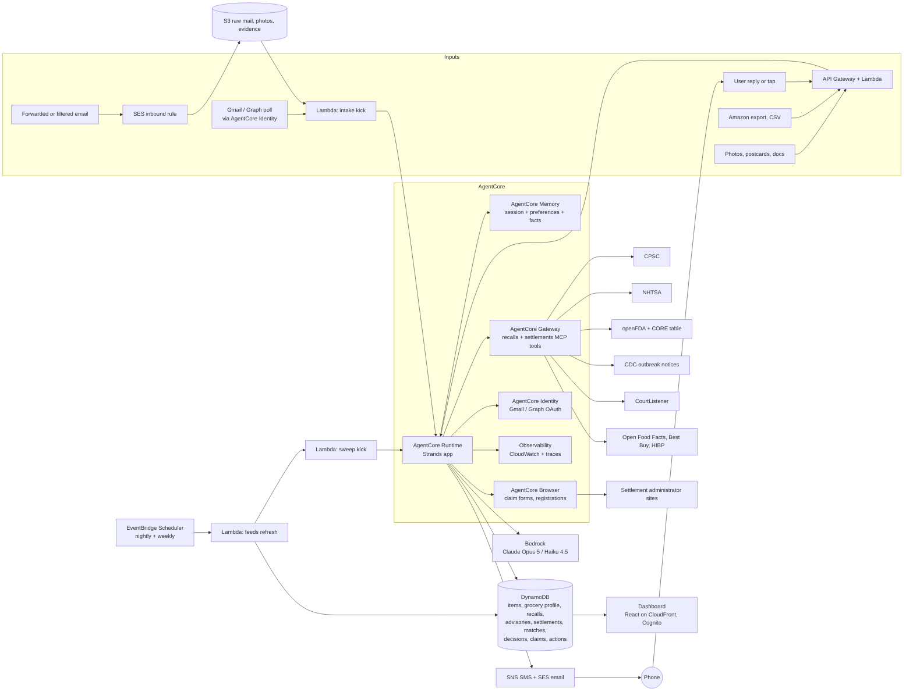

# Guardian: Build Plan

**Hackathon:** Agents for Humans (AWS, Strands Agents SDK)
**Track:** Everyday Agents
**One line:** Guardian is a background agent. It makes a quiet inventory of what your household buys and owns. It watches the recall feeds, the food-outbreak advisories, the class-action settlements, and the warranty windows for you. It speaks to you only when something that you own is affected and a decision is necessary. After one approval, it files the claim, requests the remedy, and follows the money until it arrives.

> The best output of the agent is silence. The primary metric of the product is how rarely it must speak to you. The second metric is how much money it has recovered for you.

**Status of this document.** Section 3 is a long scope catalog, by intent. It lists everything that Guardian could pull from, watch, and do. Each item has a tier (Core, Expanded, or Speculative) and a feasibility note. The catalog is there to be cut down. The sections after Section 3 describe the Core tier plus the Expanded items that are most likely to survive: Gmail ingestion, the mailroom for photos and postcards, the standing grocery profile with outbreak advisories, and class-action claim filing with payout to PayPal. This version follows the ASD-STE100 style (2026-09-13). The content is the plan of 2026-09-13.

---

## 1. The pitch

Every household owns hundreds of products. It buys groceries every week. It usually has a car. Four kinds of money and safety attach to those purchases. Almost nobody collects on any of them:

1. **Recalls.** Agencies issue hundreds of consumer-product recalls each year, plus vehicle, food, drug, and device recalls. The notices go to everyone. Nobody matches them to a home.
2. **Food-safety advisories.** An outbreak investigation often never becomes a recall. In the romaine E. coli outbreak of summer 2026, the only public record for ten weeks was one row in an FDA table: "Not Yet Identified". When FDA closed the file on 2026-09-10, it named no grower, no processor, and no brand. A household that buys romaine every week had nothing to act on, and nobody to tell them.
3. **Class-action settlements and refund programs.** Postcards arrive with a Notice ID and a deadline. Most go into the recycling. The money is legally yours, for a product that you already bought. It stays unclaimed because the claim form takes twenty minutes and the proof of purchase is in an email from three years ago.
4. **Warranties and purchase protections.** Manufacturer warranties, extended plans, and credit-card benefits expire unused. Nobody remembers the term, and nobody can find the receipt.

Guardian solves all four with one habit: forward the receipt, or take a photo of the postcard. From there, it runs alone.

- **Capture.** Receipts, order confirmations, delivery receipts, settlement notices, and photos of labels become structured records. A record says what you own, when you bought it, where, and for how much. It also has the model, the UPC, the lot code, and the warranty term.
- **Watch.** Each night, it checks the new recalls, outbreak advisories, and settlement notices against your inventory and your standing grocery profile.
- **Decide.** It sends one message with one decision when something that you own is affected and the stakes justify it. Everything else goes to a dashboard log and a monthly digest.
- **Act.** After one approval, it requests the remedy. It files the settlement claim with your proof of purchase attached and your PayPal email as the payout destination. It submits the warranty claim. It follows up until the money or the repair kit arrives.

**Who it is for.** The person who manages the household. It is most useful for:

- Parents of young children.
- Car owners.
- PC builders and gadget buyers who accumulate settlement-eligible hardware.
- Anyone who orders groceries online and wants to know when the thing in the fridge is the thing in the news.

**Why it matters.** Recalls exist because products injure people. Outbreak advisories exist because food makes people sick. Settlements exist because a court decided that you are owed money. Warranties are contracts that you paid for. The people who are too busy to track them pay the cost of a missed one.

---

## 2. How it scores on the rubric

| Criterion | What Guardian shows |
|---|---|
| Technical implementation | A Strands `Graph` of specialist agents. Tool-level and hook-level **interrupts** that pause a nightly job until a human answers hours later. **Structured output** for each judgment. A recall-and-settlement **MCP server** exposed through **AgentCore Gateway**. **AgentCore Memory** for household facts and preferences. **AgentCore Runtime** hosting. **AgentCore Browser** fills settlement claim forms, and a human attests before submit. **AgentCore Identity** holds the Gmail OAuth grant. **Observability** traces in the demo. A live demo URL. |
| Design | A complete loop: capture, watch, decide, act, log, get paid. A dashboard whose hero numbers are "days since Guardian needed you" and "recovered so far". |
| Potential impact | Real public data, real hazards, real money. The demo runs against the live CPSC, NHTSA, FDA, and CourtListener feeds, not mocks. |
| Creativity | It inverts the "another app to check" model. A notification budget is a first-class design rule. A standing grocery profile turns a brandless outbreak advisory into "check the romaine you bought Tuesday". Deterministic code where determinism is correct, and a model only where judgment is necessary. The pitch says so. |
| Presentation | A phone that buzzes with a one-tap decision is easy to demo. The video shows a receipt that goes in, a postcard that is photographed, and a settlement claim that goes out with a confirmation number. |

---

## 3. Scope catalog (long, to be cut down)

### 3.0 How to read this section

Each item has a tier and a feasibility color.

| Tier | Meaning |
|---|---|
| **Core** | In the submission. The product does not make sense without it. |
| **Expanded** | Built after Core works end to end. High value, clear path. |
| **Speculative** | Parked. Interesting, but blocked by access, terms of service, sensitivity, or effort. Listed so that the idea is not lost. |

| Feasibility | Meaning |
|---|---|
| **Green** | Official API, official export, or a stable machine-readable email format. |
| **Yellow** | Works, with quirks: human-initiated exports, semi-structured emails, rate limits, or OAuth verification hurdles. |
| **Red** | Needs browser automation against sites whose terms can prohibit it, needs credentials that Guardian must never handle, or touches data that is too sensitive for v1. |

### 3.1 Intake: where purchases and possessions come from

#### 3.1.1 Email channels

| Channel | Tier | Feasibility | How | Gotchas |
|---|---|---|---|---|
| Forward-to-address (`receipts@<your-domain>`) | Core | Green | An SES inbound rule writes to S3. A Lambda starts the intake agent. | The universal fallback. Works with any mail provider. The user must forward the mail or set up a filter. |
| Gmail auto-forward filter | Core | Green | The user creates one Gmail filter ("from:(amazon.com OR instacart.com OR shopify.com ...) forward to receipts@...") after the forwarding address is verified. No OAuth. | Gmail asks for one confirmation of the forwarding address. Guardian keeps the filter list as a copy-paste snippet in Settings. |
| Gmail API (OAuth through AgentCore Identity) | Expanded | Yellow | The `gmail.readonly` scope. Guardian searches the historical mail for receipts from past years. This fills the inventory in one pass. The token is stored in AgentCore Identity, never in chat or logs. | `gmail.readonly` is a restricted scope. An external app in "Testing" status is limited to 100 test users, and its refresh tokens expire after 7 days. Publication needs a Google verification and a security assessment. For the hackathon, run in Testing with the addresses of the judges as test users, or demo the historical backfill on the account of the builder, and use the auto-forward filter for the ongoing capture. |
| Microsoft Graph (Outlook, Hotmail, Live) | Expanded | Yellow | The `Mail.Read` delegated permission through Identity. The same parser pipeline. | A consent screen and an app registration. Personal accounts are supported. |
| iCloud, Yahoo, Fastmail, other IMAP | Speculative | Red | This needs an app-specific password. That is a credential that Guardian must never handle in a conversation. | Send these users to the forwarding filter instead. |
| USPS Informed Delivery digest | Speculative | Yellow | Informed Delivery emails a daily digest with grayscale scans of the incoming envelopes and postcards. Guardian can identify a settlement postcard or a recall letter before it is opened, and queue a reminder: "photograph this when it arrives". | Image only, low resolution. Classification, not extraction. A charming demo beat, if time permits. |

#### 3.1.2 Merchant and service parsers (email formats)

Each parser is a small module. It has a sender allowlist, a subject pattern, and an HTML-to-text step. Then a Haiku 4.5 extraction produces an `InventoryItem` or a `GroceryReceipt`, with a retailer-specific hint prompt. Each parser has recorded fixtures under test. The parsers are in the order of the value that they unlock.

**General retail**

| Merchant | Tier | Feasibility | Notes |
|---|---|---|---|
| Amazon | Core | Yellow | Order confirmation, shipped, and delivered emails. Many now omit the item names and show only "Your order of ..." with a truncated title. Line items are often missing. Pair with the Amazon data export (3.1.3) for completeness. Amazon Fresh and Whole Foods receipts arrive as separate "Your Amazon Fresh order" emails with full line items. |
| Shopify-powered stores | Core | Green | Each Shopify store sends order confirmations from a standard Liquid template ("Order #1042 confirmed"; the sender shows the store name; the footer references Shopify). The structure is consistent: line items, SKUs, variants, and prices. The email links to an order status page with a signed token. A fetch of that page returns the full structured line items. One parser covers tens of thousands of merchants. |
| Target | Core | Green | Order and pickup emails with line items. Target Circle in-store digital receipts, if the user opted in. |
| Walmart | Core | Green | Online order emails with line items. In-store paper receipts include item names and UPC codes, which is excellent for matching. Photograph them (3.1.4). The online receipt lookup of Walmart needs card digits. It is for the user only. |
| Best Buy | Core | Green | Order emails with model numbers and SKUs. The Best Buy Products API (3.1.3) adds the UPC and the manufacturer warranty terms. |
| Costco | Expanded | Yellow | Online order emails are structured. Warehouse receipts appear in the Costco app, not in email. Photograph the paper receipts. |
| Home Depot, Lowe's | Expanded | Green | Order emails with model and SKU. Strong for appliances, tools, and smoke detectors. |
| Newegg, Micro Center, B&H | Expanded | Green | Component-level detail (RAM kits, SSDs, GPUs). This is exactly what consumer-electronics settlements key on. Micro Center is the likely source of a G.Skill kit receipt. |
| Apple, Google Store, Samsung | Expanded | Green | Serial numbers often appear in shipment emails. The warranty windows are well defined. |
| Etsy, eBay | Expanded | Yellow | Structured order emails. The seller-side warranty is usually none, but recalls still apply. |
| Temu, AliExpress, Shein | Speculative | Yellow | High recall exposure, low item value, untidy naming. Include if effort permits. |
| Chewy, Petco (pet food recalls) | Expanded | Green | Pet food is a recurring FDA recall category. |
| CVS, Walgreens, Rite Aid (OTC only) | Expanded | Yellow | Online order emails for OTC items map to the openFDA drug and device recalls. Prescription data is parked (3.2.9). |
| Tire Rack, Discount Tire | Speculative | Green | Tire orders carry DOT codes. These map to NHTSA tire recalls and to tire age. |

**Grocery and food delivery** (these supply the standing grocery profile, 3.1.6)

| Service | Tier | Feasibility | Notes |
|---|---|---|---|
| Instacart | Core | Green | "Your order receipt" emails list each item with brand, size, quantity, price, replacements, and the store. The Developer Platform of Instacart is for retailers and partners, not consumers. Email is the path. |
| Amazon Fresh, Whole Foods | Core | Green | Full line items in the delivery receipts. |
| Walmart grocery (delivery and pickup) | Core | Green | Line items with brand and size. |
| Kroger family (Kroger, Ralphs, Fred Meyer, King Soopers, Harris Teeter) | Expanded | Yellow | Digital receipts by email, if enabled in the loyalty account. The public API of Kroger covers products and locations, not purchase history. |
| Albertsons, Safeway, Vons, Jewel-Osco | Expanded | Yellow | Digital receipts by email, if enabled. |
| Shipt (Target), Costco Same-Day | Expanded | Green | Structured receipts. |
| DoorDash, DashMart; Uber Eats; Grubhub; Gopuff | Expanded | Yellow | Restaurant orders matter less for recalls, but DashMart and Gopuff sell packaged groceries. The consumer APIs do not expose order history. Email is the path. |
| HelloFresh, Blue Apron, Factor, meal kits | Speculative | Yellow | Weekly box contents by email. Meal-kit ingredients have been recalled. |
| Thrive Market, Misfits Market, Boxed | Speculative | Green | Structured receipts. |
| Square, Toast, Clover email receipts | Speculative | Yellow | Small-merchant point-of-sale receipts (butchers, bakeries, farm stands). The item names are free text. |
| Apple Pay, Google Pay receipts | Speculative | Green | Merchant, date, and amount only. Useful as a nudge: "You shopped at Costco on 09/03. Forward or photograph that receipt." |

#### 3.1.3 Platform APIs and data exports

| Source | Tier | Feasibility | What it gives | Notes |
|---|---|---|---|---|
| Shopify order status page | Core | Green | Full line items, SKUs, variants, fulfillment | Each Shopify confirmation email links to it with a signed token. Shopify has no consumer-facing "all my orders across stores" API. The Shop app is closed. The merchant Admin API is not relevant here. |
| Amazon "Request Your Information" export | Expanded | Yellow | `Retail.OrderHistory.1.csv` with each order, item title, ASIN, quantity, price, and date | The user starts it at Privacy Central of Amazon. Amazon emails a ZIP after several days. Guardian guides the user one time, then parses the upload. This is the only complete Amazon history. It fills years of inventory in one pass. |
| Best Buy Products API | Expanded | Green | UPC, model number, manufacturer warranty parts and labor terms, category | Free developer key. Used to enrich any electronics item, regardless of where it was bought. |
| Open Food Facts API | Core | Green | Barcode to brand, product name, categories, packaging | Free and open. It turns a scanned grocery barcode or an Instacart line into a canonical product for FDA matching. |
| UPCitemdb, Barcode Lookup | Expanded | Yellow | General UPC to product | The free tiers are rate-limited. The paid tiers are cheap. |
| NHTSA vPIC | Core | Green | VIN to year, make, model, and more | No key. |
| Kroger API | Speculative | Green | Product and location lookup | No purchase history in the public API. |
| Instacart Developer Platform | Speculative | Red | Retailer and partner integrations only | Not a consumer surface. |
| Uber API | Speculative | Red | Rider trip history, not Eats orders | Not useful. |
| Walmart receipt lookup | Speculative | Red | Itemized receipt by store, date, card last four, and total | Needs card digits. User only. Never automated. |
| Plaid or similar bank aggregation | Speculative | Red | Merchant, date, amount for each card transaction | No item detail. A bank connection is outside the boundary of Guardian. At most, it could nudge: "You bought something at Home Depot on 9/3. Forward the receipt." Parked. |
| Retailer loyalty purchase-history pages | Speculative | Red | Itemized in-store history at Target, Kroger, Walgreens | Needs logged-in browser automation against sites whose terms generally prohibit it. Parked, unless a retailer offers an export. |
| Home inventory app exports (Sortly, Encircle, spreadsheet) | Speculative | Green | Existing inventories | A CSV import covers it. |

#### 3.1.4 Photos and documents (the mailroom)

Each photographed or uploaded file goes into a mailroom queue. A classifier routes it. A local barcode decoder runs first, because barcodes are deterministic. Do not ask a model to read a barcode. Then a vision extraction produces the typed record.

| Document | Tier | Feasibility | Extracts | Notes |
|---|---|---|---|---|
| Paper receipts (thermal) | Core | Green | Merchant, date, line items, prices, sometimes UPC | Walmart, Target, Costco, and most grocers print UPCs or item codes. |
| Product labels and rating plates | Core | Green | Brand, model, serial, date code, manufacture date | Appliances, strollers, cribs, electronics, dehumidifiers. This is what "send me a photo of the label" asks for. |
| Packaging barcodes | Core | Green | UPC or EAN through `zxing-cpp` or `pyzbar`, before any model call | Then Open Food Facts or a UPC lookup for the identity. |
| Food lot codes and best-by dates | Core | Yellow | Lot, best-by, plant code, "grown in" region | FDA `code_info` and FSIS lot lists match on these. Romaine and other produce often carry a harvest-region label that advisory matching needs. |
| Settlement postcards and notice letters | Expanded | Green | Case name, court, Notice ID, Confirmation Code or PIN, claim website, claim deadline, opt-out and objection deadlines, payment options | The postcard that the user received for the G.Skill settlement is the model input. |
| Settlement notice emails | Expanded | Green | The same fields, plus the sender domain for legitimacy checks | The same email pipeline ingests them, with a "legal notice" classifier. |
| Warranty cards and extended-plan contracts | Expanded | Green | Provider, plan number, term, coverage, claim phone or URL | SquareTrade, Asurion, AppleCare, Geek Squad, Home Depot Protection Plan. |
| Recall notice letters (manufacturer mailers) | Expanded | Green | Recall number, affected models, remedy instructions | Confirms a match and gives the remedy path. |
| Data breach notice letters | Expanded | Green | Company, breach date, offered credit monitoring, enrollment code, deadline | Supplies 3.2.4. |
| Rebate forms and rebate confirmation emails | Speculative | Yellow | Offer number, deadline, required proof, tracking URL | Supplies 3.2.6. |
| Vehicle documents (VIN plate, registration, insurance card) | Core | Green | VIN, plate, year, make, model | The VIN is all that is necessary. |
| Tire sidewalls (DOT tire identification number) | Speculative | Yellow | Manufacturer plant, size, week and year of manufacture | Maps to NHTSA tire recalls and to tire age. |
| Car seat labels | Expanded | Green | Manufacturer, model, date of manufacture, expiration | Car seat recalls and expiry (3.2.7). |
| Smoke and CO detector back labels, helmets, fire extinguishers | Speculative | Green | Model, manufacture date | Lifecycle expirations (3.2.7). |
| Appliance manuals and spec sheets | Speculative | Green | Model family, warranty terms | A backup when the label is unreadable. |
| Pharmacy labels | Speculative | Red | Drug, strength, NDC, lot, pharmacy | Sensitive health data. Parked. See 3.2.9. |

#### 3.1.5 Manual and bulk

- A manual add form (Core).
- A CSV import with a documented template (Core; also used for the demo seed).
- A bulk photo drop: a folder of receipt photos uploaded at one time, processed as a batch through the mailroom (Expanded).
- An email backfill: with the Gmail API grant, one search across years of mail for receipts (Expanded).
- An Amazon export upload (Expanded, see 3.1.3).

#### 3.1.6 The standing grocery profile

The profile is derived, not entered. From each grocery and food-delivery receipt, Guardian keeps for each household:

- **Regulars.** Items bought at least three times in 90 days: the canonical product (through Open Food Facts when a barcode or an exact brand is present), brand, size, store, and the usual cadence.
- **Likely in the kitchen now.** For each regular, an estimate of whether it is in the house now, from the last purchase date and a category shelf-life table (bagged lettuce 7 to 10 days, deli meat 5 to 7 days, eggs 3 to 5 weeks, frozen items months). This is what makes an advisory actionable: "You bought organic romaine hearts on Tuesday. They are probably still in the fridge."
- **Region signals.** When packaging or receipts carry a grown-in or packed-in location, keep it. Produce advisories frequently name a growing region before any brand.
- **Household sensitivities** (optional, entered by the user): an infant in the house (formula and baby food recalls become critical), a pregnancy (listeria advisories become critical), allergies (undeclared-allergen recalls, the most common FDA food recall class, become critical instead of standard).

The profile is a set of documents in DynamoDB, mirrored as semantic facts in AgentCore Memory. Thus, the triage agent can reason with it.

### 3.2 Watch: what Guardian monitors

#### 3.2.1 Product recalls

| Source | Tier | Feasibility | Covers | Notes |
|---|---|---|---|---|
| CPSC SaferProducts Recall API | Core | Green | Consumer products | No key, no pagination. Query by date window. |
| NHTSA Recalls by vehicle | Core | Green | Vehicle safety recalls, including park-outside and do-not-drive flags | No key. |
| NHTSA tires and child seats | Expanded | Yellow | Tire and car seat recalls | Verify the API surface in Phase 1. NHTSA publishes these, but the query paths differ from vehicles. |
| NHTSA equipment recalls | Speculative | Yellow | Aftermarket parts, trailers, motorcycle helmets | The same. |
| openFDA enforcement (food, drug, device) | Core | Green | Food, formula, OTC and Rx drugs, cosmetics, devices | 1,000 requests each day without a key, 120,000 with a free key. |
| USDA FSIS Recall API | Expanded | Yellow | Meat, poultry, egg products | It returned 403 to a generic fetch. Send a browser-like User-Agent and verify. |
| FoodSafety.gov recalls and alerts feed | Expanded | Green | Aggregated FDA and FSIS | RSS. Useful as a cross-check. |
| Manufacturer recall pages (IKEA, Peloton, Fisher-Price, Graco, Philips) | Speculative | Red | Brand-specific recall and safety notices | Scraping. Only where an RSS or JSON feed exists. |
| EPA pesticide and consumer chemical recalls | Speculative | Yellow | Pesticides, some household chemicals | Low volume. |
| Health Canada, UK OPSS, EU Safety Gate | Speculative | Green | Non-US recalls | Parked. US only in v1. |

#### 3.2.2 Food outbreaks and advisories (not formal recalls)

The romaine case exposed this category. An outbreak investigation can run for weeks with no product named. Then it names a product category without a brand. Then it closes without a grower named. Guardian handles three levels of information:

| Level | Example | Guardian behavior |
|---|---|---|
| Investigation open, product not identified | The FDA table row "Not Yet Identified" | Log only. There is nothing to act on. The dashboard shows "1 open investigation, no product named." |
| Product category or region named, no brand | "Romaine lettuce, Salinas Valley", or "iceberg lettuce (Cyclospora, July 2026)" | Match against the standing grocery profile. If a regular in that category is likely in the kitchen, send an advisory: what to check for, what to discard, how to get a refund from the store. The severity follows the pathogen and the household sensitivities. |
| Brand, lot, or retailer named, or a recall issued | A standard recall | Full recall matching (3.2.1). |

| Source | Tier | Feasibility | Notes |
|---|---|---|---|
| FDA "Investigations of Foodborne Illness Outbreaks" (CORE table) | Core | Yellow | An HTML table with reference number, pathogen, product linked (if any), case count, status, advisory or recall flag, last updated. No API. Parse weekly and compare the rows. |
| CDC multistate foodborne outbreak notices | Core | Yellow | An HTML list and notice pages with "what consumers should do". Parse weekly and compare. |
| FoodSafety.gov alerts feed | Expanded | Green | RSS. |
| State health department advisories | Speculative | Red | Fifty formats. Parked. |
| Food Safety News, Consumer Reports food safety | Speculative | Yellow | Secondary sources that often carry detail that the agencies omit. Treat them as hints, never as the trigger. |

The honesty rule for the pitch: when the agencies name nothing, Guardian can only tell you that an investigation exists. The demo must show that limit, not hide it. Then it shows what Guardian does the moment a category is named.

#### 3.2.3 Class-action settlements and refund programs

There are two ways in: a notice arrives, or the inventory says that you are probably eligible.

**Notice-driven (Expanded, Green).** Postcards and emails carry the case name, the website of the administrator, a Notice ID and Confirmation Code (or Claim ID and PIN), and deadlines. The mailroom extracts them. Then Guardian verifies that the site is the court-approved administrator before it does anything else (see the guardrails below). It pulls the long-form notice and the claim form. It determines what the claim requires (attestation only, or proof of purchase, or model and serial). Then it assembles the claim.

**Inventory-driven discovery (Expanded, Yellow).** Guardian knows that you bought a G.Skill DDR4 kit from Micro Center in 2022. Thus, it can find an open settlement whose class definition covers that product and period, even if the postcard never came.

| Source | Tier | Feasibility | Notes |
|---|---|---|---|
| Mailed postcards and notice letters (photo) | Expanded | Green | Primary. A received notice is itself evidence of class membership. |
| Settlement notice emails | Expanded | Green | The same pipeline. The sender domain is checked against the administrator list. |
| FTC refund programs | Expanded | Green | The official list of FTC-administered refunds with claim instructions and deadlines. FTC pays by check and PayPal. |
| CFPB and state attorney general settlement pages | Expanded | Yellow | Official but unstructured. Parse the few that have feeds. |
| CourtListener / RECAP API (Free Law Project) | Expanded | Green | Search the dockets for "preliminary approval" and "settlement" with the company and product names from the inventory. Set alerts by keyword. Free API key. Gives the case number, the court, and the documents, including the class definition in the settlement agreement. |
| Settlement administrator sites (Kroll, Epiq, JND, Angeion, Rust Consulting, Simpluris, Verita, A.B. Data, Analytics Consulting, CPT Group) | Expanded | Yellow | Each administrator hosts a site for each case, with claim forms. Keep an allowlist of administrator domains for legitimacy checks. Some publish case lists. Most have no API. |
| Aggregators (ClassAction.org, TopClassActions, Consumer Action, Catch) | Speculative | Red | Convenient, but scraping third-party sites is fragile, and their terms vary. Use them as a discovery hint only. Always resolve to the official administrator site. |
| Data-breach settlement trackers | Expanded | Yellow | See 3.2.4. |

Guardian must recognize these settlement types, because the claim shape differs:

| Type | Usual requirement | Example shape |
|---|---|---|
| Consumer product defect or misrepresentation | Attestation, sometimes model or serial, sometimes proof of purchase for higher tiers | Memory kits sold as a rated speed, appliances that failed, cosmetics with a banned ingredient |
| Pricing, antitrust, or fee | Attestation that you bought within the class period. Retailer or card records are sometimes accepted | "You bought X between 2019 and 2023" |
| Data breach | Attestation, plus documented losses for higher tiers | Credit monitoring plus cash |
| Privacy (biometric, tracking) | Residency and usage attestation | State-specific |
| Auto defect and warranty extension | VIN | Often a reimbursement of past repairs, with invoices |
| Subscription and billing | Account email | Automatic if identified. Otherwise, a claim |

**Guardrails for claims.** These are product features, and the pitch says so:

- The user attests, not the agent. Guardian prefills. The human reviews a one-screen summary and approves the submission. The approval is recorded with a timestamp and the exact form contents.
- Guardian never claims for a product that is not in the inventory, unless the user explicitly attests ownership in the approval.
- Guardian verifies the claim site. The domain must match the administrator named in the court notice, the administrator allowlist, or a CourtListener docket document. Guardian refuses and flags look-alike domains and "settlement rewards" lead-generation sites.
- Guardian never solves CAPTCHAs. When a form presents one, the browser session pauses, and the human completes it.
- The payout destination is the PayPal email, the Venmo handle, the Zelle contact, or the mailing address of the user, stored in the payout profile. These are addresses, not credentials. Guardian never logs in to PayPal, Venmo, or a bank.
- Guardian tracks the deadlines as first-class dates: claim deadline, opt-out deadline, objection deadline, final approval hearing, expected payment window.

#### 3.2.4 Data breaches and identity

| Item | Tier | Feasibility | Notes |
|---|---|---|---|
| Have I Been Pwned API by email | Expanded | Green | A paid key at a nominal price. Lists the breaches for each address. Cross-reference against the open breach settlements. |
| Breach notice letters (photo) | Expanded | Green | Extract the company, the dates, the offered monitoring, the enrollment code, and the deadline. |
| Credit monitoring enrollment | Speculative | Red | Enrollment often needs the SSN. Guardian shows the offer and the deadline. The user enrolls. |
| Identity theft insurance claims | Speculative | Red | Parked. |

#### 3.2.5 Warranties and purchase protections

| Item | Tier | Feasibility | Notes |
|---|---|---|---|
| Manufacturer warranty term | Core | Green | From the receipt, the Best Buy API, or a category default table, with the source flagged. |
| Extended plans (SquareTrade/Allstate, Asurion, AppleCare, Best Buy plans, Geek Squad, Home Depot and Lowe's protection plans, Costco extended) | Expanded | Green | Plan documents by email or photo. Claim URL and phone. |
| Retailer return windows (including holiday extensions) | Expanded | Green | A table for each retailer. Shown only when the user reports a problem inside the window. |
| Credit-card extended warranty | Expanded | Yellow | Many issuers add a year. Stored by the card program name (never a number). The issuer benefit guides differ. Keep a small table for the common programs. |
| Credit-card purchase protection (damage or theft within 90 to 120 days) | Expanded | Yellow | Claim through the benefits administrator of the issuer (Card Benefit Services, Assurant, Chubb, AIG) with the receipt and the card statement. The deadlines are short. This is a strong case for a message. |
| Credit-card price protection and return protection | Speculative | Yellow | Fewer cards offer these now. Needs price monitoring. |
| Cell phone protection through a card | Speculative | Yellow | The bill must be paid with the card. Parked. |

#### 3.2.6 Rebates and price adjustments

| Item | Tier | Feasibility | Notes |
|---|---|---|---|
| Mail-in and online rebates | Speculative | Yellow | Track the offer number, the deadline, the required proof, and the status page. Rebate emails and forms through the mailroom. |
| Retailer price-adjustment windows (Target 14 days, Costco 30 days, Best Buy price match window) | Speculative | Red | Needs price monitoring, which means scraping. Parked. |
| Amazon price drops (Keepa API) | Speculative | Yellow | A paid API. Amazon no longer offers price adjustments, so the value is low. Parked. |

#### 3.2.7 Lifecycle expirations (safety-adjacent)

| Item | Tier | Feasibility | Notes |
|---|---|---|---|
| Car seat expiration | Expanded | Green | The date of manufacture plus the manufacturer life (usually 6 to 10 years). Read from the label photo. |
| Smoke and CO detectors (10 years) | Speculative | Green | From the back label. |
| Tires (age from the DOT code) | Speculative | Yellow | Many manufacturers advise a replacement at 6 to 10 years, regardless of tread. |
| Helmets after impact, fire extinguishers, water filters, EpiPens, infant formula lots | Speculative | Green | Reminders, not decisions. Show them only if the household turns them on. |

#### 3.2.8 Vehicle extras

| Item | Tier | Feasibility | Notes |
|---|---|---|---|
| NHTSA complaints by vehicle | Speculative | Green | `api.nhtsa.gov/complaints/complaintsByVehicle`. Useful context when the user reports a problem. |
| Technical service bulletins and manufacturer communications | Speculative | Yellow | NHTSA publishes datasets. Verify the API coverage. TSBs sometimes reveal extended coverage ("customer satisfaction programs") that dealers do not advertise. |
| Warranty extension programs and goodwill coverage | Speculative | Yellow | Often announced in TSBs or class settlements. |
| Lemon law windows, registration and inspection deadlines | Speculative | Green | Parked. Adjacent to the product, but not the core promise. |

#### 3.2.9 Medications and medical devices

| Item | Tier | Feasibility | Notes |
|---|---|---|---|
| Rx recalls matched to pharmacy labels | Speculative | Red | Health data. Needs an explicit opt-in and stricter handling. Parked for v1. |
| Medical device recalls by serial range (CPAP, glucose monitors, infant monitors) | Expanded | Yellow | openFDA device enforcement plus the serial of the device from a label photo. Non-prescription devices only in v1. |
| OTC drug and supplement recalls | Core | Green | openFDA drug enforcement against the OTC purchases from pharmacy and grocery receipts. |

### 3.3 Act: what Guardian does after an approval

| Action | Tier | Feasibility | Notes |
|---|---|---|---|
| Request a recall remedy by email | Core | Green | From the CPSC consumer contact or the manufacturer recall page. The receipt is attached. |
| Request a recall remedy by web form | Expanded | Yellow | AgentCore Browser. The human approves the submit. |
| Write a phone script for phone-only remedies | Expanded | Green | Some recalls are phone only. Guardian prepares what to say and which numbers to have ready. |
| Retailer refund for recalled or advised-against food | Expanded | Green | Most grocers refund recalled items with or without a receipt. Guardian tells the user which store, what to bring, and logs the refund. |
| "Discard and sanitize" checklist for food advisories | Core | Green | Product-specific: what to throw out, what to wipe down, and when it is safe to buy again. |
| Warranty claim by email | Core | Green | Manufacturer contact, model and serial, problem, receipt attached. |
| Warranty or extended-plan claim by web form | Expanded | Yellow | Browser, with human approval. |
| Settlement claim filing | Expanded | Yellow | The full pipeline in Section 9. Payout to a PayPal email. |
| Credit-card benefit claim | Expanded | Yellow | Benefits administrator forms. The receipt and a statement excerpt are required. The user supplies the statement excerpt. Guardian never accesses the card account. |
| Rebate submission | Speculative | Yellow | Form fill with proof. Tracking. |
| Product registration with the manufacturer | Expanded | Yellow | Registration is how manufacturers notify owners of recalls. Browser-filled with the contact details of the user, which are not credentials. |
| Follow-ups and nudges | Core | Green | If there is no reply in 10 business days, write the nudge and ask one time. |
| Appeals and disputes | Expanded | Green | When a warranty or settlement claim is denied, write the appeal with the policy language cited. |
| Evidence locker | Core | Green | Each receipt, label photo, notice, submitted form, confirmation number, and screenshot, stored for each claim. |
| Payment tracking and reconciliation | Expanded | Green | An expected payment window for each claim. The user confirms the receipt (or forwards the PayPal notification email, which Guardian parses). The dashboard ledger updates. |

**Payout destinations and the credential boundary.** The payout profile stores a PayPal email, a Venmo handle, a Zelle email or phone, and a mailing address. These are destinations. Guardian enters them on forms. Guardian never holds a password, a card number, a bank login, or a one-time code. It never logs in to a payment app. It never moves money itself. Funds flow from the administrator to the PayPal account of the user directly.

### 3.4 Surfaces

- **SMS, email, push.** One decision for each message, numbered replies, signed one-tap links.
- **Dashboard home.** Quiet score, recovered-to-date ledger, items watched, sweeps run, open investigations, pending decisions.
- **Owed to you.** Everything with money attached and a deadline: settlement claims, warranty claims, benefit claims, refunds, rebates. Sorted by deadline.
- **Mailroom.** Photos and documents that wait for processing or are processed, with what was extracted and a "fix this" control.
- **Kitchen.** The standing grocery profile and any active advisories.
- **Inventory, activity, settings.** As in the original plan, plus the payout profile and the parser-filter snippet.

### 3.5 Tiering summary

| Tier | Contents | Approximate effort |
|---|---|---|
| **Core** | Forward address and Gmail filter. Amazon, Shopify, Target, Walmart, Best Buy, Instacart, Amazon Fresh, and Walmart grocery parsers. Photo intake for receipts, labels, barcodes, lot codes, VIN. Open Food Facts and vPIC enrichment. CPSC, NHTSA vehicles, openFDA. FDA CORE and CDC outbreak parsing. Standing grocery profile. Matching engine. Severity and budget policy. Recall remedy and warranty claim by email. Discard checklists. Evidence locker. Dashboard. AgentCore deployment. | The original ten phases plus about one week |
| **Expanded** | Gmail API backfill through Identity. Microsoft Graph. Amazon export. Best Buy API. The remaining retail and grocery parsers. Mailroom for postcards, notices, warranty cards, breach letters, car seats. Settlement notice ingestion, legitimacy checks, claim assembly, browser filing with attestation, payout profile, payment tracking. CourtListener discovery. FTC refunds. Extended plans and card benefits. Device serial recalls. Car seat expiry. Appeals. | About two times the Core build |
| **Speculative** | Everything marked Speculative above | Parked |

### 3.6 Hard boundaries

Guardian must not do these things, even if asked:

- Enter or store passwords, card numbers, bank credentials, SSNs, or one-time codes.
- Log in to retailer, bank, or payment accounts for the user with the credentials of the user.
- Solve or bypass CAPTCHAs.
- Submit a sworn claim form without a recorded human approval for that claim.
- File a claim for a product that the inventory does not contain, unless the user explicitly attests ownership in the approval.
- Scrape a site that prohibits it when an official channel exists.
- Handle prescription data in v1.

---

## 4. The autonomy contract

### Triggers

| Trigger | Source | What runs |
|---|---|---|
| A receipt or notice email arrives | SES inbound (forwarded or filtered), Gmail API poll, Graph poll | The intake agent or the mailroom agent, within minutes |
| A photo or document is uploaded | Dashboard, MMS, bulk drop | The mailroom agent |
| Nightly at 03:00 household-local | EventBridge Scheduler | The feed refresh, then the match graph |
| Weekly | EventBridge Scheduler | The openFDA refresh. The FDA CORE and CDC outbreak comparison. The CourtListener discovery queries. The settlement deadline sweep. |
| A settlement notice is ingested | Mailroom | The claims agent: verify the site, fetch the notice and the form, assess the requirements |
| An outbreak advisory names a category or a region | The weekly comparison | The grocer agent matches against the standing profile |
| The user says that something broke | SMS reply or dashboard | The warranty agent |
| The user answers a decision | Signed link or SMS reply | The graph resumes from its interrupt |
| A claim confirmation or payment email arrives | Inbound email | The claims agent updates the status and the ledger |

### Surfacing policy

| Situation | What the user experiences |
|---|---|
| Confirmed recall match, critical hazard (death, serious injury, fire, choking, amputation, lead, FDA Class I, "do not drive") | Immediate push and SMS. The remedy is already written. One tap sends it. |
| Confirmed recall match, standard hazard | The weekly digest. Guardian requests the remedy automatically if the household preference permits it. |
| Probable match, one fact missing | One question, usually a photo request. |
| An outbreak advisory names a category or a region that matches a regular likely in the kitchen | Immediate if the pathogen is E. coli O157, Listeria, or Salmonella and the household has an infant, a pregnancy, or an elderly member. Otherwise, the same day. The message says exactly what to check and what to do. |
| An outbreak investigation is open with no product named | Nothing. The dashboard shows the count of open investigations. |
| A settlement notice is ingested and the claim is assembled | One message: what the case is, what you would get, what you must attest, the deadline. One tap opens the review-and-attest screen. |
| A settlement is discovered from the inventory (no notice received) | The weekly digest, unless the deadline is within 14 days. |
| A warranty ends within 30 days on an item above the value threshold | One question: is anything wrong with it? |
| A purchase-protection window closes on a high-value item | One question, only if the user has reported damage or loss. Otherwise, silence. |
| The user reports a problem | A coverage check across the manufacturer, the extended plan, and the card benefit. A written claim. One approval. |
| A claim is paid | One line: "Paid: $38.50 from the DDR4 settlement landed in PayPal." No decision is necessary. It goes to the digest, unless the user wants immediate confirmations. |
| Nothing matched | Nothing. The dashboard log records the sweep. |

### Notification budget

Default: at most one unsolicited interruption each week. Critical hazards and claim deadlines inside 72 hours always go through. Everything else accumulates in the dashboard and a monthly digest. The budget is stored in AgentCore Memory as a user preference. The user can change it with a reply in plain language.

### Sample messages (illustrative; the recall and case numbers are placeholders)

**Critical recall:**
> Guardian: The Graco stroller you bought at Target on 2024-03-14 matches CPSC recall 25-000 (hinge can pinch or amputate a fingertip). Remedy: free repair kit. Reply 1 to request it, 2 if you no longer own it, 3 for details.

**Outbreak advisory:**
> Guardian: FDA and CDC say romaine lettuce is linked to an E. coli O157:H7 outbreak. Your Instacart order on Tuesday included Organic Romaine Hearts (3 ct). No brand has been named. Throw it out, wipe the drawer, and Safeway will refund it. Reply 1 when done, 2 if you already used it and want symptom guidance.

**Settlement claim ready:**
> Guardian: Your postcard is for the DDR4 memory settlement. Your Micro Center receipt from 2022-05-08 for a G.Skill Trident Z 32 GB kit is proof of purchase. Estimated payment: $20 to $60, to your PayPal. Claim deadline 2026-11-02. Reply 1 to review and attest, 2 to skip.

**Warranty window:**
> Guardian: Your Vitamix warranty ends 2026-10-01. Anything wrong with it? If yes, reply with a sentence and I will draft the claim.

---

## 5. Data sources

### A. Product recalls

| Source | Endpoint | Covers | Match keys | Notes |
|---|---|---|---|---|
| CPSC SaferProducts Recall API | `https://www.saferproducts.gov/RestWebServices/Recall?format=json&RecallDateStart=YYYY-MM-DD&RecallDateEnd=YYYY-MM-DD` | Consumer products | `Products[].Name`, `Products[].Model`, `Products[].UPC`, `Manufacturers[].Name`, `Retailers[].Name`, sold-date range | No key. No pagination. Also returns `Hazards`, `Remedies`, `ConsumerContact`, `Images`. |
| NHTSA vPIC | `https://vpic.nhtsa.dot.gov/api/vehicles/DecodeVinValues/{VIN}?format=json` | VIN decode | `ModelYear`, `Make`, `Model` | No key. |
| NHTSA Recalls | `https://api.nhtsa.gov/recalls/recallsByVehicle?make={make}&model={model}&modelYear={year}` | Vehicle recalls | Exact make, model, year | No key. Park-outside and do-not-drive flags. |
| NHTSA Complaints | `https://api.nhtsa.gov/complaints/complaintsByVehicle?make={make}&model={model}&modelYear={year}` | Owner complaints | The same | Context only. |
| openFDA Enforcement | `https://api.fda.gov/{food|drug|device}/enforcement.json?search=report_date:[YYYYMMDD+TO+YYYYMMDD]&limit=100&skip=N` | Food, formula, drugs, cosmetics, devices | `product_description`, `code_info`, `recalling_firm`, `classification`, `distribution_pattern` | A free key raises the daily limit to 120,000. Weekly data. |
| USDA FSIS Recall API | `https://www.fsis.usda.gov/fsis/api/recall/v/1` | Meat, poultry, eggs | Product items, establishment, states | Verify the access with a browser-like User-Agent. |
| FoodSafety.gov | The RSS feed of recalls and alerts | Aggregated | Title, link | Cross-check. |

### B. Outbreaks and advisories

| Source | Access | Fields to extract | Cadence |
|---|---|---|---|
| FDA Investigations of Foodborne Illness Outbreaks (CORE table) | The HTML table at `fda.gov/food/outbreaks-foodborne-illness/investigations-foodborne-illness-outbreaks` | Reference number, pathogen, product linked (or "Not Yet Identified"), case count, status, advisory issued, recall initiated, last updated, link to the investigation page | Weekly comparison, daily during an active advisory |
| CDC multistate foodborne outbreak notices | The HTML list and the notice pages | Pathogen, product, states, case counts, "what consumers should do", dates | Weekly comparison |
| FoodSafety.gov alerts | RSS | Title, summary, link | Weekly |

### C. Settlements and refund programs

| Source | Access | Fields | Notes |
|---|---|---|---|
| Mailed and emailed notices | Mailroom | Case name, court, administrator URL, Notice ID, Confirmation Code or PIN, claim deadline, opt-out and objection deadlines, hearing date, payment options | Primary. |
| CourtListener REST API v4 | `https://www.courtlistener.com/api/rest/v4/search/` with `type=r` for RECAP dockets. The alerts API for saved searches | Case name, docket number, court, parties, documents (the settlement agreements carry the class definition) | Free API key. Query by the company and product names from the inventory, plus terms like "preliminary approval" and "settlement". |
| FTC refund programs | `ftc.gov/enforcement/refunds` (HTML) | Program, eligibility, deadline, administrator, payment method | Official. |
| State attorney general and CFPB settlement pages | HTML | The same | Parse the few that have feeds. |
| Administrator allowlist | A JSON file kept in the repository | Domains for Kroll, Epiq, JND, Angeion, Rust Consulting, Simpluris, Verita, A.B. Data, Analytics Consulting, CPT Group, and case-specific domains confirmed from court documents | Used for legitimacy checks. |

### D. Enrichment

| Source | Access | Gives |
|---|---|---|
| Open Food Facts | `https://world.openfoodfacts.org/api/v2/product/{barcode}` | Brand, product name, categories, packaging, sometimes origin |
| Best Buy Products API | `https://api.bestbuy.com/v1/products(upc={upc})?apiKey=...&format=json`, and by SKU | UPC, model number, manufacturer warranty parts and labor, category |
| UPCitemdb, Barcode Lookup | REST | General UPC identity |
| Have I Been Pwned | `https://haveibeenpwned.com/api/v3/breachedaccount/{email}` with `hibp-api-key` | Breaches for each address |

### E. Purchase platforms and mail

| Source | Access | Gives | Notes |
|---|---|---|---|
| SES inbound | A receipt rule to S3 | Raw MIME | Universal. |
| Gmail auto-forward filter | Configured by the user | The same as above | No OAuth. |
| Gmail API | OAuth `gmail.readonly` through AgentCore Identity. `users.messages.list` with a receipt query, `users.messages.get` | Historical backfill and an ongoing poll | A restricted scope. Testing-mode limits (100 users, 7-day tokens). |
| Microsoft Graph | OAuth `Mail.Read` | The same | |
| Shopify order status page | The signed URL from the confirmation email | Line items, SKUs, variants | Fetch one time for each order. |
| Amazon Request Your Information | A ZIP started by the user, `Retail.OrderHistory.1.csv` | The complete order history | Takes days. A one-time backfill. |

### Normalized recall record

```
RecallRecord
  recall_id       "cpsc#25-000" | "nhtsa#24V123" | "fda#F-1234-2026" | "fsis#012-2026"
  source          cpsc | nhtsa | fda_food | fda_drug | fda_device | fsis
  title, published_at, url
  products[]      { name, brand, model_numbers[], upcs[], lot_codes[], sold_from, sold_to, retailers[], regions[] }
  hazard_text
  severity        critical | standard
  remedy_text
  contact         { phone, email, url }
  raw_s3_key
```

### Normalized advisory record

```
AdvisoryRecord
  advisory_id     "fda-core#1234" | "cdc#2026-romaine"
  pathogen        e_coli_o157 | listeria | salmonella | cyclospora | hepatitis_a | other
  level           investigation_open | category_named | brand_or_lot_named | recall_issued
  product_terms[] ["romaine", "romaine hearts", "salad kits containing romaine"]
  regions[]       ["Salinas Valley, CA"]
  states[]
  consumer_action "do not eat" | "check label" | "none yet"
  first_seen, last_updated, url
```

### Normalized settlement record

```
SettlementRecord
  settlement_id     "cl#<docket>" | "notice#<hash>"
  case_name, court, docket_number
  administrator     { name, domain, verified_by: "notice" | "docket_document" | "allowlist" }
  class_definition  free text plus extracted { products[], brands[], model_patterns[], purchase_from, purchase_to, residency[] }
  claim             { url, requires_proof: bool, proof_types[], fields_required[], payment_options[] }
  deadlines         { claim, opt_out, objection, hearing, expected_payment_window }
  estimated_payment { low, high, basis }
  notice_ids        { notice_id, confirmation_code }   # present only when a notice was received
```

### Severity mapping

- FDA Class I, and NHTSA park-outside or do-not-drive: **critical**.
- CPSC hazard text that contains death, serious injury, fire, burn, choking, strangulation, amputation, laceration, or lead: **critical**. A fall hazard for infant products: **critical**.
- Outbreak advisories with E. coli O157, Listeria, or Salmonella, when the household has an infant, a pregnancy, or an elderly member: **critical**. Otherwise, **standard** with same-day delivery.
- Undeclared-allergen recalls: **critical** only if the household lists that allergen. Otherwise, **standard**.
- Everything else: **standard**.
- The keyword pass runs first. The triage agent confirms with structured output.

---

## 6. Architecture



### Components and why each one exists

| Component | Role | Why |
|---|---|---|
| AgentCore Runtime | Hosts the Strands app behind `/invocations`. Routes on `payload["kind"]` (intake, mailroom, sweep, resume, report_problem, claim, reconcile). | Session isolation, long invocations, and the deployment that the judges named. |
| AgentCore Memory | Short term: the conversation and the interrupt state. Long term: `userPreferenceMemoryStrategy` (thresholds, budget, sensitivities) and `semanticMemoryStrategy` (household facts, grocery regulars, payout profile pointers). | Nightly runs can reason with what the household said last month. |
| AgentCore Gateway | Publishes the recall, advisory, settlement, and enrichment MCP tools with managed auth. | Reusable tools. Rubric points. |
| AgentCore Browser | Fills settlement claim forms, warranty web forms, and product registrations. Pauses on CAPTCHAs and before submit. | The claim-filing promise needs a browser. This one is managed and observable. |
| AgentCore Identity | Holds the Gmail and Graph OAuth grants. Supplies tokens to the tools. | Credentials never touch the context or the logs of the agent. |
| AgentCore Observability | Traces of each run in CloudWatch. | Proof that the agent ran unattended. |
| EventBridge Scheduler | Nightly and weekly triggers. | Native cron. |
| Lambda | Feed refresh, kick invocations, decision callbacks, Shopify order-page fetch, barcode decode. | Deterministic work stays out of the model loop. |
| DynamoDB | All entities in Section 11. | Fast dashboard reads. On-demand billing. |
| S3 | Raw mail, photos, recall snapshots, the evidence locker. | Cheap. Keeps the evidence for claims. |
| SES | Inbound receipts and notices. Outbound remedy, claim, and follow-up emails. | One service for both directions. |
| SNS SMS (Twilio fallback) | Critical alerts and replies. | Origination-number lead time. See the risks. |
| API Gateway HTTP API | Signed decision links, uploads, the dashboard API. | Simple. |
| Cognito | Dashboard sign-in and the Gateway inbound JWT. | Standard. |
| Bedrock | Claude Opus 5 for the judgment agents (matcher, triage, claims, grocer). Claude Haiku 4.5 for high-volume extraction (intake, mailroom classification). | Judgment is rare. Extraction is frequent. Use the cross-region inference profile ids from the Bedrock catalog. |
| Secrets Manager | The API keys for openFDA, HIBP, Best Buy, CourtListener. | Never in code. |
| CDK (Python) | All infrastructure as code. | A reproducible setup is a submission requirement. |

### The design principle that the pitch states

Code does the plumbing. Agents do the judgment. Pagination, date windows, VIN decoding, barcode decoding, UPC equality, lot-code parsing, and deadline arithmetic are code. An agent decides these questions:

- Is "Frigidaire 50-pint dehumidifier, white" the same thing as "FFAD5033W1 dehumidifiers sold 2022 to 2024"?
- Does "Organic Romaine Hearts 3 ct" fall under "romaine lettuce"?
- Does a class definition cover the kit on a Micro Center receipt?

This is why the nightly run costs cents, and why the judges will believe that it runs in the background.

---

## 7. Agents (Strands)

| Agent | Model | Runs when | Tools | Output |
|---|---|---|---|---|
| `intake` | Haiku 4.5 (Opus 5 for hard cases) | A receipt email or an export arrives | `parse_merchant_email`, `fetch_shopify_order`, `decode_vin`, `lookup_barcode`, `enrich_bestbuy`, `save_item`, `save_grocery_receipt`, `redact_pan` | `InventoryItem[]` or `GroceryReceipt` |
| `mailroom` | Haiku 4.5 classifies, Opus 5 extracts | A photo or document is uploaded, or a legal-notice email arrives | `decode_barcode_image`, `classify_document`, `extract_receipt`, `extract_label`, `extract_settlement_notice`, `extract_warranty_card`, `extract_breach_notice`, `save_document` | A typed document record and a downstream trigger |
| `matcher` | Opus 5 | Nightly, only for the ambiguous candidates | `get_item`, `get_recall`, `recalls_mcp.*` | `MatchVerdict` |
| `grocer` | Opus 5 | The weekly comparison, or when an advisory changes level | `get_grocery_profile`, `get_advisory`, `shelf_life_table` | `AdvisoryMatch` with what is likely in the kitchen |
| `claims` | Opus 5 | A notice is ingested. The weekly discovery. The user approves. A confirmation or payment email arrives | `verify_administrator`, `fetch_notice`, `courtlistener_search`, `assess_eligibility`, `assemble_claim`, `browser.*`, `request_decision`, `record_confirmation`, `update_ledger` | `EligibilityAssessment`, `ClaimPackage`, `ClaimReceipt` |
| `triage` | Opus 5 | Nightly, when any verdict, advisory, or claim needs a decision | `get_preferences`, `check_budget`, `draft_message`, `request_decision` | `SurfacePlan` |
| `remedy` | Opus 5 | After the human approves | `send_email`, `attach_evidence`, `browser.*`, `schedule_followup`, `log_action` | `ActionReport` |
| `warranty` | Opus 5 | An item is saved. 30 days before expiry. The user reports a problem | `get_item`, `warranty_defaults`, `card_benefit_table`, `draft_claim`, `request_decision` | `CoverageAssessment`, `ClaimDraft` |

### Structured output models (additions)

```python
class GroceryReceipt(BaseModel):
    store: str
    service: Literal["instacart", "amazon_fresh", "walmart", "kroger", "other"]
    purchased_at: str
    lines: list["GroceryLine"]

class GroceryLine(BaseModel):
    raw_name: str
    brand: str | None
    canonical_product: str | None     # from Open Food Facts when resolvable
    category: str                      # produce, dairy, deli, frozen, packaged, baby, otc
    size: str | None
    quantity: float
    upc: str | None
    lot_code: str | None
    region: str | None                 # "grown in Salinas Valley" when printed

class AdvisoryMatch(BaseModel):
    advisory_id: str
    matched_regulars: list[str]
    likely_in_kitchen: bool
    last_purchased: str | None
    consumer_action: str
    severity: Literal["critical", "standard"]
    rationale: str

class SettlementNotice(BaseModel):
    case_name: str
    court: str | None
    administrator_url: str
    notice_id: str | None
    confirmation_code: str | None
    claim_deadline: str | None
    opt_out_deadline: str | None
    objection_deadline: str | None
    hearing_date: str | None
    payment_options: list[str]

class EligibilityAssessment(BaseModel):
    eligible: Literal["yes", "no", "unsure"]
    basis: str                          # which inventory items and dates satisfy the class definition
    proof_required: bool
    proof_available: list[str]          # evidence locker keys
    fields_required: list[str]
    estimated_payment_low: float | None
    estimated_payment_high: float | None
    site_verified: bool
    site_verification_basis: str

class ClaimPackage(BaseModel):
    settlement_id: str
    form_url: str
    prefilled_fields: dict[str, str]    # never includes credentials
    attachments: list[str]              # evidence locker keys
    payout_method: Literal["paypal", "venmo", "zelle", "check"]
    payout_destination: str             # PayPal email, handle, or address
    attestations: list[str]             # exact text the human must affirm
```

The original models (`InventoryItem`, `MatchVerdict`, `SurfacePlan`) are unchanged. The invocation is the documented pattern: `agent(prompt, structured_output_model=Model)`, then `result.structured_output`.

### The nightly graph

```python
from strands import Agent
from strands.multiagent import GraphBuilder

builder = GraphBuilder()
builder.add_node(matcher, "matcher")
builder.add_node(grocer, "grocer")
builder.add_node(claims, "claims")
builder.add_node(triage, "triage")
builder.add_node(remedy, "remedy")

builder.add_edge("matcher", "triage", condition=has_recall_candidates)
builder.add_edge("grocer", "triage", condition=has_advisory_matches)
builder.add_edge("claims", "triage", condition=has_claims_ready)
builder.add_edge("triage", "remedy", condition=approved)
builder.set_entry_point("matcher")
builder.set_entry_point("grocer")
builder.set_entry_point("claims")
builder.set_execution_timeout(900)
graph = builder.build()
```

The three entry points run in parallel. `triage` waits for all of them, applies the budget, and raises at most the interrupts that the policy permits. The conditions read the structured results carried in `invocation_state`.

### A pause for a human

This is unchanged from the original plan, and it is central to the claims flow. Tool-level interrupts through `tool_context.interrupt("guardian-decision", reason=plan)` in `triage`, `warranty`, and `claims`. A `BeforeNodeCallEvent` hook on `remedy` that raises `event.interrupt("guardian-approval", ...)`. Thus, nothing is sent or submitted without a recorded approval. The decision-callback Lambda resumes with the same session id and an `interruptResponse`. The interrupt state must survive across two Runtime invocations that are hours apart. Phase 1 tests this with `AgentCoreMemorySessionManager`. `S3SessionManager` is the fallback.

For a claim filing, there are two interrupts in sequence. First, "review and attest": the user sees the exact prefilled form and the attestation text. Second, if the form presents a CAPTCHA, "complete the CAPTCHA". The browser session goes to the user through the live view of the dashboard. Guardian resumes after the user reports that it is done. The submit happens only after the first approval, and never on the own judgment of Guardian.

### Memory, MCP, and the runtime entry point

As in the original plan. The MCP server grows from `recalls-mcp` to `guardian-mcp`, with the tool groups `cpsc_*`, `nhtsa_*`, `fda_*`, `cdc_*`, `courtlistener_*`, `openfoodfacts_*`, `bestbuy_*`, and `hibp_*`. The runtime entry point routes on `payload["kind"]` across `intake`, `mailroom`, `sweep`, `resume`, `report_problem`, `claim`, and `reconcile`.

Browser tooling: the `strands-agents-tools` package ships a browser tool with an AgentCore Browser backend. Verify the current import path in the docs of the tools package before Phase 12. The claims agent gets a narrow tool surface (`open_url`, `read_form`, `fill_field`, `upload_file`, `screenshot`, `pause_for_human`, `click_submit`), not raw browser control. Thus, the audit log reads as a form-filling transcript.

---

## 8. Matching engine

### Recalls (unchanged)

Four stages, cheapest first:

1. Exact keys (UPC, VIN-derived make, model, and year, normalized model number).
2. Lexical candidates (a brand match, plus a `rapidfuzz` token-set ratio of 80 or more).
3. The date-window filter: a purchase date outside the stated sold window by more than 60 days drops the candidate.
4. Model adjudication with `MatchVerdict`. Only stage 4 spends tokens.

A golden set of 30 pairs, with precision and recall of at least 0.9, runs in CI.

### Outbreak advisories

1. The advisory record carries `product_terms[]` and `regions[]` (Section 5B).
2. The candidate regulars are those whose `category` and `canonical_product` or `raw_name` overlap the product terms lexically (romaine hearts, romaine salad kit, Caesar kit with romaine).
3. `likely_in_kitchen` comes from the last purchase and the shelf life.
4. `grocer` adjudicates with `AdvisoryMatch` and writes a consumer action that is specific to the item and the store of the household.
5. A region and a brand narrow the match when named. The absence of a brand widens it and lowers the confidence. The message states this plainly ("no brand has been named").

Golden set: 20 advisory and receipt pairs, including negatives (an iceberg advisory against a romaine purchase; a romaine advisory against a purchase that is three weeks old).

### Settlement eligibility

1. The class definition is extracted from the long-form notice or the settlement agreement (a CourtListener document) into `{products[], brands[], model_patterns[], purchase_from, purchase_to, residency[]}`.
2. The inventory items are filtered by brand and category, then by a purchase date inside the class period, then by the model pattern.
3. `claims` adjudicates with `EligibilityAssessment`. It cites the exact receipt and line.
4. The proof requirement is read from the claim form. Guardian checks the evidence locker for a matching receipt. It flags "proof required, none on file" as a question to the user, not as a dead end.

Golden set: 15 real, closed settlements with public class definitions, paired with synthetic inventories.

---

## 9. Claim filing pipeline (settlements)

This is the flow that the G.Skill postcard example describes, end to end.

| Step | What happens | Who acts |
|---|---|---|
| 1. Ingest | The postcard is photographed, or the notice email arrives. The mailroom extracts `SettlementNotice`. | Guardian |
| 2. Verify | The administrator domain is checked against the allowlist, the court docket on CourtListener, and the notice itself. Look-alike domains are refused. The result is stored as `site_verified`, with the basis. | Guardian |
| 3. Fetch | The long-form notice, the claim form, the FAQ, and the settlement agreement are pulled from the verified site. The class definition, the deadlines, the payment options, and the proof rules are extracted. | Guardian |
| 4. Assess | `EligibilityAssessment` against the inventory. The evidence locker is searched for proof. The estimated payment comes from the tiers in the notice. | Guardian |
| 5. Assemble | `ClaimPackage`: the prefilled fields (name, address, email, Notice ID, Confirmation Code, product details, purchase date and retailer), the attachments (receipt PDF or image), the payout method and destination (the PayPal email from the payout profile), and the exact attestation text. | Guardian |
| 6. Surface | One message. One tap opens the review screen with the form as it will be submitted. | Guardian |
| 7. Attest | The user reads the attestation, corrects anything wrong, and approves. The approval is recorded with the timestamp, the form hash, and the IP. | Human |
| 8. File | AgentCore Browser opens the form, fills the fields, uploads the attachments, selects PayPal, and enters the payout email. If a CAPTCHA appears, Guardian pauses and gives the session to the user. After the approval of the user in step 7, Guardian clicks submit. | Guardian, with the human on the CAPTCHA |
| 9. Confirm | The confirmation number and a screenshot go to the evidence locker. The confirmation email is parsed when it arrives. | Guardian |
| 10. Track | The deadlines and the expected payment window are tracked. The final approval hearing date is noted. Status changes from the site or the emails of the administrator are logged. | Guardian |
| 11. Reconcile | The payment arrives in PayPal. The user forwards the PayPal email, or replies "paid", or the dashboard asks one time after the expected window. The ledger is updated. | The human confirms, Guardian records |
| 12. Appeal | If a claim is rejected, Guardian writes the cure or the appeal with the deficiency named, and asks one time whether to send it. | Guardian writes, the human approves |

**Why PayPal.** Administrators increasingly offer PayPal, Venmo, Zelle, digital prepaid cards, and paper checks. PayPal needs only an email address. It pays within days of issuance. It cannot be lost in the mail. Guardian defaults to PayPal when offered. It falls back in the order that the user set in the payout profile. It never touches the PayPal account itself.

**Legitimacy is a feature.** Settlement scams and "claim your settlement" lead-generation sites are common. The verification step of Guardian (the allowlist, the docket cross-check, and the notice consistency) is a visible badge on each claim card: "Verified against docket 3:24-cv-01234, N.D. Cal."

---

## 10. Warranty and benefits engine

1. **Term extraction.** From the receipt, from the Best Buy API when the product is electronics, or from a category default table with `warranty_source` flagged.
2. **Coverage stack.** For each item, an ordered list of coverage:
   - The manufacturer warranty.
   - The extended plan, if a plan document exists.
   - The card extended warranty, if the program of the purchase card is known.
   - The purchase protection window, if the date is inside it.
3. **Expiry watch.** A nightly query for items whose last remaining coverage ends within 30 days, above the value threshold. One question.
4. **Problem report.** The user replies in plain language. `warranty` assesses each coverage layer, selects the best route (cheapest for the user, most likely to pay), and writes the claim with proof attached.
5. **Send and follow up.** Email where possible. Browser-filled forms with human approval where required (extended-plan portals and card benefit administrators). A follow-up in 10 business days.
6. **Registration.** The registration URL and the prefilled fields are stored at intake. Browser-filled on approval in Expanded.

---

## 11. Data model (DynamoDB)

A single table, `pk` and `sk`, on-demand billing.

| Entity | pk | sk | Key attributes |
|---|---|---|---|
| InventoryItem | `HH#<household>` | `ITEM#<item_id>` | name, brand, model_number, upc, serial, category, purchase_date, price, retailer, receipt_s3_key, warranty {term_months, ends_on, source, extended}, card_program, vehicle {vin, year, make, model}, status |
| GroceryReceipt | `HH#<household>` | `GROC#<purchased_at>#<receipt_id>` | store, service, lines[] |
| GroceryRegular | `HH#<household>` | `REG#<canonical_product>` | brand, category, size, cadence_days, last_purchased, likely_in_kitchen_until, region |
| Document | `HH#<household>` | `DOC#<doc_id>` | type (receipt, label, barcode, settlement_notice, warranty_card, breach_notice, recall_letter, vehicle, car_seat), s3_key, extracted (typed JSON), confidence, linked_ids[] |
| RecallRecord | `RECALL#<source>` | `<published_at>#<native_id>` | the normalized record; a GSI on `brand_norm` |
| AdvisoryRecord | `ADVISORY` | `<first_seen>#<advisory_id>` | the normalized record; the level history |
| SettlementRecord | `SETTLEMENT` | `<claim_deadline>#<settlement_id>` | the normalized record; the administrator verification |
| MatchCandidate | `HH#<household>` | `MATCH#<item_id>#<recall_id>` | stage, score, verdict, confidence, rationale, missing_info, state |
| AdvisoryMatch | `HH#<household>` | `ADVMATCH#<advisory_id>` | matched_regulars, likely_in_kitchen, action, state |
| Claim | `HH#<household>` | `CLAIM#<claim_id>` | settlement_id or coverage_id, type (settlement, warranty, extended_plan, card_benefit, recall_remedy, refund, rebate), package_s3_key, attestation {at, form_hash}, confirmation_number, screenshot_s3_key, status (assembled, awaiting_attestation, filed, confirmed, paid, rejected, appealed), expected_payment_window, paid_amount, paid_at |
| Decision | `HH#<household>` | `DECISION#<decision_id>` | kind, summary, options, interrupt_id, session_id, token_hash, expires_at, answered_at, answer |
| Action | `HH#<household>` | `ACTION#<action_id>` | decision_id, type, payload_s3_key, status, next_check_at |
| Activity | `HH#<household>` | `LOG#<timestamp>` | what the agent did |
| PayoutProfile | `HH#<household>` | `PAYOUT` | paypal_email, venmo_handle, zelle_contact, mailing_address, preference_order |
| Preferences | `HH#<household>` | `PREFS` | value_threshold, budget_per_week, quiet_categories, sensitivities {infant, pregnancy, elderly, allergens[]} |

---

## 12. Notifications and the decision API

The mechanism is unchanged: SNS SMS for critical, SES email otherwise, signed one-time links with a 72-hour expiry, API Gateway to Lambda to `invoke_agent_runtime` with `kind: "resume"`. Additions:

- The review-and-attest screen is a dashboard route reached from the signed link. It renders the `ClaimPackage` and the attestation text. Its approve button is the interrupt response.
- A live-view route for the browser session, so that the user can complete a CAPTCHA when Guardian pauses.
- A "paid" reply path, and a parser for the PayPal and Venmo payment-received emails that the user forwards to the receipts address.

**A risk to plan around.** US SMS through SNS needs a verified toll-free or 10DLC origination number. This can take days. Start the request in Phase 0. If the number is not ready for the video, demo with email plus a simulated phone panel in the dashboard. Twilio is a drop-in fallback.

---

## 13. Dashboard

- **Home.** The quiet score, the recovered-to-date ledger, items watched, sweeps run, open investigations, pending decisions.
- **Owed to you.** Each claim with money attached, sorted by deadline, with the verification badge, the status, and the expected payment window.
- **Pending decisions.** Cards with approve, dismiss, not mine, ask me later. Review-and-attest for claims.
- **Mailroom.** Uploads with the extraction results and a fix control.
- **Kitchen.** The regulars, the likely-in-kitchen estimates, the active advisories, and the discard checklist when one is live.
- **Inventory.** Filters by category, coverage status, and recall status. Receipt thumbnails. The coverage stack for each item.
- **Activity.** A timeline of everything that the agent did.
- **Settings.** The value threshold, the notification budget, the quiet categories, and the sensitivities. The forwarding address and the Gmail filter snippet. The Gmail and Outlook connections. The phone number. The payout profile.

Stack: Vite plus React, Cognito Hosted UI, CloudFront plus S3. Small and finished beats large and rough.

---

## 14. Repository layout

```
guardian/
  README.md, LICENSE (Apache-2.0), ARCHITECTURE.md, docs/architecture.png
  infra/                    CDK (Python): DataStack, IngestionStack, AgentStack, ApiStack, WebStack, BrowserStack
  agent/                    Strands app on AgentCore Runtime
    app.py                  entrypoint, routes on payload.kind
    agents/                 intake.py mailroom.py matcher.py grocer.py claims.py triage.py remedy.py warranty.py graph.py
    tools/                  inventory.py grocery.py documents.py notify.py vin.py barcode.py shopify.py enrich.py
                            settlements.py browser_forms.py decisions.py ledger.py
    models/                 pydantic schemas
    policy/                 severity.py budget.py defaults.py shelf_life.py card_benefits.py
    memory.py               AgentCoreMemorySessionManager wiring
    prompts/                one file per agent
  parsers/                  merchant email parsers, one module each, with fixtures
  mcp/guardian-mcp/         FastMCP server: cpsc, nhtsa, fda, cdc, courtlistener, openfoodfacts, bestbuy, hibp; Lambda handler for Gateway
  feeds/                    Lambda: fetch, normalize, upsert recalls, advisories, settlements; recorded fixtures
  api/                      Lambda: decision callback, uploads, dashboard API, Shopify order fetch
  web/                      Vite + React dashboard
  eval/                     golden sets: parsing, recall matching, advisory matching, settlement eligibility
  demo/                     seed inventory, sample receipts, sample postcard image, demo recall and advisory fixtures, video script
  data/                     administrator allowlist, shelf-life table, category warranty defaults, card benefit table
  scripts/                  deploy helpers, local runner
  .github/workflows/        lint, tests, evals
```

---

## 15. Build phases

The sizes are approximate working days for one developer. The Core phases 0 to 9 are the original plan, with the grocery profile and the outbreak parsing folded in. The Expanded phases follow.

| # | Phase | Tier | Days | Exit criterion |
|---|---|---|---|---|
| 0 | Foundations | Core | 1 | The repository, the license, CDK bootstrapped, Bedrock access, the Builder ID, the credit requested, the SMS number requested, a Strands hello-world through `agentcore dev`. |
| 1 | Feeds and stores | Core | 4 | A nightly Lambda fills the recalls from CPSC, NHTSA, and openFDA, with fixtures under test. A weekly parser compares the FDA CORE table and the CDC notices into `AdvisoryRecord`. `guardian-mcp` serves the recall and advisory tools over stdio. The interrupt-resume test across two Runtime invocations is done. |
| 2 | Intake and parsers | Core | 5 | The forward address and the Gmail filter are documented. Parsers for Amazon, Shopify (with the order-page fetch), Target, Walmart, Best Buy, Instacart, Amazon Fresh, and Walmart grocery, with fixtures. At least 90 percent field accuracy on a labeled set of 30 receipts. Barcode decode, Open Food Facts, and vPIC are wired. Card numbers never reach storage. |
| 3 | Grocery profile | Core | 2 | The regulars and likely-in-kitchen are computed from receipts. The shelf-life table. The Kitchen view data. |
| 4 | Matching engine | Core | 4 | Recall stages 1 to 4. Advisory matching. Golden sets at 0.9 precision and recall or more. The token cost for each night is logged. |
| 5 | Triage, interrupts, decisions | Core | 4 | End to end for a seeded recall and a seeded advisory: the message arrives, a tap resumes the graph, the remedy email or the discard checklist is delivered, the activity is logged. The budget and the severity are enforced, with tests. |
| 6 | Warranty | Core | 3 | Term extraction with a source flag. The expiry question. A problem report becomes a written claim. The follow-up is scheduled. |
| 7 | Dashboard | Core | 5 | Home, owed-to-you (warranty only at this point), decisions, kitchen, inventory, activity, settings. Cognito. CloudFront. |
| 8 | AgentCore deployment | Core | 2 | Runtime, Memory with three strategies, Gateway with the MCP server, Observability traces. A live URL. |
| 9 | Hardening, eval, submission assets | Core | 5 | CI with evals. Error paths. A cost report. README, diagram, video, builder.aws.com post, Devpost form. |
| 10 | Mailroom | Expanded | 4 | Photos of receipts, labels, barcodes, lot codes, VIN plates, car seat labels, settlement postcards, warranty cards, and breach letters are classified and extracted, with fixtures. The Mailroom view. |
| 11 | Gmail and Graph through Identity, the Amazon export, Best Buy enrichment | Expanded | 4 | The OAuth grants are stored in Identity. A historical backfill on a test account. The Amazon CSV import. Best Buy warranty enrichment. The Testing-mode limits are documented. |
| 12 | Settlement notices and claim filing | Expanded | 8 | A postcard becomes `SettlementNotice`. Administrator verification with the allowlist and CourtListener. Eligibility against the inventory. `ClaimPackage`. The review-and-attest screen. AgentCore Browser fills and submits a real claim form on a test settlement site built for the demo (never a live claim in the video). The CAPTCHA hand-off. The confirmation is captured. The ledger updates on a forwarded payment email. |
| 13 | Inventory-driven settlement discovery and FTC refunds | Expanded | 3 | Weekly CourtListener queries from the inventory brands. The FTC refund page is parsed. Discovered settlements appear in the digest, with deadlines. |
| 14 | Extended plans and card benefits | Expanded | 3 | Plan documents are ingested. The coverage stack. Purchase-protection window messages. Benefit claim drafts. |
| 15 | The remaining parsers, HIBP, device serial recalls, car seat expiry | Expanded | 4 | The parser catalog is complete for the Expanded rows. The HIBP cross-reference. Device serial matching. Car seat expiry reminders. |
| 16 | Speculative items | Speculative | open | Only what the user un-parks. |

The order matters through Phase 5. Phases 6 to 8 can run in parallel with two people. The Expanded phases can start after Phase 9 has a submittable Core.

---

## 16. Demo video script (5:00)

| Time | Beat | On screen |
|---|---|---|
| 0:00 | The problem | A recall notice, a settlement postcard, and the FDA table row "Not Yet Identified", side by side. Voice: three kinds of money and safety attach to things that you already bought, and nobody matches any of them to you. |
| 0:35 | Who and why | The household admin. Parents, car owners, PC builders, anyone who orders groceries. |
| 1:00 | The habit | Forward a Target order email. The stroller appears. Photograph a Micro Center receipt. The RAM kit appears with its UPC and warranty. |
| 1:30 | The quiet loop | The activity log of past nights, all quiet. A seeded recall fixture matches the stroller. The phone buzzes. Tap 1. The remedy email is sent. It is logged. |
| 2:15 | The kitchen | A seeded advisory names romaine. Guardian knows that the Instacart order of Tuesday had romaine hearts, and says so, with the discard checklist and the store refund. Voice: when the agencies name nothing, Guardian says nothing. The moment they name a category, it knows what is in your fridge. |
| 2:50 | The postcard | Photograph the settlement postcard. Guardian verifies the administrator against the docket, finds the receipt, estimates the payout, and asks for the attestation. Approve. The browser fills the form and enters the PayPal email. A confirmation number lands in the evidence locker. "Owed to you" shows it as pending. |
| 3:40 | How it is built | The architecture diagram. The Strands graph with three entry points and the interrupt highlighted. AgentCore Runtime, Memory, Gateway, Browser, Identity. An Observability trace. The eval tables. |
| 4:25 | Why it matters, what is next | The quiet score and the recovered ledger. Voice: the best output of the agent is silence, and the second best is a deposit. Next: the Gmail backfill, card benefits, shared households. The repository and the live demo URLs. |

The settlement filing in the video runs against a demo claim site in the repository that mimics a real administrator form. Never file a real claim on camera.

**Figures to verify before the recording:**

- The CPSC recall counts for the latest fiscal year.
- The CPSC statements on consumer response rates.
- The NHTSA completion rates.
- The FDA enforcement report volume.
- The romaine outbreak facts: FDA closed the investigation on 2026-09-10. CDC declared it over on 2026-07-29. Fourteen cases. No grower, processor, or brand named.

Cite the agency page or the Food Safety News report on the slide.

---

## 17. Submission checklist

- [ ] The public repository URL. Apache-2.0 visible in the About section.
- [ ] README: what it does, who it is for, how it works, quickstart, architecture image, eval results, live demo link.
- [ ] The architecture diagram exported to `docs/architecture.png`.
- [ ] All source, assets, and setup instructions. CDK deploys from a clean account.
- [ ] A demo video under 5:00 that covers the working project, the problem, who it is for, and why it matters.
- [ ] An AWS Builder ID.
- [ ] A live demo URL.
- [ ] The Devpost text description, which mirrors Sections 1 and 6.
- [ ] At least one builder.aws.com post with "Agents for Humans" in the title.
- [ ] The track selected: Everyday Agents.

**Post ideas.**

- "Agents for Humans: teaching a Strands graph to wait eight hours for a human."
- "Agents for Humans: five government feeds as one MCP server on AgentCore Gateway."
- "Agents for Humans: a notification budget as a design primitive."
- "Agents for Humans: filing a class-action claim with AgentCore Browser without ever holding a password."

---

## 18. Risks and mitigations

| Risk | Mitigation |
|---|---|
| The CPSC API has no pagination and occasional outages | Date windows. Daily S3 snapshots. Fixtures in tests. The demo uses fixtures. |
| False-positive recall matches reduce trust | Confidence tiers, the date-window filter, model adjudication, the golden-set eval in CI, no action without a recorded approval. |
| Advisory matching sends too many alerts on broad categories | Require `likely_in_kitchen`. State the uncertainty in the message. Count advisories against the budget, except critical pathogens with sensitivities. |
| The FDA CORE and CDC pages change layout | Parsers with fixtures, and an alarm when zero rows parse. The FoodSafety.gov RSS as a cross-check. |
| Receipt formats vary without end | Parser modules with fixtures. A generic fallback. The raw email is kept for a re-parse. The confidence is shown in the UI. |
| Amazon emails omit line items | The Amazon export for the backfill. A nudge to forward the "order details" email. Photograph the packing slips. |
| Gmail restricted-scope verification and the Testing-mode limits (100 users, 7-day tokens) | The auto-forward filter is the Core path. The Gmail API is Expanded and demoed on the account of the builder. Document the limits. |
| The interrupt state across two Runtime invocations | The Phase 1 test. The `S3SessionManager` fallback. The decision rows hold enough to rebuild. |
| The SMS origination approval takes days | Request it in Phase 0. Email plus a phone panel as the fallback. Twilio as a drop-in. |
| Settlement scam and look-alike sites | The verification step with the allowlist, the docket cross-check, and the notice consistency. Refuse unverified sites. A badge on each claim. |
| A claim that the user is not entitled to | Human attestation for each claim. Inventory-backed eligibility. No claims for items that are not in the inventory, unless explicitly attested. An audit log with the form hash. |
| CAPTCHAs on claim forms | Guardian never solves them. A live-view hand-off to the user. |
| Browser automation is brittle | Narrow form tools. Screenshots at each step. A pause on an unexpected page state. The human can take over. |
| Terms of service on aggregator and retailer sites | Aggregators are hints only. Always resolve to the official sources. No logged-in scraping of retailer accounts. |
| Payout details are sensitive | Stored encrypted. Addresses only, never credentials. Guardian never logs in to PayPal, Venmo, or a bank. |
| Receipts and notices contain personal data | A card-number regex pass before any model call. Encryption at rest. Partition keys for each household. A delete-my-data path. |
| Health data creep | Prescription data is parked. OTC and non-prescription devices only. Sensitivities are opt-in. |
| Bedrock spend against the credit | Model calls only for judgment. Haiku 4.5 for extraction. Tokens logged for each run. An alert at 60 percent of the credit. |
| Scope creep before Core is solid | Phases 0 to 9 are the product. Nothing Expanded starts before a submittable Core exists. |

---

## 19. First commands

```bash
pip install strands-agents strands-agents-tools "bedrock-agentcore[strands-agents]" rapidfuzz pydantic boto3 zxing-cpp
```

```bash
npm install -g @aws/agentcore
```

```bash
agentcore create
```

Then do these steps:

1. Request Bedrock model access for Claude Opus 5 and Claude Haiku 4.5.
2. Submit the $50 credit form.
3. Create the AWS Builder ID.
4. Open the SNS origination-number request.
5. Register for free API keys at openFDA, CourtListener, and Best Buy.

---

## Reference links

- Strands interrupts: https://strandsagents.com/docs/user-guide/concepts/interrupts/
- Strands human-in-the-loop handler: https://strandsagents.com/docs/user-guide/concepts/agents/interventions/human-in-the-loop/
- Strands Graph: https://strandsagents.com/docs/user-guide/concepts/multi-agent/graph/
- Strands structured output: https://strandsagents.com/docs/user-guide/concepts/agents/structured-output/
- Strands MCP tools: https://strandsagents.com/docs/user-guide/concepts/tools/mcp-tools/
- AgentCore Memory session manager: https://strandsagents.com/docs/integrations/session-managers/agentcore-memory/
- Deploy to AgentCore Runtime (Python): https://strandsagents.com/docs/user-guide/deploy/deploy_to_bedrock_agentcore/python/
- CPSC Recall API: https://www.cpsc.gov/Recalls/CPSC-Recalls-Application-Program-Interface-API-Information
- NHTSA datasets and APIs: https://www.nhtsa.gov/nhtsa-datasets-and-apis
- openFDA enforcement: https://open.fda.gov/apis/food/enforcement/
- openFDA rate limits: https://open.fda.gov/apis/authentication/
- FDA outbreak investigations table: https://www.fda.gov/food/outbreaks-foodborne-illness/investigations-foodborne-illness-outbreaks
- FDA iceberg lettuce Cyclospora investigation (July 2026): https://www.fda.gov/food/outbreaks-foodborne-illness/investigation-multistate-outbreak-cyclospora-illnesses-iceberg-lettuce-july-2026
- Food Safety News on the closed romaine investigation (September 2026): https://www.foodsafetynews.com/2026/09/fda-outbreak-investigations-continue-4/
- CourtListener REST API: https://www.courtlistener.com/help/api/rest/
- CourtListener search API: https://www.courtlistener.com/help/api/rest/search
- CourtListener alerts API: https://www.courtlistener.com/help/api/rest/alerts/
- Best Buy developer APIs: https://developer.bestbuy.com/apis
- Open Food Facts API: https://world.openfoodfacts.org/data
- Have I Been Pwned API: https://haveibeenpwned.com/API/v3
- Kroll on electronic settlement payments: https://www.kroll.com/en/publications/settlement-administration/electronic-payments-in-class-action-settlements
- FTC refund programs: https://www.ftc.gov/enforcement/refunds
