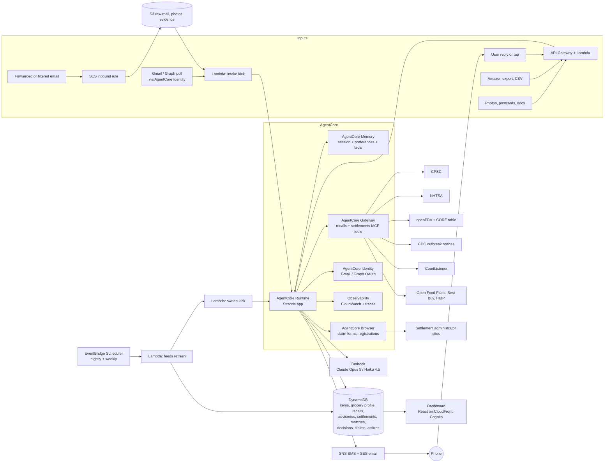

# Guardian: Build Plan

**Hackathon:** Agents for Humans (AWS, Strands Agents SDK)
**Track:** Everyday Agents
**One line:** A background agent that builds a quiet inventory of what your household buys and owns, watches recall feeds, food-outbreak advisories, class-action settlements, and warranty windows on your behalf, and interrupts you only when something you own is affected and a decision is needed. After one approval it files the claim, requests the remedy, and tracks the money until it lands.

> The agent's best output is silence. The product's headline metric is how rarely it has to talk to you, and the second is how much it has recovered for you.

**Status of this document.** Section 3 is a deliberately verbose scope catalog. It lists everything Guardian could plausibly pull from, watch, and do, tiered as Core, Expanded, or Speculative, with feasibility notes. It is meant to be pared down. Everything after Section 3 is written to the Core tier plus the Expanded items most likely to survive: Gmail ingestion, the mailroom for photos and postcards, the standing grocery profile with outbreak advisories, and class-action claim filing with payout to PayPal.

---

## 1. The pitch

Every household owns hundreds of products, buys groceries every week, and usually has a car. Four kinds of money and safety attach to those purchases, and almost nobody collects on any of them:

1. **Recalls.** Agencies issue hundreds of consumer-product recalls a year plus vehicle, food, drug, and device recalls. Notices are broadcast to everyone and matched by no one.
2. **Food-safety advisories.** Outbreak investigations often never become a recall. In the summer 2026 romaine E. coli outbreak, the only public record for ten weeks was one row on an FDA table reading "Not Yet Identified," and when FDA closed the file on 2026-09-10 it named no grower, no processor, and no brand. A household that buys romaine every week had nothing to act on and nobody to tell them.
3. **Class-action settlements and refund programs.** Postcards arrive with a Notice ID and a deadline. Most go in the recycling. Money that is legally yours for a product you already bought goes unclaimed because the claim form takes twenty minutes and proof of purchase is in an email from three years ago.
4. **Warranties and purchase protections.** Manufacturer warranties, extended plans, and credit-card benefits expire unused because nobody remembers the term or can find the receipt.

Guardian fixes all four with one habit: forward the receipt, or snap a photo of the postcard. From there it runs alone.

- **Capture.** Receipts, order confirmations, delivery receipts, settlement notices, and photos of labels become structured records: what you own, when you bought it, where, for how much, with which model, UPC, lot code, and warranty term.
- **Watch.** Every night it checks new recalls, outbreak advisories, and settlement notices against your inventory and your standing grocery profile.
- **Decide.** It surfaces one message with one decision when something you own is affected and the stakes warrant it. Everything else goes to a dashboard log and a monthly digest.
- **Act.** After a single approval it requests the remedy, files the settlement claim with your proof of purchase attached and your PayPal email as the payout destination, submits the warranty claim, and follows up until the money or the repair kit arrives.

**Who it's for.** The household's default administrator. Sharpest for parents of young children, car owners, PC builders and gadget buyers who accumulate settlement-eligible hardware, and anyone who orders groceries online and would like to know when the thing in their fridge is the thing on the news.

**Why it matters.** Recalls exist because products injure people. Outbreak advisories exist because food makes people sick. Settlements exist because a court decided you were owed money. Warranties are contracts you paid for. The cost of missing any of them is borne by exactly the people too busy to track them.

---

## 2. How it scores on the rubric

| Criterion | What Guardian shows |
|---|---|
| Technical implementation | A Strands `Graph` of specialist agents; tool-level and hook-level **interrupts** that pause a nightly job until a human answers hours later; **structured output** for every judgment; a recall-and-settlement **MCP server** exposed through **AgentCore Gateway**; **AgentCore Memory** for household facts and preferences; **AgentCore Runtime** hosting; **AgentCore Browser** filling settlement claim forms with a human attesting before submit; **AgentCore Identity** holding the Gmail OAuth grant; **Observability** traces shown in the demo; a live demo URL. |
| Design | A complete loop: capture, watch, decide, act, log, get paid. A dashboard whose hero numbers are "days since Guardian needed you" and "recovered so far." |
| Potential impact | Real public data, real hazards, real money. The demo runs against live CPSC, NHTSA, FDA, and CourtListener feeds, not mocks. |
| Creativity | Inverts the "another app to check" model. A notification budget as a first-class design rule. A standing grocery profile that turns a brandless outbreak advisory into "check the romaine you bought Tuesday." Deterministic code where determinism is right, LLM only where judgment is needed, and the pitch says so out loud. |
| Presentation | A phone buzzing with a one-tap decision is inherently demo-able. The video shows a receipt going in, a postcard being photographed, and a settlement claim going out with a confirmation number. |

---

## 3. Scope catalog (verbose, to be pared down)

### 3.0 How to read this section

Every item is tagged with a tier and a feasibility color.

| Tier | Meaning |
|---|---|
| **Core** | In the submission. The product does not make sense without it. |
| **Expanded** | Built after Core works end to end. High value, clear path. |
| **Speculative** | Parked. Interesting, but blocked by access, terms of service, sensitivity, or effort. Listed so the idea is not lost. |

| Feasibility | Meaning |
|---|---|
| **Green** | Official API, official export, or a stable machine-readable email format. |
| **Yellow** | Works, with quirks: human-initiated exports, semi-structured emails, rate limits, or OAuth verification hurdles. |
| **Red** | Requires browser automation against sites whose terms may prohibit it, requires credentials Guardian must never handle, or touches data too sensitive for v1. |

### 3.1 Intake: where purchases and possessions come from

#### 3.1.1 Email channels

| Channel | Tier | Feasibility | How | Gotchas |
|---|---|---|---|---|
| Forward-to-address (`receipts@<your-domain>`) | Core | Green | SES inbound rule to S3, Lambda kicks the intake agent. | Universal fallback. Works with any mail provider. Requires the user to forward or set up a filter. |
| Gmail auto-forward filter | Core | Green | The user creates one Gmail filter ("from:(amazon.com OR instacart.com OR shopify.com ...) forward to receipts@...") after verifying the forwarding address. Zero OAuth. | Gmail requires confirming the forwarding address once. The filter list is maintained by Guardian as a copy-paste snippet in Settings. |
| Gmail API (OAuth via AgentCore Identity) | Expanded | Yellow | `gmail.readonly` scope; Guardian searches historical mail for receipts going back years, which backfills the inventory in one pass. Token stored in AgentCore Identity, never in chat or logs. | `gmail.readonly` is a restricted scope. An external app in "Testing" status is limited to 100 test users and its refresh tokens expire after 7 days; publishing requires Google verification and a security assessment. For the hackathon, run in Testing with the judges' addresses added as test users, or demo the historical backfill on the builder's own account and rely on the auto-forward filter for ongoing capture. |
| Microsoft Graph (Outlook, Hotmail, Live) | Expanded | Yellow | `Mail.Read` delegated permission via Identity. Same parser pipeline. | Consent screen and app registration; personal accounts supported. |
| iCloud, Yahoo, Fastmail, other IMAP | Speculative | Red | Would require an app-specific password, which is a credential Guardian must never handle in conversation. | Route these users to the forwarding filter instead. |
| USPS Informed Delivery digest | Speculative | Yellow | Informed Delivery emails a daily digest with grayscale scans of incoming envelopes and postcards. Guardian can spot a settlement postcard or recall letter before it is opened and queue a "photograph this when it arrives" reminder. | Image-only, low resolution; classification, not extraction. Charming demo beat if time allows. |

#### 3.1.2 Merchant and service parsers (email formats)

Each parser is a small module: sender allowlist, subject pattern, HTML-to-text, then a Haiku 4.5 extraction into `InventoryItem` or `GroceryReceipt` with a retailer-specific hint prompt. Recorded fixtures under test for each. Parsers are ordered by how much value they unlock.

**General retail**

| Merchant | Tier | Feasibility | Notes |
|---|---|---|---|
| Amazon | Core | Yellow | Order confirmation, shipped, and delivered emails. Many now omit item names and show only "Your order of ..." with a truncated title; line items are often missing entirely. Pair with the Amazon data export (3.1.3) for completeness. Amazon Fresh and Whole Foods receipts arrive as separate "Your Amazon Fresh order" emails with full line items. |
| Shopify-powered stores | Core | Green | Every Shopify store sends order confirmations from a standard Liquid template ("Order #1042 confirmed", sender shows the store name, footer references Shopify). Consistent structure with line items, SKUs, variants, and prices. The email links to an order status page with a signed token; fetching it returns full structured line items. One parser covers tens of thousands of merchants. |
| Target | Core | Green | Order and pickup emails with line items; Target Circle in-store digital receipts if the user opted in. |
| Walmart | Core | Green | Online order emails with line items. In-store paper receipts include item names and UPC codes, which is excellent for matching; photograph them (3.1.4). Walmart's online receipt lookup requires card digits and is user-only. |
| Best Buy | Core | Green | Order emails with model numbers and SKUs. Best Buy's Products API (3.1.3) enriches with UPC and manufacturer warranty terms. |
| Costco | Expanded | Yellow | Online order emails are structured; warehouse receipts appear in the Costco app, not email. Photograph paper receipts. |
| Home Depot, Lowe's | Expanded | Green | Order emails with model and SKU; strong for appliances, tools, and smoke detectors. |
| Newegg, Micro Center, B&H | Expanded | Green | Component-level detail (RAM kits, SSDs, GPUs), which is exactly what consumer-electronics settlements key on. Micro Center is the likely source of a G.Skill kit receipt. |
| Apple, Google Store, Samsung | Expanded | Green | Serial numbers often appear in shipment emails; warranty windows are well defined. |
| Etsy, eBay | Expanded | Yellow | Structured order emails; seller-side warranty is usually nil but recalls still apply. |
| Temu, AliExpress, Shein | Speculative | Yellow | High recall exposure, low item value, messy naming. Include if effort allows. |
| Chewy, Petco (pet food recalls) | Expanded | Green | Pet food is a recurring FDA recall category. |
| CVS, Walgreens, Rite Aid (OTC only) | Expanded | Yellow | Online order emails for OTC items map to openFDA drug and device recalls. Prescription data is parked (3.2.9). |
| Tire Rack, Discount Tire | Speculative | Green | Tire orders carry DOT codes, which map to NHTSA tire recalls and tire age. |

**Grocery and food delivery** (feeds the standing grocery profile, 3.1.6)

| Service | Tier | Feasibility | Notes |
|---|---|---|---|
| Instacart | Core | Green | "Your order receipt" emails list every item with brand, size, quantity, price, replacements, and the store. Instacart's Developer Platform is for retailers and partners, not consumers, so email is the path. |
| Amazon Fresh, Whole Foods | Core | Green | Full line items in delivery receipts. |
| Walmart grocery (delivery and pickup) | Core | Green | Line items with brand and size. |
| Kroger family (Kroger, Ralphs, Fred Meyer, King Soopers, Harris Teeter) | Expanded | Yellow | Digital receipts by email if enabled in the loyalty account; Kroger's public API covers products and locations, not purchase history. |
| Albertsons, Safeway, Vons, Jewel-Osco | Expanded | Yellow | Digital receipts by email if enabled. |
| Shipt (Target), Costco Same-Day | Expanded | Green | Structured receipts. |
| DoorDash, DashMart; Uber Eats; Grubhub; Gopuff | Expanded | Yellow | Restaurant orders matter less for recalls, but DashMart and Gopuff sell packaged groceries. Consumer APIs do not expose order history; email it is. |
| HelloFresh, Blue Apron, Factor, meal kits | Speculative | Yellow | Weekly box contents by email; meal-kit ingredients have been recalled. |
| Thrive Market, Misfits Market, Boxed | Speculative | Green | Structured receipts. |
| Square, Toast, Clover email receipts | Speculative | Yellow | Small-merchant point-of-sale receipts (butchers, bakeries, farm stands). Item names are freeform. |
| Apple Pay, Google Pay receipts | Speculative | Green | Merchant, date, amount only. Useful as a nudge: "you shopped at Costco on 09/03; forward or photograph that receipt." |

#### 3.1.3 Platform APIs and data exports

| Source | Tier | Feasibility | What it yields | Notes |
|---|---|---|---|---|
| Shopify order status page | Core | Green | Full line items, SKUs, variants, fulfillment | Linked from every Shopify confirmation email with a signed token. Shopify has no consumer-facing "all my orders across stores" API; the Shop app is closed. The merchant Admin API is irrelevant here. |
| Amazon "Request Your Information" export | Expanded | Yellow | `Retail.OrderHistory.1.csv` with every order, item title, ASIN, quantity, price, and date | User-initiated at Amazon's Privacy Central; Amazon emails a ZIP after several days. Guardian guides the user once, then parses the upload. This is the only complete Amazon history and it backfills years of inventory in one shot. |
| Best Buy Products API | Expanded | Green | UPC, model number, manufacturer warranty parts and labor terms, category | Free developer key. Used to enrich any electronics item, regardless of where it was bought. |
| Open Food Facts API | Core | Green | Barcode to brand, product name, categories, packaging | Free and open. Turns a scanned grocery barcode or an Instacart line into a canonical product for FDA matching. |
| UPCitemdb, Barcode Lookup | Expanded | Yellow | General UPC to product | Free tiers are rate-limited; paid tiers cheap. |
| NHTSA vPIC | Core | Green | VIN to year, make, model, and more | No key. |
| Kroger API | Speculative | Green | Product and location lookup | No purchase history in the public API. |
| Instacart Developer Platform | Speculative | Red | Retailer and partner integrations only | Not a consumer surface. |
| Uber API | Speculative | Red | Rider trip history, not Eats orders | Not useful. |
| Walmart receipt lookup | Speculative | Red | Itemized receipt by store, date, card last four, and total | Requires card digits. User-only; never automated. |
| Plaid or similar bank aggregation | Speculative | Red | Merchant, date, amount for every card transaction | Provides no item detail, and connecting bank accounts is outside Guardian's boundary. At most it could nudge "you bought something at Home Depot on 9/3; forward the receipt." Parked. |
| Retailer loyalty purchase-history pages | Speculative | Red | Itemized in-store history at Target, Kroger, Walgreens | Requires logged-in browser automation against sites whose terms generally prohibit it. Parked unless a retailer offers an export. |
| Home inventory app exports (Sortly, Encircle, spreadsheet) | Speculative | Green | Existing inventories | CSV import covers it. |

#### 3.1.4 Photos and documents (the mailroom)

Anything photographed or uploaded lands in a mailroom queue. A classifier routes it, a local barcode decoder runs first (barcodes are deterministic; do not ask a model to read a barcode), then a vision extraction produces the typed record.

| Document | Tier | Feasibility | Extracts | Notes |
|---|---|---|---|---|
| Paper receipts (thermal) | Core | Green | Merchant, date, line items, prices, sometimes UPC | Walmart, Target, Costco, and most grocers print UPCs or item codes. |
| Product labels and rating plates | Core | Green | Brand, model, serial, date code, manufacture date | Appliances, strollers, cribs, electronics, dehumidifiers. This is what "send me a photo of the label" asks for. |
| Packaging barcodes | Core | Green | UPC/EAN via `zxing-cpp` or `pyzbar` before any model call | Then Open Food Facts or UPC lookup for identity. |
| Food lot codes and best-by dates | Core | Yellow | Lot, best-by, plant code, "grown in" region | FDA `code_info` and FSIS lot lists match on these. Romaine and other produce often carry a harvest-region label that advisory matching needs. |
| Settlement postcards and notice letters | Expanded | Green | Case name, court, Notice ID, Confirmation Code or PIN, claim website, claim deadline, opt-out and objection deadlines, payment options | The postcard the user received for the G.Skill settlement is the model input. |
| Settlement notice emails | Expanded | Green | Same fields, plus the sender domain for legitimacy checks | Ingested by the same email pipeline with a "legal notice" classifier. |
| Warranty cards and extended-plan contracts | Expanded | Green | Provider, plan number, term, coverage, claim phone or URL | SquareTrade, Asurion, AppleCare, Geek Squad, Home Depot Protection Plan. |
| Recall notice letters (manufacturer mailers) | Expanded | Green | Recall number, affected models, remedy instructions | Confirms a match and provides the remedy path. |
| Data breach notice letters | Expanded | Green | Company, breach date, offered credit monitoring, enrollment code, deadline | Feeds 3.2.4. |
| Rebate forms and rebate confirmation emails | Speculative | Yellow | Offer number, deadline, required proof, tracking URL | Feeds 3.2.6. |
| Vehicle documents (VIN plate, registration, insurance card) | Core | Green | VIN, plate, year, make, model | VIN is all that is needed. |
| Tire sidewalls (DOT tire identification number) | Speculative | Yellow | Manufacturer plant, size, week and year of manufacture | Maps to NHTSA tire recalls and tire age. |
| Car seat labels | Expanded | Green | Manufacturer, model, date of manufacture, expiration | Car seat recalls and expiry (3.2.7). |
| Smoke and CO detector back labels, helmets, fire extinguishers | Speculative | Green | Model, manufacture date | Lifecycle expirations (3.2.7). |
| Appliance manuals and spec sheets | Speculative | Green | Model family, warranty terms | Backup when the label is unreadable. |
| Pharmacy labels | Speculative | Red | Drug, strength, NDC, lot, pharmacy | Sensitive health data. Parked; see 3.2.9. |

#### 3.1.5 Manual and bulk

- Manual add form (Core).
- CSV import with a documented template (Core; also used for demo seeding).
- Bulk photo drop: a folder of receipt photos uploaded at once, processed as a batch through the mailroom (Expanded).
- Email backfill: with the Gmail API grant, a one-time search across years of mail for receipts (Expanded).
- Amazon export upload (Expanded, see 3.1.3).

#### 3.1.6 The standing grocery profile

Derived, not entered. From every grocery and food-delivery receipt, Guardian maintains per household:

- **Regulars.** Items bought at least three times in 90 days: canonical product (via Open Food Facts when a barcode or exact brand is present), brand, size, store, typical cadence.
- **Likely in the kitchen now.** For each regular, an estimate of whether it is currently in the house, from the last purchase date and a category shelf-life table (bagged lettuce 7 to 10 days, deli meat 5 to 7 days, eggs 3 to 5 weeks, frozen items months). This is what makes an advisory actionable: "you bought organic romaine hearts on Tuesday; they are probably still in the fridge."
- **Region signals.** Where packaging or receipts carry a grown-in or packed-in location, keep it. Produce advisories frequently reference a growing region before any brand.
- **Household sensitivities** (optional, user-entered): infant in the house (formula and baby food recalls are critical), pregnancy (listeria advisories are critical), allergies (undeclared-allergen recalls, which are the most common FDA food recall class, become critical instead of standard).

The profile is a set of documents in DynamoDB mirrored as semantic facts in AgentCore Memory so the triage agent can reason with it.

### 3.2 Watch: what Guardian monitors

#### 3.2.1 Product recalls

| Source | Tier | Feasibility | Covers | Notes |
|---|---|---|---|---|
| CPSC SaferProducts Recall API | Core | Green | Consumer products | No key, no pagination; query by date window. |
| NHTSA Recalls by vehicle | Core | Green | Vehicle safety recalls including park-outside and do-not-drive flags | No key. |
| NHTSA tires and child seats | Expanded | Yellow | Tire and car seat recalls | Verify the API surface in Phase 1; NHTSA publishes these but the query paths differ from vehicles. |
| NHTSA equipment recalls | Speculative | Yellow | Aftermarket parts, trailers, motorcycle helmets | Same. |
| openFDA enforcement (food, drug, device) | Core | Green | Food, formula, OTC and Rx drugs, cosmetics, devices | 1,000 requests/day without a key, 120,000 with a free key. |
| USDA FSIS Recall API | Expanded | Yellow | Meat, poultry, egg products | Returned 403 to a generic fetch; send a browser-like User-Agent and verify. |
| FoodSafety.gov recalls and alerts feed | Expanded | Green | Aggregated FDA and FSIS | RSS; useful as a cross-check. |
| Manufacturer recall pages (IKEA, Peloton, Fisher-Price, Graco, Philips) | Speculative | Red | Brand-specific recall and safety notices | Scraping; only where an RSS or JSON feed exists. |
| EPA pesticide and consumer chemical recalls | Speculative | Yellow | Pesticides, some household chemicals | Low volume. |
| Health Canada, UK OPSS, EU Safety Gate | Speculative | Green | Non-US recalls | Parked; US-only in v1. |

#### 3.2.2 Food outbreaks and advisories (not formal recalls)

This is the category the romaine case exposed. Outbreak investigations can run for weeks with no product named, then name a product category without a brand, then close without ever naming a grower. Guardian handles three levels of information:

| Level | Example | Guardian behavior |
|---|---|---|
| Investigation open, product not identified | FDA table row "Not Yet Identified" | Log only. Nothing to act on. Dashboard shows "1 open investigation, no product named." |
| Product category or region named, no brand | "Romaine lettuce, Salinas Valley," or "iceberg lettuce (Cyclospora, July 2026)" | Match against the standing grocery profile. If a regular in that category is likely in the kitchen, surface an advisory: what to check for, what to discard, how to get a refund from the store. Severity follows the pathogen and household sensitivities. |
| Brand, lot, or retailer named, or a recall issued | Standard recall | Full recall matching (3.2.1). |

| Source | Tier | Feasibility | Notes |
|---|---|---|---|
| FDA "Investigations of Foodborne Illness Outbreaks" (CORE table) | Core | Yellow | HTML table with reference number, pathogen, product linked (if any), case count, status, whether an advisory or recall exists, last updated. No API; parse weekly and diff rows. |
| CDC multistate foodborne outbreak notices | Core | Yellow | HTML list plus individual notice pages with "what consumers should do." Parse weekly and diff. |
| FoodSafety.gov alerts feed | Expanded | Green | RSS. |
| State health department advisories | Speculative | Red | Fifty formats. Parked. |
| Food Safety News, Consumer Reports food safety | Speculative | Yellow | Secondary sources that often carry detail agencies omit. Treat as hints, never as the trigger. |

Honesty rule for the pitch: when agencies name nothing, Guardian can only tell you that an investigation exists. The demo should show that limit rather than pretend around it, and then show what it does the moment a category is named.

#### 3.2.3 Class-action settlements and refund programs

Two ways in: a notice arrives, or the inventory says you are probably eligible.

**Notice-driven (Expanded, Green).** Postcards and emails carry the case name, the administrator's website, a Notice ID and Confirmation Code (or Claim ID and PIN), and deadlines. The mailroom extracts them. Guardian then verifies the site is the court-approved administrator before doing anything else (guardrails below), pulls the long-form notice and claim form, determines what the claim requires (attestation only, or proof of purchase, or model and serial), and assembles it.

**Inventory-driven discovery (Expanded, Yellow).** Because Guardian knows you bought a G.Skill DDR4 kit from Micro Center in 2022, it can find an open settlement whose class definition covers that product and period even if the postcard never came.

| Source | Tier | Feasibility | Notes |
|---|---|---|---|
| Mailed postcards and notice letters (photo) | Expanded | Green | Primary. Receiving a notice is itself evidence of class membership. |
| Settlement notice emails | Expanded | Green | Same pipeline; sender domain is checked against the administrator list. |
| FTC refund programs | Expanded | Green | Official list of FTC-administered refunds with claim instructions and deadlines; FTC pays by check and PayPal. |
| CFPB and state attorney general settlement pages | Expanded | Yellow | Official but unstructured. Parse the handful with feeds. |
| CourtListener / RECAP API (Free Law Project) | Expanded | Green | Search dockets for "preliminary approval" and "settlement" with company and product names from the inventory; set alerts by keyword. Free API key. Gives the case number, court, and documents, including the settlement agreement's class definition. |
| Settlement administrator sites (Kroll, Epiq, JND, Angeion, Rust Consulting, Simpluris, Verita, A.B. Data, Analytics Consulting, CPT Group) | Expanded | Yellow | Each administrator hosts per-case sites with claim forms. Maintain an allowlist of administrator domains for legitimacy checks. Some publish case lists; most do not have APIs. |
| Aggregators (ClassAction.org, TopClassActions, Consumer Action, Catch) | Speculative | Red | Convenient, but scraping third-party sites is fragile and their terms vary. Use as a discovery hint only, and always resolve to the official administrator site. |
| Data-breach settlement trackers | Expanded | Yellow | See 3.2.4. |

Settlement types Guardian should recognize, because the claim shape differs:

| Type | Typical requirement | Example shape |
|---|---|---|
| Consumer product defect or misrepresentation | Attestation, sometimes model or serial, sometimes proof of purchase for higher tiers | Memory kits sold as a rated speed, appliances that failed, cosmetics with a banned ingredient |
| Pricing, antitrust, or fee | Attestation that you bought within the class period; retailer or card records sometimes accepted | "You bought X between 2019 and 2023" |
| Data breach | Attestation, plus documented losses for higher tiers | Credit monitoring plus cash |
| Privacy (biometric, tracking) | Residency and usage attestation | State-specific |
| Auto defect and warranty extension | VIN | Often reimbursement of past repairs with invoices |
| Subscription and billing | Account email | Automatic if identified, otherwise claim |

**Guardrails for claims** (these are product features, and the pitch says so):

- The user, not the agent, attests. Guardian prefills; the human reviews a one-screen summary and approves the submission. The approval is recorded with a timestamp and the exact form contents.
- Guardian never claims for a product that is not in the inventory or explicitly attested by the user in the approval.
- Guardian verifies the claim site: the domain must match the administrator named in the court notice, the administrator allowlist, or a CourtListener docket document. Look-alike domains and "settlement rewards" lead-generation sites are refused and flagged.
- Guardian never solves CAPTCHAs. When a form presents one, the browser session pauses and the human completes it.
- Payout destination is the user's PayPal email, Venmo handle, Zelle contact, or mailing address stored in the payout profile. These are addresses, not credentials. Guardian never logs in to PayPal, Venmo, or a bank.
- Deadlines are tracked as first-class dates: claim deadline, opt-out deadline, objection deadline, final approval hearing, expected payment window.

#### 3.2.4 Data breaches and identity

| Item | Tier | Feasibility | Notes |
|---|---|---|---|
| Have I Been Pwned API by email | Expanded | Green | Paid key at a nominal price. Lists breaches per address. Cross-reference against open breach settlements. |
| Breach notice letters (photo) | Expanded | Green | Extract company, dates, offered monitoring, enrollment code and deadline. |
| Credit monitoring enrollment | Speculative | Red | Enrollment often requires SSN. Guardian surfaces the offer and deadline; the user enrolls. |
| Identity theft insurance claims | Speculative | Red | Parked. |

#### 3.2.5 Warranties and purchase protections

| Item | Tier | Feasibility | Notes |
|---|---|---|---|
| Manufacturer warranty term | Core | Green | From the receipt, the Best Buy API, or a category default table with the source flagged. |
| Extended plans (SquareTrade/Allstate, Asurion, AppleCare, Best Buy plans, Geek Squad, Home Depot and Lowe's protection plans, Costco extended) | Expanded | Green | Plan documents by email or photo; claim URL and phone. |
| Retailer return windows (including holiday extensions) | Expanded | Green | Per-retailer table. Surfaces only when the user reports a problem inside the window. |
| Credit-card extended warranty | Expanded | Yellow | Many issuers add a year. Stored by card program name (never a number). Issuer benefit guides differ; maintain a small table for the common programs. |
| Credit-card purchase protection (damage or theft within 90 to 120 days) | Expanded | Yellow | Claim through the issuer's benefits administrator (Card Benefit Services, Assurant, Chubb, AIG) with receipt and card statement. Deadlines are short; this is a strong surfacing case. |
| Credit-card price protection and return protection | Speculative | Yellow | Fewer cards offer these now. Requires price monitoring. |
| Cell phone protection via card | Speculative | Yellow | Requires the bill be paid with the card. Parked. |

#### 3.2.6 Rebates and price adjustments

| Item | Tier | Feasibility | Notes |
|---|---|---|---|
| Mail-in and online rebates | Speculative | Yellow | Track offer number, deadline, required proof, and status page. Rebate emails and forms via mailroom. |
| Retailer price-adjustment windows (Target 14 days, Costco 30 days, Best Buy price match window) | Speculative | Red | Needs price monitoring, which means scraping. Parked. |
| Amazon price drops (Keepa API) | Speculative | Yellow | Paid API; Amazon no longer offers price adjustments, so value is low. Parked. |

#### 3.2.7 Lifecycle expirations (safety-adjacent)

| Item | Tier | Feasibility | Notes |
|---|---|---|---|
| Car seat expiration | Expanded | Green | Date of manufacture plus manufacturer life (typically 6 to 10 years). Read from the label photo. |
| Smoke and CO detectors (10 years) | Speculative | Green | From the back label. |
| Tires (age from DOT code) | Speculative | Yellow | Many manufacturers advise replacement at 6 to 10 years regardless of tread. |
| Helmets after impact, fire extinguishers, water filters, EpiPens, infant formula lots | Speculative | Green | Reminders, not decisions. Only surface if the household turns them on. |

#### 3.2.8 Vehicle extras

| Item | Tier | Feasibility | Notes |
|---|---|---|---|
| NHTSA complaints by vehicle | Speculative | Green | `api.nhtsa.gov/complaints/complaintsByVehicle`. Useful context when the user reports a problem. |
| Technical service bulletins and manufacturer communications | Speculative | Yellow | NHTSA publishes datasets; API coverage to verify. TSBs sometimes reveal extended coverage ("customer satisfaction programs") that dealers do not advertise. |
| Warranty extension programs and goodwill coverage | Speculative | Yellow | Often announced in TSBs or class settlements. |
| Lemon law windows, registration and inspection deadlines | Speculative | Green | Parked; adjacent to the product but not the core promise. |

#### 3.2.9 Medications and medical devices

| Item | Tier | Feasibility | Notes |
|---|---|---|---|
| Rx recalls matched to pharmacy labels | Speculative | Red | Health data; requires explicit opt-in and stricter handling. Parked for v1. |
| Medical device recalls by serial range (CPAP, glucose monitors, infant monitors) | Expanded | Yellow | openFDA device enforcement plus the device's serial from a label photo. Non-prescription devices only in v1. |
| OTC drug and supplement recalls | Core | Green | openFDA drug enforcement against OTC purchases from pharmacy and grocery receipts. |

### 3.3 Act: what Guardian does after approval

| Action | Tier | Feasibility | Notes |
|---|---|---|---|
| Request a recall remedy by email | Core | Green | From the CPSC consumer contact or manufacturer recall page; receipt attached. |
| Request a recall remedy by web form | Expanded | Yellow | AgentCore Browser with the human approving submit. |
| Draft a phone script for phone-only remedies | Expanded | Green | Some recalls are phone-only. Guardian prepares what to say and what numbers to have ready. |
| Retailer refund for recalled or advised-against food | Expanded | Green | Most grocers refund recalled items with or without a receipt. Guardian tells the user which store, what to bring, and logs the refund. |
| "Discard and sanitize" checklist for food advisories | Core | Green | Product-specific: what to throw out, what to wipe down, and when it is safe to buy again. |
| Warranty claim by email | Core | Green | Manufacturer contact, model and serial, problem, receipt attached. |
| Warranty or extended-plan claim by web form | Expanded | Yellow | Browser with human approval. |
| Settlement claim filing | Expanded | Yellow | Full pipeline in Section 9. Payout to PayPal email. |
| Credit-card benefit claim | Expanded | Yellow | Benefits administrator forms; receipt and statement excerpt required (the user supplies the statement excerpt; Guardian never accesses the card account). |
| Rebate submission | Speculative | Yellow | Form fill with proof; tracking. |
| Product registration with the manufacturer | Expanded | Yellow | Registration is how manufacturers notify owners of recalls. Browser-filled with the user's contact details, which are not credentials. |
| Follow-ups and nudges | Core | Green | If no reply in 10 business days, draft the nudge and ask once. |
| Appeals and disputes | Expanded | Green | When a warranty or settlement claim is denied, draft the appeal with the policy language cited. |
| Evidence locker | Core | Green | Every receipt, label photo, notice, submitted form, confirmation number, and screenshot stored per claim. |
| Payment tracking and reconciliation | Expanded | Green | Expected payment window per claim; the user confirms receipt (or forwards the PayPal notification email, which Guardian parses); the dashboard ledger updates. |

**Payout destinations and the credential boundary.** The payout profile stores a PayPal email, a Venmo handle, a Zelle email or phone, and a mailing address. These are destinations. Guardian enters them on forms. Guardian never holds a password, a card number, a bank login, or a one-time code, never logs in to a payment app, and never moves money itself. Funds flow from the administrator to the user's PayPal directly.

### 3.4 Surfaces

- **SMS, email, push.** One decision per message, numbered replies, signed one-tap links.
- **Dashboard home.** Quiet score, recovered-to-date ledger, items watched, sweeps run, open investigations, pending decisions.
- **Owed to you.** Everything with money attached and a deadline: settlement claims, warranty claims, benefit claims, refunds, rebates. Sorted by deadline.
- **Mailroom.** Photos and documents awaiting or completed processing, with what was extracted and a "fix this" affordance.
- **Kitchen.** The standing grocery profile and any active advisories.
- **Inventory, activity, settings.** As in the original plan, plus the payout profile and parser-filter snippet.

### 3.5 Tiering summary

| Tier | Contents | Rough effort |
|---|---|---|
| **Core** | Forward address and Gmail filter; Amazon, Shopify, Target, Walmart, Best Buy, Instacart, Amazon Fresh, Walmart grocery parsers; photo intake for receipts, labels, barcodes, lot codes, VIN; Open Food Facts and vPIC enrichment; CPSC, NHTSA vehicles, openFDA; FDA CORE and CDC outbreak parsing; standing grocery profile; matching engine; severity and budget policy; recall remedy and warranty claim by email; discard checklists; evidence locker; dashboard; AgentCore deployment | The original ten phases plus about a week |
| **Expanded** | Gmail API backfill via Identity; Microsoft Graph; Amazon export; Best Buy API; remaining retail and grocery parsers; mailroom for postcards, notices, warranty cards, breach letters, car seats; settlement notice ingestion, legitimacy checks, claim assembly, browser filing with attestation, payout profile, payment tracking; CourtListener discovery; FTC refunds; extended plans and card benefits; device serial recalls; car seat expiry; appeals | Roughly doubles the build |
| **Speculative** | Everything marked Speculative above | Parked |

### 3.6 Hard boundaries

Guardian will not, even if asked:

- Enter or store passwords, card numbers, bank credentials, SSNs, or one-time codes.
- Log in to retailer, bank, or payment accounts on the user's behalf using the user's credentials.
- Solve or bypass CAPTCHAs.
- Submit a sworn claim form without a recorded, per-claim human approval.
- File a claim for a product the inventory does not contain unless the user explicitly attests ownership in the approval.
- Scrape a site that prohibits it when an official channel exists.
- Handle prescription data in v1.

---

## 4. The autonomy contract

### Triggers

| Trigger | Source | What runs |
|---|---|---|
| Receipt or notice email arrives | SES inbound (forwarded or filtered), Gmail API poll, Graph poll | Intake agent or mailroom agent within minutes |
| Photo or document uploaded | Dashboard, MMS, bulk drop | Mailroom agent |
| Nightly at 03:00 household-local | EventBridge Scheduler | Feed refresh, then the match graph |
| Weekly | EventBridge Scheduler | openFDA refresh; FDA CORE and CDC outbreak diff; CourtListener discovery queries; settlement deadline sweep |
| Settlement notice ingested | Mailroom | Claims agent: verify site, fetch notice and form, assess requirements |
| Outbreak advisory names a category or region | Weekly diff | Grocer agent matches against the standing profile |
| User says something broke | SMS reply or dashboard | Warranty agent |
| User answers a decision | Signed link or SMS reply | Graph resumes from its interrupt |
| Claim confirmation or payment email arrives | Inbound email | Claims agent updates status and the ledger |

### Surfacing policy

| Situation | What the user experiences |
|---|---|
| Confirmed recall match, critical hazard (death, serious injury, fire, choking, amputation, lead, FDA Class I, "do not drive") | Immediate push and SMS. Remedy already drafted. One tap sends it. |
| Confirmed recall match, standard hazard | Weekly digest. Auto-requests remedy if the household preference allows. |
| Probable match, one fact missing | One question, usually a photo request. |
| Outbreak advisory names a category or region that matches a regular likely in the kitchen | Immediate if the pathogen is E. coli O157, Listeria, or Salmonella and the household has an infant, pregnancy, or elderly member; otherwise same-day. Message says exactly what to check and what to do. |
| Outbreak investigation open with no product named | Nothing. Dashboard shows the open investigation count. |
| Settlement notice ingested and claim assembled | One message: what the case is, what you would get, what you must attest, the deadline. One tap opens the review-and-attest screen. |
| Settlement discovered from inventory (no notice received) | Weekly digest unless the deadline is within 14 days. |
| Warranty ending within 30 days on an item over the value threshold | One question: anything wrong with it? |
| Purchase-protection window closing on a high-value item | One question, only if the user has reported damage or loss. Otherwise silent. |
| User reports a problem | Coverage check across manufacturer, extended plan, and card benefit; drafted claim; one approval. |
| Claim paid | One line: "Paid: $38.50 from the DDR4 settlement landed in PayPal." No decision needed; goes to the digest unless the user wants immediate confirmations. |
| Nothing matched | Nothing. The dashboard log records the sweep. |

### Notification budget

Default: at most one unsolicited interruption per week, except critical hazards and claim deadlines inside 72 hours, which always go through. Everything else accumulates in the dashboard and a monthly digest. Stored in AgentCore Memory as a user preference; changeable by replying in plain language.

### Sample messages (illustrative; recall and case numbers are placeholders)

**Critical recall:**
> Guardian: The Graco stroller you bought at Target on 2024-03-14 matches CPSC recall 25-000 (hinge can pinch or amputate a fingertip). Remedy: free repair kit. Reply 1 to request it, 2 if you no longer own it, 3 for details.

**Outbreak advisory:**
> Guardian: FDA and CDC say romaine lettuce is linked to an E. coli O157:H7 outbreak. Your Instacart order on Tuesday included Organic Romaine Hearts (3 ct). No brand has been named. Throw it out, wipe the drawer, and Safeway will refund it. Reply 1 when done, 2 if you already used it and want symptom guidance.

**Settlement claim ready:**
> Guardian: Your postcard is for the DDR4 memory settlement. Your Micro Center receipt from 2022-05-08 for a G.Skill Trident Z 32 GB kit is proof of purchase. Estimated payment: $20 to $60, to your PayPal. Claim deadline 2026-11-02. Reply 1 to review and attest, 2 to skip.

**Warranty window:**
> Guardian: Your Vitamix warranty ends 2026-10-01. Anything wrong with it? If yes, reply with a sentence and I'll draft the claim.

---

## 5. Data sources

### A. Product recalls

| Source | Endpoint | Covers | Match keys | Notes |
|---|---|---|---|---|
| CPSC SaferProducts Recall API | `https://www.saferproducts.gov/RestWebServices/Recall?format=json&RecallDateStart=YYYY-MM-DD&RecallDateEnd=YYYY-MM-DD` | Consumer products | `Products[].Name`, `Products[].Model`, `Products[].UPC`, `Manufacturers[].Name`, `Retailers[].Name`, sold-date range | No key. No pagination. Also returns `Hazards`, `Remedies`, `ConsumerContact`, `Images`. |
| NHTSA vPIC | `https://vpic.nhtsa.dot.gov/api/vehicles/DecodeVinValues/{VIN}?format=json` | VIN decode | `ModelYear`, `Make`, `Model` | No key. |
| NHTSA Recalls | `https://api.nhtsa.gov/recalls/recallsByVehicle?make={make}&model={model}&modelYear={year}` | Vehicle recalls | Exact make, model, year | No key. Park-outside and do-not-drive flags. |
| NHTSA Complaints | `https://api.nhtsa.gov/complaints/complaintsByVehicle?make={make}&model={model}&modelYear={year}` | Owner complaints | Same | Context only. |
| openFDA Enforcement | `https://api.fda.gov/{food|drug|device}/enforcement.json?search=report_date:[YYYYMMDD+TO+YYYYMMDD]&limit=100&skip=N` | Food, formula, drugs, cosmetics, devices | `product_description`, `code_info`, `recalling_firm`, `classification`, `distribution_pattern` | Free key raises the daily limit to 120,000. Weekly data. |
| USDA FSIS Recall API | `https://www.fsis.usda.gov/fsis/api/recall/v/1` | Meat, poultry, eggs | Product items, establishment, states | Verify access with a browser-like User-Agent. |
| FoodSafety.gov | RSS feed of recalls and alerts | Aggregated | Title, link | Cross-check. |

### B. Outbreaks and advisories

| Source | Access | Fields to extract | Cadence |
|---|---|---|---|
| FDA Investigations of Foodborne Illness Outbreaks (CORE table) | HTML table at `fda.gov/food/outbreaks-foodborne-illness/investigations-foodborne-illness-outbreaks` | Reference number, pathogen, product linked (or "Not Yet Identified"), case count, status, advisory issued, recall initiated, last updated, link to the investigation page | Weekly diff, daily during an active advisory |
| CDC multistate foodborne outbreak notices | HTML list and notice pages | Pathogen, product, states, case counts, "what consumers should do," dates | Weekly diff |
| FoodSafety.gov alerts | RSS | Title, summary, link | Weekly |

### C. Settlements and refund programs

| Source | Access | Fields | Notes |
|---|---|---|---|
| Mailed and emailed notices | Mailroom | Case name, court, administrator URL, Notice ID, Confirmation Code or PIN, claim deadline, opt-out and objection deadlines, hearing date, payment options | Primary. |
| CourtListener REST API v4 | `https://www.courtlistener.com/api/rest/v4/search/` with `type=r` for RECAP dockets; alerts API for saved searches | Case name, docket number, court, parties, documents (settlement agreements carry the class definition) | Free API key. Query by company and product names from the inventory plus terms like "preliminary approval" and "settlement." |
| FTC refund programs | `ftc.gov/enforcement/refunds` (HTML) | Program, eligibility, deadline, administrator, payment method | Official. |
| State attorney general and CFPB settlement pages | HTML | Same | Parse a handful with feeds. |
| Administrator allowlist | Maintained JSON in the repo | Domains for Kroll, Epiq, JND, Angeion, Rust Consulting, Simpluris, Verita, A.B. Data, Analytics Consulting, CPT Group, and case-specific domains confirmed from court documents | Used for legitimacy checks. |

### D. Enrichment

| Source | Access | Yields |
|---|---|---|
| Open Food Facts | `https://world.openfoodfacts.org/api/v2/product/{barcode}` | Brand, product name, categories, packaging, sometimes origin |
| Best Buy Products API | `https://api.bestbuy.com/v1/products(upc={upc})?apiKey=...&format=json` and by SKU | UPC, model number, manufacturer warranty parts and labor, category |
| UPCitemdb, Barcode Lookup | REST | General UPC identity |
| Have I Been Pwned | `https://haveibeenpwned.com/api/v3/breachedaccount/{email}` with `hibp-api-key` | Breaches per address |

### E. Purchase platforms and mail

| Source | Access | Yields | Notes |
|---|---|---|---|
| SES inbound | Receipt rule to S3 | Raw MIME | Universal. |
| Gmail auto-forward filter | User-configured | Same as above | No OAuth. |
| Gmail API | OAuth `gmail.readonly` via AgentCore Identity; `users.messages.list` with a receipt query, `users.messages.get` | Historical backfill and ongoing poll | Restricted scope; Testing-mode limits (100 users, 7-day tokens). |
| Microsoft Graph | OAuth `Mail.Read` | Same | |
| Shopify order status page | Signed URL from the confirmation email | Line items, SKUs, variants | Fetch once per order. |
| Amazon Request Your Information | User-initiated ZIP, `Retail.OrderHistory.1.csv` | Complete order history | Takes days; one-time backfill. |

### Normalized recall record

```
RecallRecord
  recall_id       "cpsc#25-000" | "nhtsa#24V123" | "fda#F-1234-2026" | "fsis#012-2026"
  source          cpsc | nhtsa | fda_food | fda_drug | fda_device | fsis
  title, published_at, url
  products[]      { name, brand, model_numbers[], upcs[], lot_codes[], sold_from, sold_to, retailers[], regions[] }
  hazard_text
  severity        critical | standard
  remedy_text
  contact         { phone, email, url }
  raw_s3_key
```

### Normalized advisory record

```
AdvisoryRecord
  advisory_id     "fda-core#1234" | "cdc#2026-romaine"
  pathogen        e_coli_o157 | listeria | salmonella | cyclospora | hepatitis_a | other
  level           investigation_open | category_named | brand_or_lot_named | recall_issued
  product_terms[] ["romaine", "romaine hearts", "salad kits containing romaine"]
  regions[]       ["Salinas Valley, CA"]
  states[]
  consumer_action "do not eat" | "check label" | "none yet"
  first_seen, last_updated, url
```

### Normalized settlement record

```
SettlementRecord
  settlement_id     "cl#<docket>" | "notice#<hash>"
  case_name, court, docket_number
  administrator     { name, domain, verified_by: "notice" | "docket_document" | "allowlist" }
  class_definition  free text plus extracted { products[], brands[], model_patterns[], purchase_from, purchase_to, residency[] }
  claim             { url, requires_proof: bool, proof_types[], fields_required[], payment_options[] }
  deadlines         { claim, opt_out, objection, hearing, expected_payment_window }
  estimated_payment { low, high, basis }
  notice_ids        { notice_id, confirmation_code }   # present only when a notice was received
```

### Severity mapping

- FDA Class I, NHTSA park-outside or do-not-drive, CPSC hazard text containing death, serious injury, fire, burn, choking, strangulation, amputation, laceration, lead, or fall hazard for infant products: **critical**.
- Outbreak advisories with E. coli O157, Listeria, or Salmonella when the household has an infant, pregnancy, or elderly member: **critical**. Otherwise **standard** with same-day delivery.
- Undeclared-allergen recalls: **critical** only if the household lists that allergen; otherwise **standard**.
- Everything else: **standard**.
- Keyword pass first, triage agent confirms with structured output.

---

## 6. Architecture



### Components and why each exists

| Component | Role | Why |
|---|---|---|
| AgentCore Runtime | Hosts the Strands app behind `/invocations`; routes on `payload["kind"]` (intake, mailroom, sweep, resume, report_problem, claim, reconcile). | Session isolation, long-running invocations, the deployment the judges named. |
| AgentCore Memory | Short-term: conversation and interrupt state. Long-term: `userPreferenceMemoryStrategy` (thresholds, budget, sensitivities), `semanticMemoryStrategy` (household facts, grocery regulars, payout profile pointers). | Lets nightly runs reason with what the household said last month. |
| AgentCore Gateway | Publishes the recall, advisory, settlement, and enrichment MCP tools with managed auth. | Reusable tools, rubric points. |
| AgentCore Browser | Fills settlement claim forms, warranty web forms, product registrations. Pauses on CAPTCHAs and before submit. | The claim-filing promise needs a browser; this one is managed and observable. |
| AgentCore Identity | Holds the Gmail and Graph OAuth grants; supplies tokens to tools. | Credentials never touch the agent's context or logs. |
| AgentCore Observability | Traces of every run in CloudWatch. | Proof the agent ran unattended. |
| EventBridge Scheduler | Nightly and weekly triggers. | Native cron. |
| Lambda | Feed refresh, kick invocations, decision callbacks, Shopify order-page fetch, barcode decode. | Deterministic work stays out of the LLM loop. |
| DynamoDB | All entities in Section 11. | Fast dashboard reads; on-demand billing. |
| S3 | Raw mail, photos, recall snapshots, evidence locker. | Cheap; keeps evidence for claims. |
| SES | Inbound receipts and notices; outbound remedy, claim, and follow-up emails. | One service for both directions. |
| SNS SMS (Twilio fallback) | Critical alerts and replies. | Origination-number lead time; see risks. |
| API Gateway HTTP API | Signed decision links, uploads, dashboard API. | Simple. |
| Cognito | Dashboard sign-in and Gateway inbound JWT. | Standard. |
| Bedrock | Claude Opus 5 for judgment agents (matcher, triage, claims, grocer); Claude Haiku 4.5 for high-volume extraction (intake, mailroom classification). | Judgment is rare; extraction is frequent. Use cross-region inference profile IDs from the Bedrock catalog. |
| Secrets Manager | API keys for openFDA, HIBP, Best Buy, CourtListener. | Never in code. |
| CDK (Python) | All infrastructure as code. | Reproducible setup is a submission requirement. |

### Design principle the pitch states out loud

Deterministic pipes, judgment in agents. Pagination, date windows, VIN decoding, barcode decoding, UPC equality, lot-code parsing, and deadline arithmetic are code. Deciding whether "Frigidaire 50-pint dehumidifier, white" is the same thing as "FFAD5033W1 dehumidifiers sold 2022 to 2024," whether "Organic Romaine Hearts 3 ct" falls under "romaine lettuce," or whether a class definition covers the kit on a Micro Center receipt is an agent. This is how the nightly run costs cents and why judges will believe it runs in the background.

---

## 7. Agents (Strands)

| Agent | Model | Runs when | Tools | Output |
|---|---|---|---|---|
| `intake` | Haiku 4.5 (Opus 5 for hard cases) | Receipt email or export arrives | `parse_merchant_email`, `fetch_shopify_order`, `decode_vin`, `lookup_barcode`, `enrich_bestbuy`, `save_item`, `save_grocery_receipt`, `redact_pan` | `InventoryItem[]` or `GroceryReceipt` |
| `mailroom` | Haiku 4.5 classify, Opus 5 extract | Photo or document uploaded, or a legal-notice email arrives | `decode_barcode_image`, `classify_document`, `extract_receipt`, `extract_label`, `extract_settlement_notice`, `extract_warranty_card`, `extract_breach_notice`, `save_document` | Typed document record and downstream trigger |
| `matcher` | Opus 5 | Nightly, only for ambiguous candidates | `get_item`, `get_recall`, `recalls_mcp.*` | `MatchVerdict` |
| `grocer` | Opus 5 | Weekly diff, or when an advisory changes level | `get_grocery_profile`, `get_advisory`, `shelf_life_table` | `AdvisoryMatch` with what is likely in the kitchen |
| `claims` | Opus 5 | Notice ingested; weekly discovery; user approves; confirmation or payment email arrives | `verify_administrator`, `fetch_notice`, `courtlistener_search`, `assess_eligibility`, `assemble_claim`, `browser.*`, `request_decision`, `record_confirmation`, `update_ledger` | `EligibilityAssessment`, `ClaimPackage`, `ClaimReceipt` |
| `triage` | Opus 5 | Nightly, when any verdict, advisory, or claim needs a decision | `get_preferences`, `check_budget`, `draft_message`, `request_decision` | `SurfacePlan` |
| `remedy` | Opus 5 | After the human approves | `send_email`, `attach_evidence`, `browser.*`, `schedule_followup`, `log_action` | `ActionReport` |
| `warranty` | Opus 5 | Item saved; 30 days before expiry; user reports a problem | `get_item`, `warranty_defaults`, `card_benefit_table`, `draft_claim`, `request_decision` | `CoverageAssessment`, `ClaimDraft` |

### Structured output models (additions)

```python
class GroceryReceipt(BaseModel):
    store: str
    service: Literal["instacart", "amazon_fresh", "walmart", "kroger", "other"]
    purchased_at: str
    lines: list["GroceryLine"]

class GroceryLine(BaseModel):
    raw_name: str
    brand: str | None
    canonical_product: str | None     # from Open Food Facts when resolvable
    category: str                      # produce, dairy, deli, frozen, packaged, baby, otc
    size: str | None
    quantity: float
    upc: str | None
    lot_code: str | None
    region: str | None                 # "grown in Salinas Valley" when printed

class AdvisoryMatch(BaseModel):
    advisory_id: str
    matched_regulars: list[str]
    likely_in_kitchen: bool
    last_purchased: str | None
    consumer_action: str
    severity: Literal["critical", "standard"]
    rationale: str

class SettlementNotice(BaseModel):
    case_name: str
    court: str | None
    administrator_url: str
    notice_id: str | None
    confirmation_code: str | None
    claim_deadline: str | None
    opt_out_deadline: str | None
    objection_deadline: str | None
    hearing_date: str | None
    payment_options: list[str]

class EligibilityAssessment(BaseModel):
    eligible: Literal["yes", "no", "unsure"]
    basis: str                          # which inventory items and dates satisfy the class definition
    proof_required: bool
    proof_available: list[str]          # evidence locker keys
    fields_required: list[str]
    estimated_payment_low: float | None
    estimated_payment_high: float | None
    site_verified: bool
    site_verification_basis: str

class ClaimPackage(BaseModel):
    settlement_id: str
    form_url: str
    prefilled_fields: dict[str, str]    # never includes credentials
    attachments: list[str]              # evidence locker keys
    payout_method: Literal["paypal", "venmo", "zelle", "check"]
    payout_destination: str             # PayPal email, handle, or address
    attestations: list[str]             # exact text the human must affirm
```

The original models (`InventoryItem`, `MatchVerdict`, `SurfacePlan`) are unchanged. Invocation is the documented pattern: `agent(prompt, structured_output_model=Model)` then `result.structured_output`.

### The nightly graph

```python
from strands import Agent
from strands.multiagent import GraphBuilder

builder = GraphBuilder()
builder.add_node(matcher, "matcher")
builder.add_node(grocer, "grocer")
builder.add_node(claims, "claims")
builder.add_node(triage, "triage")
builder.add_node(remedy, "remedy")

builder.add_edge("matcher", "triage", condition=has_recall_candidates)
builder.add_edge("grocer", "triage", condition=has_advisory_matches)
builder.add_edge("claims", "triage", condition=has_claims_ready)
builder.add_edge("triage", "remedy", condition=approved)
builder.set_entry_point("matcher")
builder.set_entry_point("grocer")
builder.set_entry_point("claims")
builder.set_execution_timeout(900)
graph = builder.build()
```

Three entry points run in parallel; `triage` waits for all of them, applies the budget, and raises at most the interrupts the policy allows. Conditions read structured results carried in `invocation_state`.

### Pausing for a human

Unchanged from the original plan and central to the claims flow: tool-level interrupts via `tool_context.interrupt("guardian-decision", reason=plan)` in `triage`, `warranty`, and `claims`; a `BeforeNodeCallEvent` hook on `remedy` that raises `event.interrupt("guardian-approval", ...)` so nothing is sent or submitted without a recorded approval. The decision-callback Lambda resumes with the same session id and an `interruptResponse`. Interrupt state must survive across two Runtime invocations hours apart; Phase 1 spikes this with `AgentCoreMemorySessionManager`, with `S3SessionManager` as the fallback.

For claim filing there are two interrupts in sequence: first "review and attest" (the user sees the exact prefilled form and the attestation text), then, if the form presents a CAPTCHA, "complete the CAPTCHA" (the browser session is handed to the user through the dashboard's live view; Guardian resumes after the user reports it is done). Submit happens only after the first approval and never on Guardian's own judgment.

### Memory, MCP, and runtime entry point

As in the original plan. The MCP server grows from `recalls-mcp` to `guardian-mcp` with tool groups: `cpsc_*`, `nhtsa_*`, `fda_*`, `cdc_*`, `courtlistener_*`, `openfoodfacts_*`, `bestbuy_*`, `hibp_*`. The runtime entry point routes on `payload["kind"]` across `intake`, `mailroom`, `sweep`, `resume`, `report_problem`, `claim`, and `reconcile`.

Browser tooling: the `strands-agents-tools` package ships a browser tool with an AgentCore Browser backend; verify the current import path in the tools package docs before Phase 12. The claims agent gets a narrow tool surface (`open_url`, `read_form`, `fill_field`, `upload_file`, `screenshot`, `pause_for_human`, `click_submit`) rather than raw browser control, so the audit log reads as a form-filling transcript.

---

## 8. Matching engine

### Recalls (unchanged)

Four stages, cheapest first: exact keys (UPC, VIN-derived make/model/year, normalized model number); lexical candidates (brand match plus `rapidfuzz` token-set ratio at or above 80); date-window filter (purchase date outside the stated sold window by more than 60 days drops the candidate); LLM adjudication with `MatchVerdict`. Only stage 4 spends tokens. Golden set of 30 pairs with precision and recall of at least 0.9, run in CI.

### Outbreak advisories

1. Advisory record carries `product_terms[]` and `regions[]` (Section 5B).
2. Candidate regulars are those whose `category` and `canonical_product` or `raw_name` lexically overlap the product terms (romaine hearts, romaine salad kit, Caesar kit with romaine).
3. `likely_in_kitchen` from last purchase and shelf life.
4. `grocer` adjudicates with `AdvisoryMatch` and writes a consumer action specific to the household's item and store.
5. Region and brand narrow the match when named; absence of a brand widens it and lowers confidence, which the message states plainly ("no brand has been named").

Golden set: 20 advisory and receipt pairs including negatives (iceberg advisory versus romaine purchase; romaine advisory versus a purchase three weeks old).

### Settlement eligibility

1. Class definition is extracted from the long-form notice or the settlement agreement (CourtListener document) into `{products[], brands[], model_patterns[], purchase_from, purchase_to, residency[]}`.
2. Inventory items are filtered by brand and category, then by purchase date inside the class period, then by model pattern.
3. `claims` adjudicates with `EligibilityAssessment`, citing the exact receipt and line.
4. Proof requirement is read from the claim form; Guardian checks the evidence locker for a matching receipt and flags "proof required, none on file" as a question to the user rather than a dead end.

Golden set: 15 real, closed settlements with public class definitions paired with synthetic inventories.

---

## 9. Claim filing pipeline (settlements)

This is the flow the G.Skill postcard example describes end to end.

| Step | What happens | Who acts |
|---|---|---|
| 1. Ingest | Postcard photographed or notice email arrives. Mailroom extracts `SettlementNotice`. | Guardian |
| 2. Verify | Administrator domain checked against the allowlist, the court docket on CourtListener, and the notice itself. Look-alike domains are refused. Result stored as `site_verified` with basis. | Guardian |
| 3. Fetch | Long-form notice, claim form, FAQ, and settlement agreement pulled from the verified site. Class definition, deadlines, payment options, and proof rules extracted. | Guardian |
| 4. Assess | `EligibilityAssessment` against the inventory. Evidence locker searched for proof. Estimated payment from the notice's tiers. | Guardian |
| 5. Assemble | `ClaimPackage`: prefilled fields (name, address, email, Notice ID, Confirmation Code, product details, purchase date and retailer), attachments (receipt PDF or image), payout method and destination (PayPal email from the payout profile), and the exact attestation text. | Guardian |
| 6. Surface | One message; one tap opens the review screen with the form as it will be submitted. | Guardian |
| 7. Attest | The user reads the attestation, edits anything wrong, and approves. The approval is recorded with timestamp, form hash, and IP. | Human |
| 8. File | AgentCore Browser opens the form, fills fields, uploads attachments, selects PayPal and enters the payout email. If a CAPTCHA appears, Guardian pauses and hands the session to the user. After the user's approval in step 7, Guardian clicks submit. | Guardian, with the human on CAPTCHA |
| 9. Confirm | Confirmation number and screenshot captured to the evidence locker; confirmation email parsed when it arrives. | Guardian |
| 10. Track | Deadlines and expected payment window tracked; final approval hearing date noted; status changes from the administrator's site or emails logged. | Guardian |
| 11. Reconcile | Payment arrives in PayPal. The user forwards the PayPal email, or replies "paid," or the dashboard asks once after the expected window. Ledger updated. | Human confirms, Guardian records |
| 12. Appeal | If a claim is rejected, Guardian drafts the cure or appeal with the deficiency named and asks once whether to send. | Guardian drafts, human approves |

**Why PayPal.** Administrators increasingly offer PayPal, Venmo, Zelle, digital prepaid cards, and paper checks. PayPal needs only an email address, pays within days of issuance, and cannot be lost in the mail. Guardian defaults to PayPal when offered, falls back in the order the user set in the payout profile, and never touches the PayPal account itself.

**Legitimacy is a feature.** Settlement scams and "claim your settlement" lead-generation sites are common. Guardian's verification step (allowlist plus court docket plus notice consistency) is a user-visible badge on every claim card: "Verified against docket 3:24-cv-01234, N.D. Cal."

---

## 10. Warranty and benefits engine

1. **Term extraction.** From the receipt, the Best Buy API when the product is electronics, or a category default table with `warranty_source` flagged.
2. **Coverage stack.** For each item, the ordered list of coverage: manufacturer warranty, extended plan if a plan document exists, card extended warranty if the purchase card's program is known, purchase protection window if inside it.
3. **Expiry watch.** Nightly query for items whose last remaining coverage ends within 30 days above the value threshold. One question.
4. **Problem report.** The user replies in plain language. `warranty` assesses each coverage layer, picks the best route (cheapest for the user, most likely to pay), and drafts the claim with proof attached.
5. **Send and follow up.** Email where possible; browser-filled forms with human approval where required (extended-plan portals and card benefit administrators). Follow-up in 10 business days.
6. **Registration.** Registration URL and prefilled fields stored at intake; browser-filled on approval in Expanded.

---

## 11. Data model (DynamoDB)

Single table, `pk` and `sk`, on-demand billing.

| Entity | pk | sk | Key attributes |
|---|---|---|---|
| InventoryItem | `HH#<household>` | `ITEM#<item_id>` | name, brand, model_number, upc, serial, category, purchase_date, price, retailer, receipt_s3_key, warranty {term_months, ends_on, source, extended}, card_program, vehicle {vin, year, make, model}, status |
| GroceryReceipt | `HH#<household>` | `GROC#<purchased_at>#<receipt_id>` | store, service, lines[] |
| GroceryRegular | `HH#<household>` | `REG#<canonical_product>` | brand, category, size, cadence_days, last_purchased, likely_in_kitchen_until, region |
| Document | `HH#<household>` | `DOC#<doc_id>` | type (receipt, label, barcode, settlement_notice, warranty_card, breach_notice, recall_letter, vehicle, car_seat), s3_key, extracted (typed JSON), confidence, linked_ids[] |
| RecallRecord | `RECALL#<source>` | `<published_at>#<native_id>` | normalized record; GSI on `brand_norm` |
| AdvisoryRecord | `ADVISORY` | `<first_seen>#<advisory_id>` | normalized record; level history |
| SettlementRecord | `SETTLEMENT` | `<claim_deadline>#<settlement_id>` | normalized record; administrator verification |
| MatchCandidate | `HH#<household>` | `MATCH#<item_id>#<recall_id>` | stage, score, verdict, confidence, rationale, missing_info, state |
| AdvisoryMatch | `HH#<household>` | `ADVMATCH#<advisory_id>` | matched_regulars, likely_in_kitchen, action, state |
| Claim | `HH#<household>` | `CLAIM#<claim_id>` | settlement_id or coverage_id, type (settlement, warranty, extended_plan, card_benefit, recall_remedy, refund, rebate), package_s3_key, attestation {at, form_hash}, confirmation_number, screenshot_s3_key, status (assembled, awaiting_attestation, filed, confirmed, paid, rejected, appealed), expected_payment_window, paid_amount, paid_at |
| Decision | `HH#<household>` | `DECISION#<decision_id>` | kind, summary, options, interrupt_id, session_id, token_hash, expires_at, answered_at, answer |
| Action | `HH#<household>` | `ACTION#<action_id>` | decision_id, type, payload_s3_key, status, next_check_at |
| Activity | `HH#<household>` | `LOG#<timestamp>` | what the agent did |
| PayoutProfile | `HH#<household>` | `PAYOUT` | paypal_email, venmo_handle, zelle_contact, mailing_address, preference_order |
| Preferences | `HH#<household>` | `PREFS` | value_threshold, budget_per_week, quiet_categories, sensitivities {infant, pregnancy, elderly, allergens[]} |

---

## 12. Notifications and the decision API

Unchanged in mechanism: SNS SMS for critical, SES email otherwise, signed one-time links with 72-hour expiry, API Gateway to Lambda to `invoke_agent_runtime` with `kind: "resume"`. Additions:

- The review-and-attest screen is a dashboard route reached from the signed link; it renders the `ClaimPackage` and the attestation text, and its approve button is the interrupt response.
- A live-view route for the browser session so the user can complete a CAPTCHA when Guardian pauses.
- A "paid" reply path and a parser for PayPal and Venmo payment-received emails forwarded to the receipts address.

**Risk to plan around.** US SMS through SNS needs a verified toll-free or 10DLC origination number, which can take days. Start the request in Phase 0. If it is not ready for the video, demo with email plus a simulated phone panel in the dashboard. Twilio is a drop-in fallback.

---

## 13. Dashboard

- **Home.** Quiet score, recovered-to-date ledger, items watched, sweeps run, open investigations, pending decisions.
- **Owed to you.** Every claim with money attached, sorted by deadline, with the verification badge, status, and expected payment window.
- **Pending decisions.** Cards with approve, dismiss, not mine, ask me later; review-and-attest for claims.
- **Mailroom.** Uploads with extraction results and a fix affordance.
- **Kitchen.** Regulars, likely-in-kitchen estimates, active advisories, and the discard checklist when one is live.
- **Inventory.** Filters by category, coverage status, recall status; receipt thumbnails; coverage stack per item.
- **Activity.** Timeline of everything the agent did.
- **Settings.** Value threshold, notification budget, quiet categories, sensitivities, forwarding address and Gmail filter snippet, Gmail and Outlook connections, phone number, payout profile.

Stack: Vite plus React, Cognito Hosted UI, CloudFront plus S3. Small and finished beats large and rough.

---

## 14. Repository layout

```
guardian/
  README.md, LICENSE (Apache-2.0), ARCHITECTURE.md, docs/architecture.png
  infra/                    CDK (Python): DataStack, IngestionStack, AgentStack, ApiStack, WebStack, BrowserStack
  agent/                    Strands app on AgentCore Runtime
    app.py                  entrypoint, routes on payload.kind
    agents/                 intake.py mailroom.py matcher.py grocer.py claims.py triage.py remedy.py warranty.py graph.py
    tools/                  inventory.py grocery.py documents.py notify.py vin.py barcode.py shopify.py enrich.py
                            settlements.py browser_forms.py decisions.py ledger.py
    models/                 pydantic schemas
    policy/                 severity.py budget.py defaults.py shelf_life.py card_benefits.py
    memory.py               AgentCoreMemorySessionManager wiring
    prompts/                one file per agent
  parsers/                  merchant email parsers, one module each, with fixtures
  mcp/guardian-mcp/         FastMCP server: cpsc, nhtsa, fda, cdc, courtlistener, openfoodfacts, bestbuy, hibp; Lambda handler for Gateway
  feeds/                    Lambda: fetch, normalize, upsert recalls, advisories, settlements; recorded fixtures
  api/                      Lambda: decision callback, uploads, dashboard API, Shopify order fetch
  web/                      Vite + React dashboard
  eval/                     golden sets: parsing, recall matching, advisory matching, settlement eligibility
  demo/                     seed inventory, sample receipts, sample postcard image, demo recall and advisory fixtures, video script
  data/                     administrator allowlist, shelf-life table, category warranty defaults, card benefit table
  scripts/                  deploy helpers, local runner
  .github/workflows/        lint, tests, evals
```

---

## 15. Build phases

Sizes are rough working days for one developer. Core phases 0 to 9 are the original plan with the grocery profile and outbreak parsing folded in. Expanded phases follow.

| # | Phase | Tier | Days | Exit criterion |
|---|---|---|---|---|
| 0 | Foundations | Core | 1 | Repo, license, CDK bootstrapped, Bedrock access, Builder ID, credit requested, SMS number requested, Strands hello-world via `agentcore dev`. |
| 1 | Feeds and stores | Core | 4 | Nightly Lambda populates recalls from CPSC, NHTSA, openFDA with fixtures under test. Weekly parser diffs the FDA CORE table and CDC notices into `AdvisoryRecord`. `guardian-mcp` serves the recall and advisory tools over stdio. Interrupt-resume spike done across two Runtime invocations. |
| 2 | Intake and parsers | Core | 5 | Forward address and Gmail filter documented. Parsers for Amazon, Shopify (with order-page fetch), Target, Walmart, Best Buy, Instacart, Amazon Fresh, Walmart grocery with fixtures. At least 90% field accuracy on a 30-receipt labeled set. Barcode decode, Open Food Facts, vPIC wired. Card numbers never reach storage. |
| 3 | Grocery profile | Core | 2 | Regulars and likely-in-kitchen computed from receipts; shelf-life table; Kitchen view data. |
| 4 | Matching engine | Core | 4 | Recall stages 1 to 4; advisory matching; golden sets at or above 0.9 precision and recall; token cost per night logged. |
| 5 | Triage, interrupts, decisions | Core | 4 | End to end for a seeded recall and a seeded advisory: message arrives, tap resumes the graph, remedy email or discard checklist delivered, activity logged. Budget and severity enforced with tests. |
| 6 | Warranty | Core | 3 | Term extraction with source flag; expiry question; problem report to drafted claim; follow-up scheduled. |
| 7 | Dashboard | Core | 5 | Home, owed-to-you (warranty only at this point), decisions, kitchen, inventory, activity, settings. Cognito. CloudFront. |
| 8 | AgentCore deployment | Core | 2 | Runtime, Memory with three strategies, Gateway with the MCP server, Observability traces. Live URL. |
| 9 | Hardening, eval, submission assets | Core | 5 | CI with evals; error paths; cost report; README, diagram, video, builder.aws.com post, Devpost form. |
| 10 | Mailroom | Expanded | 4 | Photos of receipts, labels, barcodes, lot codes, VIN plates, car seat labels, settlement postcards, warranty cards, breach letters classified and extracted with fixtures; Mailroom view. |
| 11 | Gmail and Graph via Identity, Amazon export, Best Buy enrichment | Expanded | 4 | OAuth grants stored in Identity; historical backfill on a test account; Amazon CSV import; Best Buy warranty enrichment. Testing-mode limits documented. |
| 12 | Settlement notices and claim filing | Expanded | 8 | Postcard to `SettlementNotice`; administrator verification with allowlist and CourtListener; eligibility against inventory; `ClaimPackage`; review-and-attest screen; AgentCore Browser fills and submits a real claim form on a test settlement site built for the demo (never a live claim in the video); CAPTCHA hand-off; confirmation captured; ledger updated on a forwarded payment email. |
| 13 | Inventory-driven settlement discovery and FTC refunds | Expanded | 3 | Weekly CourtListener queries from inventory brands; FTC refund page parsed; discovered settlements surfaced in the digest with deadlines. |
| 14 | Extended plans and card benefits | Expanded | 3 | Plan documents ingested; coverage stack; purchase-protection window surfacing; benefit claim drafts. |
| 15 | Remaining parsers, HIBP, device serial recalls, car seat expiry | Expanded | 4 | Parser catalog completed for the Expanded rows; HIBP cross-reference; device serial matching; car seat expiry reminders. |
| 16 | Speculative items | Speculative | open | Only what the user un-parks. |

Order matters through Phase 5. Phases 6 to 8 can run in parallel with two people. Expanded phases can start once Phase 9 has a submittable Core.

---

## 16. Demo video script (5:00)

| Time | Beat | On screen |
|---|---|---|
| 0:00 | Problem | A recall notice, a settlement postcard, and the FDA table row reading "Not Yet Identified," side by side. Voice: three kinds of money and safety attached to things you already bought, and nobody matching any of them to you. |
| 0:35 | Who and why | The household admin. Parents, car owners, PC builders, anyone who orders groceries. |
| 1:00 | The habit | Forward a Target order email; the stroller appears. Photograph a Micro Center receipt; the RAM kit appears with its UPC and warranty. |
| 1:30 | The quiet loop | Activity log of past nights, all quiet. Seeded recall fixture matches the stroller; phone buzzes; tap 1; remedy email sent; logged. |
| 2:15 | The kitchen | Seeded advisory names romaine. Guardian knows Tuesday's Instacart order had romaine hearts and says so, with the discard checklist and the store refund. Voice: when the agencies name nothing, Guardian says nothing; the moment they name a category, it knows what is in your fridge. |
| 2:50 | The postcard | Photograph the settlement postcard. Guardian verifies the administrator against the docket, finds the receipt, estimates the payout, and asks for attestation. Approve. The browser fills the form and enters the PayPal email; a confirmation number lands in the evidence locker; "Owed to you" shows it pending. |
| 3:40 | How it is built | Architecture diagram; the Strands graph with three entry points and the interrupt highlighted; AgentCore Runtime, Memory, Gateway, Browser, Identity; an Observability trace; eval tables. |
| 4:25 | Why it matters, what's next | Quiet score and recovered ledger. Voice: the agent's best output is silence, and the second best is a deposit. Next: Gmail backfill, card benefits, shared households. Repo and live demo URLs. |

The settlement filing in the video runs against a demo claim site in the repo that mimics a real administrator form. Never file a real claim on camera.

**Figures to verify before recording:** CPSC recall counts for the latest fiscal year; CPSC statements on consumer response rates; NHTSA completion rates; FDA enforcement report volume; the romaine outbreak facts (FDA closed the investigation on 2026-09-10; CDC declared it over on 2026-07-29; fourteen cases; no grower, processor, or brand named). Cite the agency page or the Food Safety News report on the slide.

---

## 17. Submission checklist

- [ ] Public repo URL; Apache-2.0 visible in the About section
- [ ] README: what it does, who it is for, how it works, quickstart, architecture image, eval results, live demo link
- [ ] Architecture diagram exported to `docs/architecture.png`
- [ ] All source, assets, setup instructions; CDK deploys from a clean account
- [ ] Demo video under 5:00 covering the working project, the problem, who it is for, and why it matters
- [ ] AWS Builder ID
- [ ] Live demo URL
- [ ] Devpost text description mirroring Sections 1 and 6
- [ ] At least one builder.aws.com post with "Agents for Humans" in the title
- [ ] Track selected: Everyday Agents

**Post ideas.** "Agents for Humans: teaching a Strands graph to wait eight hours for a human." "Agents for Humans: five government feeds as one MCP server on AgentCore Gateway." "Agents for Humans: a notification budget as a design primitive." "Agents for Humans: filing a class-action claim with AgentCore Browser without ever holding a password."

---

## 18. Risks and mitigations

| Risk | Mitigation |
|---|---|
| CPSC API has no pagination and occasional outages | Date windows; daily S3 snapshots; fixtures in tests; demo uses fixtures. |
| False-positive recall matches erode trust | Confidence tiers, date-window filter, LLM adjudication, golden-set eval in CI, no action without recorded approval. |
| Advisory matching over-alerts on broad categories | Require `likely_in_kitchen`; state uncertainty in the message; count advisories against the budget except critical pathogens with sensitivities. |
| FDA CORE and CDC pages change layout | Parsers with fixtures and a diff alarm when zero rows parse; FoodSafety.gov RSS as a cross-check. |
| Receipt formats vary endlessly | Parser modules with fixtures; generic fallback; raw email retained for re-parse; confidence shown in the UI. |
| Amazon emails omit line items | Amazon export for backfill; nudge to forward the "order details" email; photograph packing slips. |
| Gmail restricted-scope verification and Testing-mode limits (100 users, 7-day tokens) | Auto-forward filter is the Core path; Gmail API is Expanded and demoed on the builder's account; document the limits. |
| Interrupt state across two Runtime invocations | Phase 1 spike; `S3SessionManager` fallback; decision rows hold enough to rebuild. |
| SMS origination approval takes days | Request in Phase 0; email plus phone panel fallback; Twilio drop-in. |
| Settlement scam and look-alike sites | Verification step with allowlist, docket cross-check, and notice consistency; refuse unverified sites; badge on every claim. |
| Filing a claim the user is not entitled to | Human attestation per claim; inventory-backed eligibility; no claims for items not in inventory unless explicitly attested; audit log with form hash. |
| CAPTCHAs on claim forms | Never solved by Guardian; live-view hand-off to the user. |
| Browser automation brittleness | Narrow form tools; screenshots at every step; pause on unexpected page state; human can take over. |
| Terms of service on aggregator and retailer sites | Aggregators are hints only; always resolve to official sources; no logged-in scraping of retailer accounts. |
| Payout details are sensitive | Stored encrypted; addresses only, never credentials; Guardian never logs in to PayPal, Venmo, or a bank. |
| Receipts and notices contain personal data | Card-number regex pass before any model call; encryption at rest; per-household partition keys; delete-my-data path. |
| Health data creep | Prescription data parked; OTC and non-prescription devices only; sensitivities are opt-in. |
| Bedrock spend against the credit | LLM calls only for judgment; Haiku 4.5 for extraction; tokens logged per run; alert at 60% of credit. |
| Scope creep before Core is solid | Phases 0 to 9 are the product; nothing Expanded starts before a submittable Core exists. |

---

## 19. First commands

```bash
pip install strands-agents strands-agents-tools "bedrock-agentcore[strands-agents]" rapidfuzz pydantic boto3 zxing-cpp
```

```bash
npm install -g @aws/agentcore
```

```bash
agentcore create
```

Then request Bedrock model access for Claude Opus 5 and Claude Haiku 4.5, submit the $50 credit form, create the AWS Builder ID, open the SNS origination-number request, and register for free API keys at openFDA, CourtListener, and Best Buy.

---

## Reference links

- Strands interrupts: https://strandsagents.com/docs/user-guide/concepts/interrupts/
- Strands human-in-the-loop handler: https://strandsagents.com/docs/user-guide/concepts/agents/interventions/human-in-the-loop/
- Strands Graph: https://strandsagents.com/docs/user-guide/concepts/multi-agent/graph/
- Strands structured output: https://strandsagents.com/docs/user-guide/concepts/agents/structured-output/
- Strands MCP tools: https://strandsagents.com/docs/user-guide/concepts/tools/mcp-tools/
- AgentCore Memory session manager: https://strandsagents.com/docs/integrations/session-managers/agentcore-memory/
- Deploy to AgentCore Runtime (Python): https://strandsagents.com/docs/user-guide/deploy/deploy_to_bedrock_agentcore/python/
- CPSC Recall API: https://www.cpsc.gov/Recalls/CPSC-Recalls-Application-Program-Interface-API-Information
- NHTSA datasets and APIs: https://www.nhtsa.gov/nhtsa-datasets-and-apis
- openFDA enforcement: https://open.fda.gov/apis/food/enforcement/
- openFDA rate limits: https://open.fda.gov/apis/authentication/
- FDA outbreak investigations table: https://www.fda.gov/food/outbreaks-foodborne-illness/investigations-foodborne-illness-outbreaks
- FDA iceberg lettuce Cyclospora investigation (July 2026): https://www.fda.gov/food/outbreaks-foodborne-illness/investigation-multistate-outbreak-cyclospora-illnesses-iceberg-lettuce-july-2026
- Food Safety News on the closed romaine investigation (September 2026): https://www.foodsafetynews.com/2026/09/fda-outbreak-investigations-continue-4/
- CourtListener REST API: https://www.courtlistener.com/help/api/rest/
- CourtListener search API: https://www.courtlistener.com/help/api/rest/search
- CourtListener alerts API: https://www.courtlistener.com/help/api/rest/alerts/
- Best Buy developer APIs: https://developer.bestbuy.com/apis
- Open Food Facts API: https://world.openfoodfacts.org/data
- Have I Been Pwned API: https://haveibeenpwned.com/API/v3
- Kroll on electronic settlement payments: https://www.kroll.com/en/publications/settlement-administration/electronic-payments-in-class-action-settlements
- FTC refund programs: https://www.ftc.gov/enforcement/refunds
