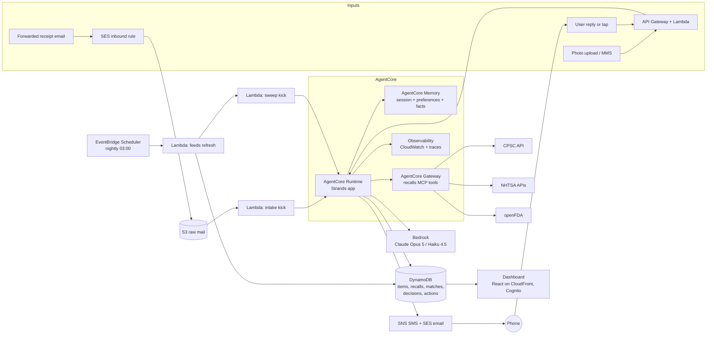

# Recall & Warranty Guardian: Build Plan

**Hackathon:** Agents for Humans (AWS, Strands Agents SDK)
**Track:** Everyday Agents
**One line:** A background agent that builds a quiet inventory of what your household owns from forwarded receipts, checks it against government recall feeds every night, tracks warranty windows, and interrupts you only when something you own is actually affected and a decision is needed.

> The agent's best output is silence. The product's headline metric is how rarely it has to talk to you.

---

## 1. The pitch

Every household owns hundreds of products and usually a car. Government agencies issue hundreds of consumer-product recalls a year, plus vehicle, food, drug, and medical-device recalls. Almost nobody hears about the ones that apply to them, because recall notices are broadcast to everyone and matched by no one. At the same time, warranties expire unused because nobody remembers the term or can find the receipt.

The Guardian fixes both with one habit: forward the receipt. From there it runs alone.

- **Capture.** Receipts and order confirmations forwarded to a private address become inventory items with brand, model, UPC, purchase date, retailer, price, and warranty term. Photos of paper receipts and product labels work too. Cars are added by VIN.
- **Watch.** Every night it pulls new recalls from CPSC, NHTSA, and openFDA, and matches them against the inventory with a deterministic-first, LLM-only-when-ambiguous matcher.
- **Decide.** It surfaces one message with one decision when a match is confirmed and the hazard warrants it. Everything else goes to a dashboard log and a monthly digest.
- **Act.** After a single approval it requests the remedy, files the warranty claim, attaches the receipt, and follows up if the manufacturer goes quiet.

**Who it's for.** The household's default administrator. Sharpest for parents of young children (strollers, cribs, car seats, formula, toys are among the most-recalled categories), car owners, and anyone with major appliances.

**Why it matters.** Recalls exist because products injure people. Remedies are free repairs, replacements, or refunds that go unclaimed. Warranty claims are money left on the table. The cost of missing either is borne by exactly the people too busy to track it.

---

## 2. How it scores on the rubric

| Criterion | What the Guardian shows |
|---|---|
| Technical implementation | A Strands `Graph` of specialist agents; tool-level and hook-level **interrupts** that pause a nightly job until a human answers hours later; **structured output** for every judgment; a recall-feed **MCP server** exposed through **AgentCore Gateway**; **AgentCore Memory** for household facts and preferences; **AgentCore Runtime** hosting; **AgentCore Observability** traces shown in the demo; a live demo URL. |
| Design | A complete loop: capture, watch, decide, act, log. A dashboard whose hero number is "days since Guardian last needed you." |
| Potential impact | Real public data, real hazards, real money. The demo runs against live CPSC/NHTSA/FDA feeds, not mocks. |
| Creativity | Inverts the "another app to check" model. A notification budget as a first-class design rule. Deterministic code where determinism is right, LLM only where judgment is needed, and the pitch says so out loud. |
| Presentation | A phone buzzing with a one-tap decision is inherently demo-able. The video shows a receipt going in and a remedy request going out. |

---

## 3. Scope

### In v1 (the submission)

1. Inventory intake from forwarded emails (SES inbound), uploaded photos (receipt or product label), a manual form, and CSV import (for demo seeding).
2. Vehicles by VIN via the NHTSA vPIC decoder.
3. Nightly recall sweep across CPSC (consumer products), NHTSA (vehicles), and openFDA (food, drug, device enforcement reports). USDA FSIS (meat, poultry, eggs) as an optional fourth source.
4. Matching engine with confidence tiers and LLM adjudication only for ambiguous candidates.
5. Severity-gated surfacing with a notification budget.
6. Remedy execution after approval: drafted and sent remedy request or warranty claim by email with receipt attached; follow-up scheduling.
7. Warranty tracking: term extraction, expiry windows, "anything wrong with it?" check for high-value items, claim drafting when the user reports a problem.
8. Dashboard: inventory, matches, pending decisions, activity log, quiet score.
9. Deployment on AgentCore Runtime with Memory, Gateway, and Observability. Public repo, Apache-2.0, README, architecture diagram, 5-minute video.

### Explicitly out of v1

- Connecting to bank or card accounts. Receipts are the only financial input, and card numbers are stripped at intake.
- Scraping retailer accounts. The user forwards; the agent does not log in anywhere on their behalf.
- Auto-purchasing replacements.
- Non-US recall sources.
- Insurance claims.

### Stretch (after v1 is solid)

- AgentCore Browser fills manufacturer product-registration and warranty-claim web forms.
- Gmail read access via AgentCore Identity (OAuth) so receipts no longer need forwarding.
- Card-program extended-warranty rules (many cards add a year) using only the card's program name, never a number.
- Shared households: two adults, one inventory, decisions routed to whoever bought the item.

---

## 4. The autonomy contract

This section is the theme. Judges should be able to read it and see that the agent runs in the background and only surfaces for real decisions.

### Triggers

| Trigger | Source | What runs |
|---|---|---|
| Receipt forwarded | SES inbound rule on `receipts@<your-domain>` | Intake agent, within minutes |
| Photo uploaded | Dashboard or MMS | Intake agent |
| Nightly at 03:00 household-local | EventBridge Scheduler | Feed refresh, then the match graph |
| Weekly | EventBridge Scheduler | openFDA full-window refresh (FDA publishes weekly) |
| User says something broke | SMS reply or dashboard | Warranty agent |
| User answers a decision | Signed link or SMS reply | Graph resumes from its interrupt |

### Surfacing policy

| Situation | What the user experiences |
|---|---|
| Confirmed match, critical hazard (death, serious injury, fire, choking, amputation, lead, FDA Class I, "do not drive") | Immediate push and SMS. Remedy already drafted. One tap sends it. |
| Confirmed match, standard hazard | Added to the weekly digest. Auto-requests remedy if the household preference allows. |
| Probable match, one fact missing | One question, usually a photo request: "Send me the date code on the bottom of the unit." |
| Warranty ending within 30 days on an item over the household's value threshold (default $200) | One question: "Anything wrong with it? Claims must be in before the 14th." |
| User reports a problem | Coverage check, drafted claim, one approval. |
| Nothing matched | Nothing. The dashboard log records the sweep. |

### Notification budget

Default: at most one unsolicited interruption per week, except critical hazards, which always go through. Everything else accumulates in the dashboard and a monthly digest. The budget is stored in AgentCore Memory as a user preference and can be changed by replying in plain language ("only bother me about the kids' stuff").

### Sample messages (illustrative, not real recall numbers)

**Critical:**
> Guardian: The Graco stroller you bought at Target on 2024-03-14 matches CPSC recall 25-000 (hinge can pinch or amputate a fingertip). Remedy: free repair kit. Reply 1 to request it, 2 if you no longer own it, 3 for details.

**Needs one fact:**
> Guardian: A recall of Frigidaire dehumidifiers covers some units sold in 2023. Yours might be one. Reply with a photo of the label on the back and I'll check the model and date code.

**Warranty window:**
> Guardian: Your Vitamix warranty ends 2026-10-01. Anything wrong with it? If yes, reply with a sentence and I'll draft the claim.

---

## 5. Data sources

| Source | Endpoint | Covers | Match keys | Notes |
|---|---|---|---|---|
| CPSC SaferProducts Recall API | `https://www.saferproducts.gov/RestWebServices/Recall?format=json&RecallDateStart=YYYY-MM-DD&RecallDateEnd=YYYY-MM-DD` | Consumer products: juvenile products, furniture, appliances, toys, sporting goods, tools | `Products[].Name`, `Products[].Model`, `Products[].UPC`, `Manufacturers[].Name`, `Retailers[].Name`, sold-date range in the description | No API key. No pagination, so always query a date window. Fields per the CPSC Recall Retrieval Web Services Programmer's Guide. Also returns `Hazards`, `Remedies`, `ConsumerContact`, `Images`. |
| NHTSA vPIC | `https://vpic.nhtsa.dot.gov/api/vehicles/DecodeVinValues/{VIN}?format=json` | VIN to year, make, model | `ModelYear`, `Make`, `Model` | No key. |
| NHTSA Recalls | `https://api.nhtsa.gov/recalls/recallsByVehicle?make={make}&model={model}&modelYear={year}` | Vehicle safety recalls | Exact make, model, year | No key. Returns campaign number, component, summary, consequence, remedy, and park-outside / do-not-drive flags. |
| openFDA Enforcement | `https://api.fda.gov/food/enforcement.json`, `/drug/enforcement.json`, `/device/enforcement.json` with `search=report_date:[YYYYMMDD+TO+YYYYMMDD]&limit=100&skip=N` | Food, infant formula, OTC and Rx drugs, cosmetics, medical devices | `product_description`, `code_info` (lot and UPC text), `recalling_firm`, `classification` (I, II, III), `distribution_pattern` | 1,000 requests/day without a key, 120,000 with a free key passed as `api_key`. Weekly data. |
| USDA FSIS Recall API (optional) | `https://www.fsis.usda.gov/fsis/api/recall/v/1` | Meat, poultry, egg products | Product items, establishment, states | Returned 403 to a generic fetch during planning. Send a browser-like `User-Agent` and verify before committing. |

### Normalized recall record

Every source is mapped into one shape before any agent sees it:

```
RecallRecord
  recall_id            "cpsc#25-000" | "nhtsa#24V123" | "fda#F-1234-2026"
  source               cpsc | nhtsa | fda_food | fda_drug | fda_device | fsis
  title, published_at, url
  products[]           { name, brand, model_numbers[], upcs[], lot_codes[], sold_from, sold_to, retailers[] }
  hazard_text
  severity             critical | standard          (see mapping below)
  remedy_text
  contact              { phone, email, url }
  raw_s3_key
```

### Severity mapping

- FDA Class I, or NHTSA park-outside / do-not-drive, or CPSC hazard text containing death, serious injury, fire, burn, choking, strangulation, amputation, laceration, lead, or fall hazard for infant products: **critical**.
- Everything else: **standard**.
- The classifier is a keyword pass first, then the triage agent confirms with structured output. Keywords are cheap and explainable; the model catches phrasing the list misses.

---

## 6. Architecture



### Components and why each exists

| Component | Role | Why this and not something else |
|---|---|---|
| AgentCore Runtime | Hosts the Strands app behind `/invocations`. One deployment handles intake, sweep, resume, and problem reports by switching on `payload["kind"]`. | Session isolation, long-running invocations, and it is the deployment the judges named. |
| AgentCore Memory | Short-term: conversation and interrupt state per session. Long-term: `userPreferenceMemoryStrategy` for thresholds and budget, `semanticMemoryStrategy` for household facts ("the car is a 2019 Outback"). | Lets the agent remember "don't bother me about items under $50" across nightly runs without a custom store. |
| AgentCore Gateway | Publishes the recall MCP server's tools with managed auth. | Turns the feeds into reusable MCP tools other builders can use, and scores on the rubric. |
| AgentCore Observability | Traces of every graph run, visible in CloudWatch. | Shown in the demo to prove the agent ran unattended. |
| EventBridge Scheduler | Nightly and weekly triggers. | Native cron; no server. |
| Lambda (three small ones) | Feed refresh, kick invocations, decision callbacks. | Deterministic work stays out of the LLM loop. |
| DynamoDB | Items, recalls, matches, decisions, actions, activity log. | Fast reads for the dashboard; on-demand billing fits the credit. |
| S3 | Raw mail, receipt images, recall snapshots. | Cheap, and keeps evidence for claims. |
| SES | Inbound receipts and outbound remedy or claim emails. | One service for both directions. |
| SNS SMS (or Twilio fallback) | Critical alerts and replies. | See risk on US origination-number lead time. |
| API Gateway HTTP API | Signed one-time decision links, dashboard API. | Cheap and simple. |
| Cognito | Dashboard sign-in and Gateway inbound JWT. | Standard. |
| Bedrock | Claude Opus 5 for judgment agents; Claude Haiku 4.5 for high-volume extraction. | Judgment is rare per night; extraction is frequent. Pick the model IDs from the Bedrock model catalog for your region (use cross-region inference profiles). |
| CDK (Python) | All infrastructure as code. | Reproducible setup is a submission requirement. |

### Design principle the pitch states explicitly

Deterministic pipes, judgment in agents. Pagination, date windows, VIN decoding, UPC equality, and lot-code parsing are code. Deciding whether "Frigidaire 50-pint dehumidifier, white" is the same thing as "FFAD5033W1 dehumidifiers sold 2022 to 2024" is an agent. This is how the nightly run costs cents and why judges will believe it runs in the background.

---

## 7. Agents (Strands)

| Agent | Model | Runs when | Tools | Output |
|---|---|---|---|---|
| `intake` | Haiku 4.5 (Opus 5 for hard images) | Receipt or photo arrives | `decode_vin`, `save_item`, `redact_pan` | `InventoryItem` (structured) |
| `matcher` | Opus 5 | Nightly, only for ambiguous candidates | `get_item`, `get_recall`, `recalls_mcp.*` | `MatchVerdict` (structured) |
| `triage` | Opus 5 | Nightly, when any verdict is yes or unsure | `get_preferences`, `check_budget`, `draft_message`, `request_decision` (interrupts) | `SurfacePlan` (structured) |
| `remedy` | Opus 5 | After the human approves | `send_email`, `attach_receipt`, `schedule_followup`, `log_action` | `ActionReport` (structured) |
| `warranty` | Opus 5 | Item saved; 30 days before expiry; user reports a problem | `get_item`, `warranty_defaults`, `draft_claim`, `request_decision` | `CoverageAssessment`, `ClaimDraft` |

### Structured output models

```python
from pydantic import BaseModel, Field
from typing import Literal

class InventoryItem(BaseModel):
    name: str
    brand: str | None
    model_number: str | None
    upc: str | None
    serial: str | None
    category: str
    purchase_date: str | None          # ISO date
    price: float | None
    retailer: str | None
    warranty_term_months: int | None
    warranty_source: Literal["receipt", "category_default", "unknown"]
    vin: str | None

class MatchVerdict(BaseModel):
    is_match: Literal["yes", "no", "unsure"]
    confidence: float = Field(ge=0, le=1)
    rationale: str
    missing_info: list[str] = []       # e.g. ["date code on bottom label"]

class SurfacePlan(BaseModel):
    channel: Literal["sms_now", "digest", "silent"]
    severity: Literal["critical", "standard"]
    message: str
    options: list[str]                 # ["request_remedy", "no_longer_own", "details"]
```

Invocation follows the documented pattern:

```python
result = matcher(prompt, structured_output_model=MatchVerdict)
verdict = result.structured_output
```

### The nightly graph

```python
from strands import Agent
from strands.multiagent import GraphBuilder

builder = GraphBuilder()
builder.add_node(matcher, "matcher")
builder.add_node(triage, "triage")
builder.add_node(remedy, "remedy")

def has_candidates(state, **kwargs) -> bool:
    text = str(state.results["matcher"].result)
    return '"is_match": "yes"' in text or '"is_match": "unsure"' in text

def approved(state, **kwargs) -> bool:
    return '"decision": "request_remedy"' in str(state.results["triage"].result)

builder.add_edge("matcher", "triage", condition=has_candidates)
builder.add_edge("triage", "remedy", condition=approved)
builder.set_entry_point("matcher")
builder.set_execution_timeout(600)
graph = builder.build()
```

The `matcher` node receives the night's candidate pairs (already generated deterministically, see section 8) in the task payload. It does not paginate feeds. In practice the conditions read structured results carried in `invocation_state` rather than string-matching; the sketch shows the shape.

### Pausing for a human

Two places raise interrupts, both documented Strands mechanisms:

1. **Tool-level** inside `triage` and `warranty`: `request_decision` calls `tool_context.interrupt("guardian-decision", reason=plan)`. The agent stops, `result.stop_reason == "interrupt"`, and `result.interrupts` carries the id and the plan.
2. **Hook-level** on the `remedy` node: a `BeforeNodeCallEvent` hook raises `event.interrupt("guardian-approval", reason=...)` so nothing is ever sent without a recorded approval, even if a future code path reaches `remedy` directly.

```python
from strands import tool
from strands.types.tools import ToolContext

@tool(context=True)
def request_decision(tool_context: ToolContext, plan: dict) -> dict:
    """Pause until the household answers. Returns their choice."""
    return tool_context.interrupt("guardian-decision", reason=plan)
```

Resuming hours later, from the decision-callback Lambda, with the same session id:

```python
responses = [{
    "interruptResponse": {
        "interruptId": decision["interrupt_id"],
        "response": {"choice": "request_remedy"},
    }
}]
graph(responses)   # continues into the remedy node
```

Interrupt state must survive across two separate Runtime invocations hours apart. The session manager persists it. Phase 1 includes a spike to confirm this with `AgentCoreMemorySessionManager`; `S3SessionManager` is the fallback.

### Memory wiring

```python
from bedrock_agentcore.memory.integrations.strands.session_manager import AgentCoreMemorySessionManager
from bedrock_agentcore.memory.integrations.strands.config import AgentCoreMemoryConfig

config = AgentCoreMemoryConfig(
    memory_id=MEMORY_ID,
    actor_id=household_id,
    session_id=f"sweep-{run_date}",
)
session_manager = AgentCoreMemorySessionManager(agentcore_memory_config=config, region_name=REGION)
triage = Agent(system_prompt=TRIAGE_PROMPT, tools=[...], session_manager=session_manager)
```

Memory resource strategies: `userPreferenceMemoryStrategy` on `/preferences/{actorId}/`, `semanticMemoryStrategy` on `/facts/{actorId}/`, `summaryMemoryStrategy` on `/summaries/{actorId}/{sessionId}/`.

### Recall tools over MCP

The `recalls-mcp` server (FastMCP) exposes `cpsc_search(date_from, date_to, product_name?)`, `nhtsa_recalls_by_vehicle(make, model, year)`, `vin_decode(vin)`, `fda_enforcement_search(kind, date_from, date_to, query?)`. It is deployed as a Lambda target behind AgentCore Gateway, and Strands connects to it:

```python
from strands.tools.mcp import MCPClient
from mcp.client.streamable_http import streamablehttp_client

recalls = MCPClient(lambda: streamablehttp_client(GATEWAY_URL, headers={"Authorization": f"Bearer {token}"}))
matcher = Agent(system_prompt=MATCHER_PROMPT, tools=[recalls, get_item, get_recall])
```

The same server runs locally over stdio during development. Publishing it as its own repo is a second open-source artifact and a natural builder.aws.com post.

### Runtime entry point

```python
from bedrock_agentcore.runtime import BedrockAgentCoreApp

app = BedrockAgentCoreApp()

@app.entrypoint
def invoke(payload):
    kind = payload["kind"]            # intake | sweep | resume | report_problem
    if kind == "intake":
        return run_intake(payload)
    if kind == "sweep":
        return run_sweep(payload)
    if kind == "resume":
        return resume_graph(payload)
    if kind == "report_problem":
        return run_warranty(payload)

if __name__ == "__main__":
    app.run()
```

Deployment uses the AgentCore CLI (`npm install -g @aws/agentcore`, then `agentcore create`, `agentcore dev`, `agentcore deploy`, `agentcore invoke`). The container is `linux/arm64`, serves port 8080 with `/invocations` and `/ping`, and is pushed to ECR by the CLI.

---

## 8. Matching engine

The nightly sweep is where the credibility lives. Four stages, cheapest first.

| Stage | Method | Result |
|---|---|---|
| 1. Exact keys | UPC equality; VIN-derived make/model/year equality; model-number equality after normalization (uppercase, strip spaces, dashes, dots) | `certain` |
| 2. Lexical candidates | Brand match (normalized, alias table for "Frigidaire" vs "Electrolux") AND `rapidfuzz.fuzz.token_set_ratio(item.name, product.name) >= 80` | `candidate` |
| 3. Date-window filter | If the recall states a sold-from/sold-to range and the purchase date falls outside it by more than 60 days, drop to `unlikely` | Removes most false positives before any LLM call |
| 4. LLM adjudication | `matcher` agent with `MatchVerdict` structured output, given the item, the recall products, hazard, and sold window | `yes`, `no`, or `unsure` plus `missing_info` |

Only stage 4 costs tokens. On a typical night a household produces zero to a handful of candidates. Over a year of CPSC data (a few hundred recalls) against a 300-item inventory, expect stage 2 to yield a few dozen candidates total.

**Evaluation.** A golden set of 30 item/recall pairs: 15 true matches drawn from real recalls, 15 hard negatives (same brand, different model; same product, outside the sold window). Target precision at least 0.9 and recall at least 0.9 on the set. The eval script lives in `eval/` and runs in CI. Show the eval in the README; judges reward evidence over adjectives.

**Unsure handling.** When `missing_info` names a single fact the user can supply with a photo, the triage agent asks for it. The photo returns through `intake`, which extracts the model and date code, and the matcher re-runs on that pair only.

---

## 9. Warranty engine

1. **Term extraction.** At intake, the agent reads the receipt for warranty lines (including purchased extended plans). If absent, it applies a category default table (small appliances 12 months, major appliances 12 months parts, TVs 12 months, mattresses 120 months, power tools 36 months, and so on) and records `warranty_source = category_default` so the dashboard shows the term as an estimate.
2. **Expiry watch.** A nightly query finds items whose warranty ends within 30 days and whose price exceeds the household threshold. Only those produce the "anything wrong with it?" question, and only within the notification budget.
3. **Problem report.** The user replies in plain language. The `warranty` agent assesses coverage (term, purchase date, exclusions it can infer, receipt available or not) and drafts a claim: manufacturer contact, model and serial, problem description, purchase proof attached from S3.
4. **Send and follow up.** After one approval the `remedy` agent sends it via SES and schedules a follow-up check in 10 business days. If no reply lands (SES inbound on the same address), it drafts a nudge and asks once whether to send it.
5. **Registration (stretch).** Many recall notifications depend on product registration. v1 stores the manufacturer registration URL and drafts the fields; AgentCore Browser fills the form in v2.

---

## 10. Data model (DynamoDB)

Single table, `pk`/`sk` design, on-demand billing.

| Entity | pk | sk | Key attributes |
|---|---|---|---|
| InventoryItem | `HH#<household>` | `ITEM#<item_id>` | name, brand, model_number, upc, serial, category, purchase_date, price, retailer, receipt_s3_key, warranty {term_months, ends_on, source, extended}, vehicle {vin, year, make, model}, status |
| RecallRecord | `RECALL#<source>` | `<published_at>#<native_id>` | normalized record from section 5; GSI on `brand_norm` for candidate generation |
| MatchCandidate | `HH#<household>` | `MATCH#<item_id>#<recall_id>` | stage, score, verdict, confidence, rationale, missing_info, state (new, surfaced, confirmed, dismissed, not_mine, resolved) |
| Decision | `HH#<household>` | `DECISION#<decision_id>` | kind, summary, options, interrupt_id, session_id, token_hash, expires_at, answered_at, answer |
| Action | `HH#<household>` | `ACTION#<action_id>` | decision_id, type (email_sent, claim_filed, followup_scheduled, nudge_sent), payload_s3_key, status, next_check_at |
| Activity | `HH#<household>` | `LOG#<timestamp>` | what the agent did, for the "while you were away" view |
| Preferences | `HH#<household>` | `PREFS` | value_threshold, budget_per_week, quiet_categories (mirrors AgentCore Memory for fast dashboard reads) |

---

## 11. Notifications and the decision API

- **Outbound.** SNS SMS for critical alerts, SES email for everything else, and web push from the dashboard if time allows. Each message carries a short signed link (`/d/<token>`) and, for SMS, numbered reply options.
- **Tokens.** One-time, HMAC-signed, 72-hour expiry, bound to the decision id and the household. Tapping a link never needs a login.
- **Inbound.** API Gateway HTTP API routes `/d/<token>` and SNS inbound SMS to a Lambda that validates the token, writes the answer to the Decision row, and calls `invoke_agent_runtime` with `kind: "resume"`, the original `runtimeSessionId`, and the interrupt response payload. The graph resumes into `remedy`.
- **Idempotency.** A decision can be answered once. Repeated taps show the recorded answer and the action status.

**Risk to plan around.** US SMS through SNS needs a verified toll-free or 10DLC origination number, which can take days to approve. Start the request in Phase 0. If it is not ready for the video, demo with email plus a simulated phone panel in the dashboard that renders the exact SMS text. Twilio is a drop-in fallback for the tool implementation.

---

## 12. Dashboard

Purpose: prove the agent worked while nobody watched, and make the rare decision effortless.

- **Home.** Quiet score ("42 days since Guardian needed you"), items watched, sweeps run, recalls screened this month, decisions pending (usually zero).
- **Pending decisions.** The same cards the SMS points to, with approve, dismiss, not mine, and "ask me later."
- **Inventory.** Filter by category, warranty status, recall status. Each item shows its receipt thumbnail, warranty bar, and any matches with the matcher's rationale.
- **Activity.** Timeline: "03:02 pulled 4 new CPSC recalls, 0 candidates." "03:03 pulled 61 FDA enforcement reports, 1 candidate, adjudicated no (different lot range)."
- **Settings.** Value threshold, notification budget, quiet categories, forwarding address with a copy button, phone number.

Stack: Vite plus React, Cognito Hosted UI, CloudFront plus S3. Keep it small and finished rather than large and rough. The design criterion is about coherence.

---

## 13. Repository layout

```
guardian/
  README.md                 what, who, why, quickstart, architecture image, eval results, demo link
  LICENSE                   Apache-2.0
  ARCHITECTURE.md           this section 6, expanded
  docs/architecture.png     exported diagram for the submission
  infra/                    CDK (Python): DataStack, IngestionStack, AgentStack, ApiStack, WebStack
  agent/                    Strands app deployed to AgentCore Runtime
    app.py                  BedrockAgentCoreApp entrypoint, routes on payload.kind
    agents/                 intake.py matcher.py triage.py remedy.py warranty.py graph.py
    tools/                  inventory.py notify.py vin.py receipts.py decisions.py
    models/                 pydantic schemas (section 7)
    policy/                 severity.py budget.py defaults.py
    memory.py               AgentCoreMemorySessionManager wiring
    prompts/                one file per agent
  mcp/recalls-mcp/          FastMCP server: cpsc, nhtsa, vin, fda tools; Lambda handler for Gateway
  feeds/                    Lambda: fetch, normalize, upsert recalls; recorded fixtures for tests
  api/                      Lambda: decision callback, dashboard API
  web/                      Vite + React dashboard
  eval/                     golden sets and scripts for parsing and matching
  demo/                     seed inventory, sample receipt emails, demo recall fixture, video script
  scripts/                  deploy helpers, local runner (agentcore dev)
  .github/workflows/        lint, unit tests, eval
```

---

## 14. Build phases

Each phase has an exit criterion you can demonstrate. Sizes are rough working days for one developer; treat them as relative weights.

| # | Phase | Size | Exit criterion |
|---|---|---|---|
| 0 | Foundations | 1 | Repo with license and README skeleton. CDK bootstrapped. Bedrock model access granted. AWS Builder ID created. $50 credit requested. SMS origination number requested. Strands hello-world runs locally and via `agentcore dev`. |
| 1 | Feeds and recall store | 3 | Nightly Lambda populates `RecallRecord` rows from CPSC, NHTSA (for known vehicles), and openFDA with recorded fixtures under test. `recalls-mcp` serves the four tools locally over stdio. Spike done: an interrupt raised in one Runtime invocation is resumed in a second with `AgentCoreMemorySessionManager` (or fallback chosen). |
| 2 | Intake | 3 | Forwarding a receipt from five common retailers and one generic email yields an `InventoryItem` with at least 90% field accuracy on a 20-receipt hand-labeled set. Photo of a product label yields model and date code. VIN adds a vehicle. Card numbers never reach storage. |
| 3 | Matching engine | 4 | Stages 1 to 4 implemented. Golden set precision and recall at least 0.9. Token cost per night logged. `matcher` runs as a graph node. |
| 4 | Triage, interrupts, decisions | 4 | End to end: seeded recall matches the demo stroller, SMS or email arrives with a signed link, tapping approve resumes the graph, `remedy` sends the request via SES, activity log records it. Budget and severity policy enforced with tests. |
| 5 | Warranty | 3 | Term extraction with source flag. Expiry question fires only above threshold and within budget. "My blender died" produces a drafted claim with receipt attached; approval sends it; follow-up scheduled. |
| 6 | Dashboard | 4 | Home, decisions, inventory, activity, settings. Cognito sign-in. Deployed on CloudFront. Looks finished. |
| 7 | AgentCore deployment | 2 | Runtime, Memory (three strategies), Gateway with the MCP server, Observability traces visible. Live demo URL in the README. |
| 8 | Hardening and eval | 2 | CI runs lint, tests, and the matching eval. Error paths: feed down, model timeout, unanswered decision expiry. Cost report against the credit. |
| 9 | Submission assets | 3 | Architecture diagram exported. README complete with quickstart that a stranger can follow. 5-minute video recorded to the script in section 15. At least one builder.aws.com post published with "Agents for Humans" in the title. Devpost form submitted. |
| 10 | Stretch | open | Browser-filled registrations, Gmail via Identity, shared households, digest email design. |

Order matters through Phase 4; after that Phases 5 to 7 can proceed in parallel if there are two people.

---

## 15. Demo video script (5:00)

| Time | Beat | On screen |
|---|---|---|
| 0:00 to 0:35 | Problem | Slide: a real recall notice next to a cluttered inbox. Voice: recalls are broadcast to everyone and matched by no one; warranties expire unused. Cite the CPSC and NHTSA figures you verified (see below). |
| 0:35 to 1:00 | Who and why | Slide: a parent's week. The household admin who already has too many apps. Cost of missing a recall is safety; cost of missing a warranty is money. |
| 1:00 to 1:30 | The habit | Screen: forward a Target order email to the Guardian address. Dashboard shows the stroller appear with brand, model, purchase date, warranty bar. Voice: that is the only thing the user ever does. |
| 1:30 to 2:30 | The quiet loop | Screen: activity log of past nights, all "0 candidates." Trigger tonight's sweep with a seeded recall fixture that matches the stroller. Phone (real or panel) buzzes with the critical message. Tap 1. Watch the graph resume: remedy email sent, follow-up scheduled, activity logged. Show the SES message. |
| 2:30 to 3:05 | Judgment, not keyword matching | Screen: a second candidate, a dehumidifier with a sold-window ambiguity. Guardian asks for a label photo. Upload it. Matcher returns "no, date code outside range," and the log records why. Voice: this is the LLM doing the one thing code cannot. |
| 3:05 to 3:35 | Warranty | Screen: reply "the blender stopped working." Coverage assessment, drafted claim with receipt attached, one approval, sent. |
| 3:35 to 4:20 | How it is built | Architecture diagram. Strands graph with the interrupt highlighted. AgentCore Runtime, Memory strategies, Gateway MCP tools, an Observability trace of tonight's run. Eval results table. |
| 4:20 to 5:00 | Why it matters and what's next | Quiet score on the dashboard. Voice: the agent's best output is silence. Next: browser-filled registrations, Gmail via Identity, shared households. Repo URL and live demo URL. |

**Figures to verify before recording** (cite the source on the slide): number of CPSC recalls issued in the most recent fiscal year; CPSC statements on typical consumer response rates to recalls; NHTSA vehicle recall completion rates; the number of FDA enforcement reports per year. Use only numbers you have checked against the agency's own publications.

Recording tips: record the live demo in one take with the seeded fixture, keep the camera on the phone panel when it buzzes, and put the diagram on screen for at least 20 seconds.

---

## 16. Submission checklist

- [ ] Public repo URL; Apache-2.0 visible in the About section
- [ ] README: what it does, who it is for, how it works, quickstart, architecture image, eval results, live demo link
- [ ] Architecture diagram exported to `docs/architecture.png`
- [ ] All source, assets, and setup instructions; CDK deploys from a clean account with documented prerequisites
- [ ] Demo video under 5:00 covering the working project, the problem, who it is for, and why it matters
- [ ] AWS Builder ID
- [ ] Live demo URL (dashboard on CloudFront, agent on AgentCore Runtime)
- [ ] Text description on Devpost mirroring README sections 1 and 6
- [ ] At least one builder.aws.com post with "Agents for Humans" in the title, published before the deadline
- [ ] Track selected: Everyday Agents

**Post ideas for bonus points.** "Agents for Humans: teaching a Strands graph to wait eight hours for a human." "Agents for Humans: three government recall APIs as one MCP server on AgentCore Gateway." "Agents for Humans: a notification budget as a design primitive."

---

## 17. Risks and mitigations

| Risk | Mitigation |
|---|---|
| CPSC API has no pagination and occasional outages | Always query by date window; snapshot daily to S3; tests run on recorded fixtures; demo uses a fixture recall so the video never depends on a live feed |
| False-positive matches erode trust | Confidence tiers, date-window filter, LLM adjudication, golden-set eval in CI, and no action is ever taken without a recorded approval |
| Receipt formats vary endlessly | Start with five retailers plus a generic fallback; store the raw email so re-parsing is possible; show `warranty_source` and parse confidence in the UI |
| Interrupt state across two Runtime invocations | Phase 1 spike; `S3SessionManager` fallback; decision rows also store enough to rebuild the plan if a session is lost |
| SMS origination approval takes days | Request in Phase 0; email plus dashboard phone panel as the demo fallback; Twilio as a drop-in |
| FSIS API blocks generic clients | Optional source; set a browser-like User-Agent; skip if unstable |
| NHTSA coverage of child car seats via the recalls API is unclear | Verify in Phase 1; if absent, treat car seats as CPSC-adjacent and add NHTSA campaign search by make |
| Receipts contain personal and payment data | Strip card numbers at intake with a regex pass before the model sees the text; encrypt S3 and DynamoDB at rest; per-household partition keys; no bank connections |
| Bedrock spend against the $50 credit | LLM calls only in stage 4 and the judgment agents; Haiku 4.5 for extraction; log tokens per run; alert at 60% of credit |
| Scope creep before the core loop is solid | Phases 0 to 4 are the product; nothing in 5 to 10 starts until the Phase 4 demo works end to end |

---

## 18. First commands

```bash
pip install strands-agents strands-agents-tools "bedrock-agentcore[strands-agents]" rapidfuzz pydantic boto3
```

```bash
npm install -g @aws/agentcore
```

```bash
agentcore create
```

Then request Bedrock model access for Claude Opus 5 and Claude Haiku 4.5 in your region, submit the $50 credit form on the hackathon Resources tab, create your AWS Builder ID, and open the SNS origination-number request.

---

## Reference links

- Strands interrupts: https://strandsagents.com/docs/user-guide/concepts/interrupts/
- Strands human-in-the-loop handler: https://strandsagents.com/docs/user-guide/concepts/agents/interventions/human-in-the-loop/
- Strands Graph: https://strandsagents.com/docs/user-guide/concepts/multi-agent/graph/
- Strands structured output: https://strandsagents.com/docs/user-guide/concepts/agents/structured-output/
- Strands MCP tools: https://strandsagents.com/docs/user-guide/concepts/tools/mcp-tools/
- AgentCore Memory session manager: https://strandsagents.com/docs/integrations/session-managers/agentcore-memory/
- Deploy to AgentCore Runtime (Python): https://strandsagents.com/docs/user-guide/deploy/deploy_to_bedrock_agentcore/python/
- CPSC Recall API: https://www.cpsc.gov/Recalls/CPSC-Recalls-Application-Program-Interface-API-Information
- NHTSA datasets and APIs: https://www.nhtsa.gov/nhtsa-datasets-and-apis
- openFDA enforcement: https://open.fda.gov/apis/food/enforcement/
- openFDA rate limits: https://open.fda.gov/apis/authentication/
