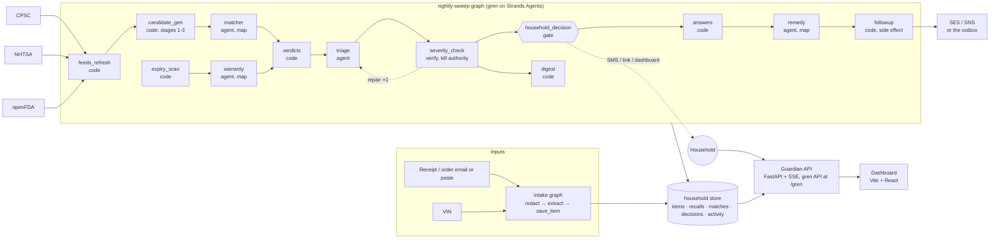

# Guardian — Recall & Warranty Guardian

**Agents for Humans hackathon (AWS, Strands Agents SDK) · Everyday Agents track · Apache-2.0**

A background agent that builds a quiet inventory of what your household owns from forwarded receipts, checks it against government recall feeds every night, tracks warranty windows, and interrupts you only when something you own is actually affected and a decision is needed. After one approval it drafts and sends the remedy request with your receipt attached, and follows up.

> The agent's best output is silence. The product's headline metric is how rarely it has to talk to you.

## What it does

1. **Capture.** Forward a receipt or paste an order confirmation. An intake graph strips card numbers, extracts the products (brand, model, UPC, purchase date, retailer, price, warranty term) and files them. Cars are added by VIN through NHTSA's vPIC decoder.
2. **Watch.** Every night a Strands graph pulls new recalls from **CPSC**, **NHTSA** (per vehicle) and **openFDA**, normalizes them, and runs a deterministic matcher: exact keys (UPC, vehicle class, model number), then lexical similarity, then the sold-window filter. Only ambiguous pairs reach a model.
3. **Decide.** A triage agent applies the severity rules and the household's notification budget. An adversarial verifier with kill authority checks the plan against the deterministic severity pass and can send triage back for one repair round. Critical hazards become one SMS with one decision; standard hazards go to the weekly digest. The graph then pauses on a human gate, durably, for up to 72 hours.
4. **Act.** When the household answers, the graph resumes: a remedy agent drafts the request from the recall's own remedy and contact, a side-effect node sends it exactly once, records the action, and schedules a 10-business-day follow-up.

**Who it is for.** The household's default administrator: parents of young children, car owners, anyone with appliances. **Why it matters.** Recalls exist because products injure people; remedies are free and go unclaimed because notices are broadcast to everyone and matched by no one.

## Status: milestone 1 (beta)

| Works today | How it is verified |
|---|---|
| Live feeds: CPSC SaferProducts API, NHTSA vPIC + recalls by vehicle, openFDA food enforcement | `guardian feeds`; recorded fixtures under `guardian/feeds/fixtures` (captured 2026-09-13) drive the tests |
| Matching stages 1-3 in code, stage 4 by the `matcher` agent | `tests/test_matching.py` on the demo household against the recorded feeds |
| The nightly sweep as a 13-node gren graph on the Strands engine, with a verifier repair cycle and a human gate | `tests/test_sweep_graph.py` runs it end to end on the mock provider: pause at the gate, approve → remedy → followup; decline; quiet night; verifier kill + repair |
| Household decisions from gate interrupts, SMS to the outbox, approve/decline from the dashboard or CLI, activity log | `tests/test_api.py`, the dashboard |
| Intake graph (redact → extract → save) | `guardian intake "..."` with the headless Claude Code provider |
| Dashboard (Home, Decisions, Inventory, Activity, Settings, Agent flow) and the full trace view of the run graph | `web/`; screenshots under `var/screens` after `npm run build` |
| Providers: Amazon Bedrock, Anthropic API, headless Claude Code, mock | selected by gren from the environment (see below) |

Not yet: AgentCore Runtime/Memory/Gateway deployment (the graph runs anywhere gren runs; see `gren/docs/AWS.md`), SNS/SES delivery (messages go to `var/household/outbox` unless `GUARDIAN_SNS=1` / `GUARDIAN_SES_FROM` are set with AWS credentials), Cognito, the mailroom (photos), grocery advisories and settlements from the plan's Expanded tier. `read_this_labubu.md` has the handoff.

**A real first sweep (2026-09-13, live feeds, headless Claude Code provider):** 594 CPSC recalls, 3 NHTSA campaigns and 1,200 openFDA reports pulled for the 400-day first-run window; 7,143 item-recall pairs checked in code; 5 exact matches (two UPCs, three vehicle campaigns) and 3 ambiguous pairs adjudicated by the model (one yes at 0.95, two no at 0.97); triage surfaced three decisions, put the Outback campaigns in the digest and queued the Vitamix warranty question within budget; the verifier passed the plan; the run paused at the gate after 235 s and $0.41. Approving a decision from the dashboard drafted the refund request to the recall's real contact address and the follow-up was scheduled.

The demo household in `demo/household.json` matches **real** recalls from the live feeds: TOMY's Boon NURSH bottle recall (CPSC 26530, exact UPC match, choking hazard), the Cade California Electronic finger-light recall (CPSC 26761, brand match adjudicated by the model, button-battery ingestion), the Hampton Bay Halwin ceiling fan (CPSC 26702, standard hazard → digest) and three NHTSA campaigns filed against 2019 Subaru Outbacks.

## Architecture



Deterministic pipes, judgment in agents. Feed pagination, VIN decoding, UPC equality, sold-window arithmetic and the notification budget are code. Deciding whether "LED projecting finger light toys" is the recalled product, or whether a plan is worth an interruption tonight, is an agent, and every agent output is a validated structured object. `ARCHITECTURE.md` explains how the graph compiles onto Strands (`GraphBuilder`, AND-join edge conditions, gates as interrupts, memoized resume) and where the AgentCore pieces attach.

## Quickstart

Prerequisites: Python 3.11+, Node 22+, and one model provider: AWS credentials for Bedrock (`AWS_REGION` set, Claude models enabled), or `ANTHROPIC_API_KEY`, or a Claude Code login (`claude auth login`). With none of these, `--bridge mock` runs the graph without tokens.

```bash
python -m venv .venv
.venv/Scripts/activate                  # Windows;  source .venv/bin/activate on macOS/Linux
pip install -e "./gren[dev]" -e ".[dev]"
guardian seed                           # the demo household (12 items) into var/household
guardian serve                          # API on http://127.0.0.1:8787, gren API at /gren, dashboard if web/dist exists
```

```bash
cd web && npm install && npm run dev    # dashboard on http://localhost:5173 (proxies /api and /gren to 8787)
npm run build                           # then `guardian serve` hosts it at http://127.0.0.1:8787
```

Run the sweep from the dashboard (click the logo or "Run sweep now") or from a terminal:

```bash
guardian sweep                          # live feeds, default provider; pauses at the gate when something matches
guardian answer <decision_id> request_remedy
guardian intake --file demo/receipt.txt # or: guardian intake "Amazon order ... Graco Modes Nest Stroller ... $379.99"
```

AWS: `docs/AWS_SETUP.md` lists what to create (Bedrock access, an IAM key or Bedrock API key, SES identities, AgentCore) and what goes into `.env` (template: `.env.example`, loaded automatically); `python scripts/aws_check.py` verifies every piece.

Environment: `GUARDIAN_DATA` (store dir, default `var/household`), `GUARDIAN_RUNS` (gren runs, default `var/runs`), `GUARDIAN_FEEDS=fixtures` (replay recorded feeds), `GREN_BRIDGE` (provider override), `OPENFDA_API_KEY` (optional), `GUARDIAN_SNS=1` and `GUARDIAN_SES_FROM` (real delivery, needs `pip install -e ".[aws]"`).

Tests (no tokens):

```bash
GREN_ALLOW_MOCK=1 python -m pytest -q
```

## The nightly graph

| Node | Kind | Job |
|---|---|---|
| `feeds_refresh` | code | Pull CPSC, NHTSA (per vehicle) and openFDA by date window; normalize into `RecallRecord`; upsert |
| `expiry_scan` | code | Warranties ending within 30 days above the value threshold; the budget and preferences for triage |
| `candidate_gen` | code | Stages 1-3: exact keys, `rapidfuzz` token-set ratio ≥ 80 with brand overlap, sold-window filter; records every candidate |
| `warranty` | agent (map) | One "anything wrong with it?" question per expiring item |
| `matcher` | agent (map) | Adjudicates only ambiguous pairs → `MatchVerdict {is_match, confidence, rationale, missing_info}` |
| `verdicts` | code | Persists verdicts, joins certain matches, hands triage one compact input |
| `triage` | agent | Severity rules + notification budget → `SurfacePlan {channel, decisions[], digest[], queued[]}` with the SMS text |
| `severity_check` | verify | Adversarial check against the keyword pass; a kill sends triage back once with the reasons |
| `household_decision` | gate | The Strands interrupt. Answered by SMS reply, signed link, dashboard or MCP; per-decision answers ride in the approval |
| `digest` | code | Standard hazards go to the weekly digest, never an interruption |
| `answers` | code | The household's answers as the list the remedy agent maps over |
| `remedy` | agent (map) | Drafts each approved request from the recall's remedy and contact → `ActionReport` |
| `followup` | code, side effect | Sends (SES or outbox), records the action, closes the match, schedules the follow-up; at most once per run |

`gren analyze guardian/graphs/nightly-sweep.yaml` prints the derived edges, the critical path, the frozen constraints (`gate_before_side_effect`, `spend_cap`, `verifier_can_kill`, `width_budget`, …) and the pre-ship checklist.

## Repository layout

```
guardian/        the Guardian package: models, store, feeds/, matching/, policy/, reducers/ (gren code nodes), graphs/ (YAML), service.py, api/, cli.py
gren/            gren, the Graph Engineering Runtime on Strands Agents (engine, providers, dashboard, MCP server); merged with its full history
web/             Vite + React dashboard (src/app: shell and pages; src/trace: the full trace view; src/api: the contract)
tests/           pytest: feeds, matching, policy, schemas, the sweep graph end to end, the HTTP API
demo/            the demo household
design/          the design handoff (README + high-fidelity HTML prototypes)
BUILD_PLAN.md    the product and architecture plan; agents-for-humans-hackathon-requirements.md
```

## License

Apache-2.0. gren (under `gren/`) is MIT.
