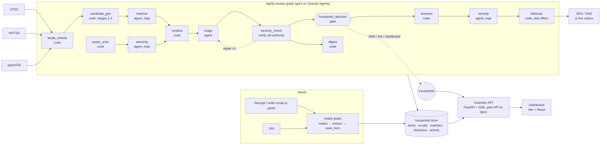

# Guardian: Recall and Warranty Guardian

**Agents for Humans hackathon (AWS, Strands Agents SDK). Everyday Agents track. Apache-2.0 license.**

Guardian is a background agent for a household. It makes an inventory of the products that the household owns, from forwarded receipts. Each night, it compares the inventory with the government recall feeds. It monitors the warranty windows. It speaks to the household only when a recall applies to a product that the household owns and a decision is necessary. After one approval, it writes and sends the remedy request with the receipt attached. Then it follows up.

> The best output of the agent is silence. The primary metric of the product is how rarely it must speak to you.

## What the agent does

1. **Capture.** You forward a receipt or paste an order confirmation. The intake graph removes the card numbers. It extracts each product (brand, model, UPC, purchase date, retailer, price, warranty term) and saves it. You add a car by VIN. The NHTSA vPIC decoder identifies the car.
2. **Watch.** Each night, a Strands graph pulls the new recalls from CPSC, NHTSA (one query for each vehicle), and openFDA. It normalizes the records. Then a deterministic matcher runs in 3 stages: exact keys (UPC, vehicle class, model number), lexical similarity, and the sold-window filter. Only the ambiguous pairs go to a model.
3. **Decide.** A triage agent applies the severity rules and the notification budget of the household. An adversarial verifier compares the plan with the deterministic severity pass. The verifier can reject the plan and send the triage agent back for one repair round. A critical hazard becomes one SMS with one decision. A standard hazard goes to the weekly digest. Then the graph stops at a human gate. The gate holds the run safely for up to 72 hours.
4. **Act.** When the household answers, the graph continues. A remedy agent writes the request from the remedy text and the contact address of the recall. A side-effect node sends the request one time, records the action, and schedules a follow-up after 10 business days.

**Who it is for.** The person who manages the household: parents of young children, car owners, and anyone with appliances.

**Why it matters.** Recalls exist because products injure people. The remedies are free. Many remedies stay unclaimed, because the notices go to everyone and nobody matches them to the products in a home.

## Status: milestone 1 (beta)

| Works today | Verification |
|---|---|
| Live feeds: CPSC SaferProducts API, NHTSA vPIC and recalls by vehicle, openFDA food enforcement | `guardian feeds`. The recorded fixtures in `guardian/feeds/fixtures` (captured 2026-09-13) supply the tests. |
| Match stages 1 to 3 in code, stage 4 by the `matcher` agent | `tests/test_matching.py` runs the demo household against the recorded feeds. |
| The nightly sweep as a 13-node gren graph on the Strands engine, with a verifier repair cycle and a human gate | `tests/test_sweep_graph.py` runs the graph end to end on the mock provider: stop at the gate, approve, remedy, follow-up; decline; quiet night; verifier rejection and repair. |
| Household decisions from gate interrupts, SMS to the outbox, approve or decline from the dashboard or the CLI, the activity log | `tests/test_api.py` and the dashboard |
| Intake graph (redact, extract, save) | `guardian intake "..."` with the headless Claude Code provider |
| Dashboard (Home, Decisions, Inventory, Activity, Settings, Agent flow) with the full trace workbench of the run graph | `web/`. `docs/AGENT_FLOW.md` describes the workbench. |
| Providers: Amazon Bedrock, Anthropic API, headless Claude Code, mock | gren selects the provider from the environment. See the Quickstart. |
| A live deployment on one EC2 instance with automatic HTTPS | https://guardian.44-214-230-44.sslip.io, made by `scripts/deploy_ec2.py`. It runs the graphs on the Anthropic API. |

Not done yet:

- Amazon Bedrock as the live provider. The account's authorization was pending at submission (support case 178934068800881). The `bedrock` provider is in the code and in the tests; the live site runs the same graphs on the Anthropic API. See `docs/PROBLEMS_EXPERIENCED.md`.
- AgentCore Runtime, Memory, and Gateway. The account quotas block the deployment. See `docs/AWS_SETUP.md`.
- SNS and SES delivery. Messages go to `var/household/outbox` unless `GUARDIAN_SNS=1` or `GUARDIAN_SES_FROM` is set with AWS credentials.
- Cognito.
- The mailroom (photos), grocery advisories, and settlements from the Expanded tier of the plan.

`read_this_labubu.md` contains the handoff.

**A real first sweep (2026-09-13, live feeds, headless Claude Code provider).** The sweep pulled 594 CPSC recalls, 3 NHTSA campaigns, and 1,200 openFDA reports for the 400-day first-run window. The code compared 7,143 item and recall pairs. It found 5 exact matches (2 UPCs and 3 vehicle campaigns). The model adjudicated 3 ambiguous pairs (1 yes at 0.95, 2 no at 0.97). Triage surfaced 3 decisions, put the Outback campaigns in the digest, and queued the Vitamix warranty question within the budget. The verifier accepted the plan. The run stopped at the gate after 235 s and $0.41. One approval from the dashboard produced the refund request to the real contact address of the recall, and Guardian scheduled the follow-up.

The demo household in `demo/household.json` matches real recalls from the live feeds:

- The TOMY Boon NURSH bottle recall (CPSC 26530): exact UPC match, choking hazard.
- The Cade California Electronic finger-light recall (CPSC 26761): brand match adjudicated by the model, button-battery ingestion.
- The Hampton Bay Halwin ceiling fan (CPSC 26702): standard hazard, digest.
- Three NHTSA campaigns for the 2019 Subaru Outback.

## Architecture



Code does the plumbing. Agents do the judgment. Feed pagination, VIN decoding, UPC equality, sold-window arithmetic, and the notification budget are code. An agent decides if "LED projecting finger light toys" is the recalled product, or if a plan is worth an interruption tonight. Each agent output is a validated structured object. `ARCHITECTURE.md` explains how the graph compiles onto Strands (`GraphBuilder`, AND-join edge conditions, gates as interrupts, memoized resume) and where the AWS pieces attach. `docs/PROBLEMS_EXPERIENCED.md` records what did not work on the AWS side during the hackathon (Bedrock authorization, AgentCore quotas) and what shipped instead.

## Quickstart

Before you start, make sure that you have:

- Python 3.11 or later.
- Node 22 or later.
- One model provider: AWS credentials for Bedrock (`AWS_REGION` set, Claude models authorized), or `ANTHROPIC_API_KEY`, or a Claude Code login (`claude auth login`). If you have none of these, `--bridge mock` runs the graph without tokens.

Install and start the API:

```bash
python -m venv .venv
.venv/Scripts/activate                  # Windows. On macOS or Linux: source .venv/bin/activate
pip install -e "./gren[dev]" -e ".[dev]"
guardian seed                           # loads the demo household (12 items) into var/household
guardian serve                          # API on http://127.0.0.1:8787, gren API at /gren, dashboard if web/dist exists
```

Start the dashboard:

```bash
cd web && npm install && npm run dev    # dashboard on http://localhost:5173 (proxies /api and /gren to 8787)
npm run build                           # then `guardian serve` hosts it at http://127.0.0.1:8787
```

Run a sweep from the dashboard (click the logo or "Run sweep now") or from a terminal:

```bash
guardian sweep                          # live feeds, default provider. Stops at the gate when something matches.
guardian answer <decision_id> request_remedy
guardian intake --file demo/receipt.txt # or: guardian intake "Amazon order ... Graco Modes Nest Stroller ... $379.99"
```

AWS: `docs/AWS_SETUP.md` lists what you must create (Bedrock access, credentials, SES identities, the live server) and what goes into `.env`. `.env.example` is the template. Guardian loads `.env` automatically. `python scripts/aws_check.py` verifies each piece.

Environment variables:

| Variable | Function | Default |
|---|---|---|
| `GUARDIAN_DATA` | The household store directory | `var/household` |
| `GUARDIAN_RUNS` | The gren run store directory | `var/runs` |
| `GUARDIAN_FEEDS` | `fixtures` replays the recorded feeds | `live` |
| `GREN_BRIDGE` | The model provider: `bedrock`, `anthropic`, `claude-code`, `mock` | automatic |
| `OPENFDA_API_KEY` | Optional. Raises the openFDA request limit | none |
| `GUARDIAN_SNS=1`, `GUARDIAN_SES_FROM` | Real delivery. Needs `pip install -e ".[aws]"` | outbox |
| `GUARDIAN_DAILY_BUDGET_USD` | Stops new model work for the day at this spend | `10` |

Run the tests. They use no tokens:

```bash
GREN_ALLOW_MOCK=1 python -m pytest -q
```

## The nightly graph

| Node | Kind | Job |
|---|---|---|
| `feeds_refresh` | code | Pulls CPSC, NHTSA (one query for each vehicle), and openFDA by date window. Normalizes the records into `RecallRecord`. Upserts them. |
| `expiry_scan` | code | Finds the warranties that end within 30 days above the value threshold. Supplies the budget and the preferences to triage. |
| `candidate_gen` | code | Stages 1 to 3: exact keys, `rapidfuzz` token-set ratio of 80 or more with brand overlap, sold-window filter. Records each candidate. |
| `warranty` | agent (map) | Asks one question for each expiring item: "Is anything wrong with it?" |
| `matcher` | agent (map) | Adjudicates only the ambiguous pairs. Output: `MatchVerdict {is_match, confidence, rationale, missing_info}`. |
| `verdicts` | code | Saves the verdicts. Joins the certain matches. Gives triage one compact input. |
| `triage` | agent | Applies the severity rules and the notification budget. Output: `SurfacePlan {channel, decisions[], digest[], queued[]}` with the SMS text. |
| `severity_check` | verify | Adversarial check against the keyword pass. A rejection sends triage back one time with the reasons. |
| `household_decision` | gate | The Strands interrupt. The household answers by SMS reply, signed link, dashboard, or MCP. The answers for each decision travel in the approval. |
| `digest` | code | Puts the standard hazards in the weekly digest. Never an interruption. |
| `answers` | code | Turns the answers of the household into the list that the remedy agent maps over. |
| `remedy` | agent (map) | Writes each approved request from the remedy text and the contact of the recall. Output: `ActionReport`. |
| `followup` | code, side effect | Sends (SES or outbox), records the action, closes the match, schedules the follow-up. Runs at most one time in each run. |

`gren analyze guardian/graphs/nightly-sweep.yaml` shows the derived edges, the critical path, the frozen constraints (`gate_before_side_effect`, `spend_cap`, `verifier_can_kill`, `width_budget`, and more), and the pre-ship checklist.

## Demo deck and video

- `docs/deck/Guardian-Demo-Deck.pptx` is the deck (13 slides with speaker notes). `docs/deck/preview` has one PNG for each slide. Rebuild both with `python scripts/build_deck.py --export`.
- `python scripts/record_demo.py all --reset` renders the slides, records the live site with Playwright, and assembles `var/demo/guardian-demo.mp4`. `docs/DEMO_SCRIPT.md` has the timecodes and the words for the voice-over.
- `python scripts/record_demo.py mux narration.wav` lays the voice-over under the video.
- `docs/architecture.png` is the architecture diagram.

## Repository layout

```
guardian/        the Guardian package: models, store, feeds/, matching/, policy/, reducers/ (gren code nodes), graphs/ (YAML), service.py, api/, cli.py
gren/            gren, the Graph Engineering Runtime on Strands Agents (engine, providers, dashboard, MCP server). Merged with its full history.
web/             Vite + React dashboard (src/app: shell and pages; src/trace: the Agent flow workbench; src/api: the contract)
tests/           pytest: feeds, matching, policy, schemas, the sweep graph end to end, the HTTP API, the deployment helpers
demo/            the demo household
deploy/          the EC2 install script (deploy/ec2) and the AgentCore project (deploy/agentcore)
scripts/         aws_check.py, deploy_ec2.py, package_agent.py, build_deck.py, record_demo.py, deck_content.py
docs/            AWS_SETUP.md, AGENT_FLOW.md, DEMO_SCRIPT.md, architecture.png, deck/ (the PPTX and its previews)
design/          the design handoff (README, high-fidelity HTML prototypes, deck/ and fonts/)
BUILD_PLAN.md    the product and architecture plan. agents-for-humans-hackathon-requirements.md lists the rules.
```

## License

Apache-2.0. gren (under `gren/`) is MIT.
